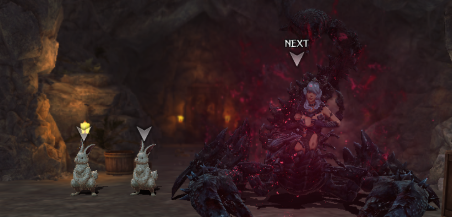
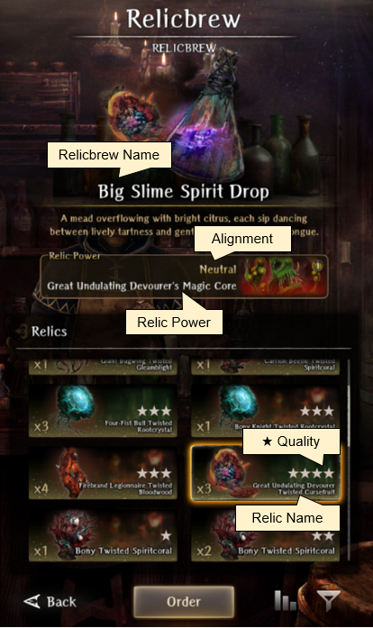
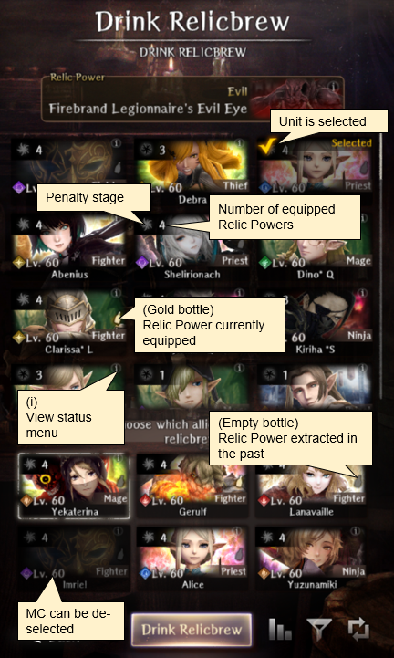
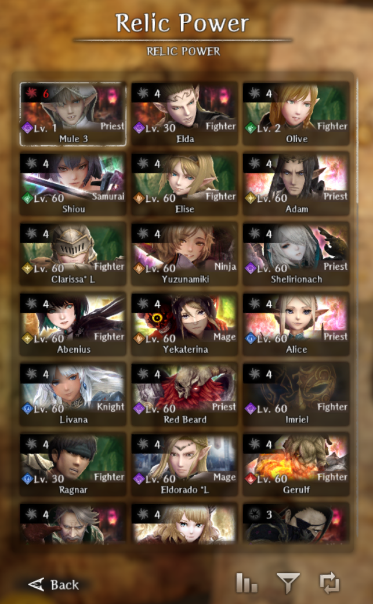
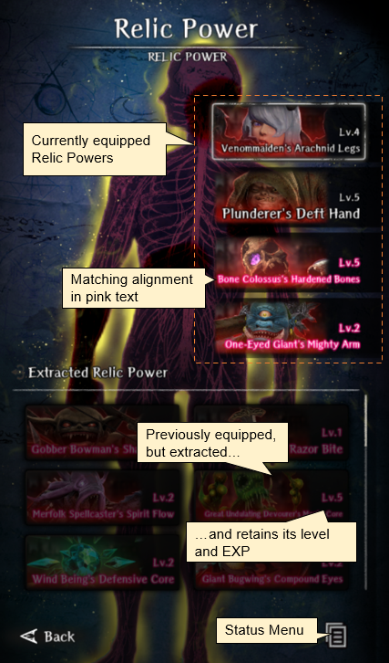
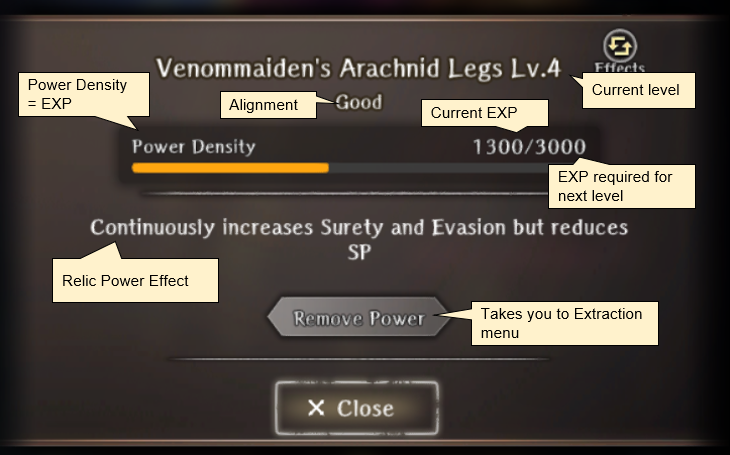
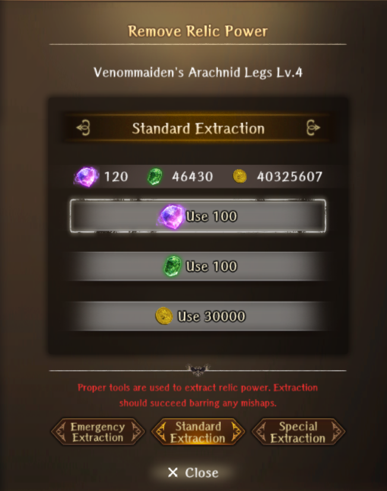
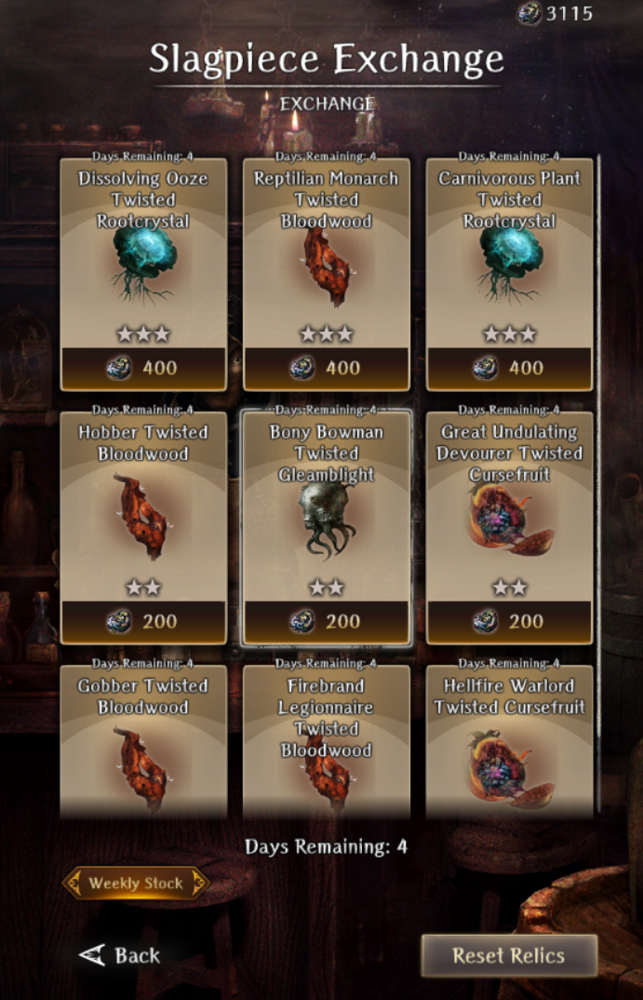

# Relicbrews

## Requirements

!!! warning "Upon completion of [Recovery of Belongings](../abyss-guides/2-port-town-grand-legion/requests.md#recovery-of-belongings) and subsequently [Recovery of Research Materials](../abyss-guides/2-port-town-grand-legion/requests.md#recovery-of-belongings) you unlock the ability to access Relicbrews at the Black Barrel Tavern, which can be accessed via the world map."

## Terminology 

The Relicbrew mechanic uses several different terms that sound similar and can be confusing to new players. The subsections provide more detailed information on each term.

=== "Terminology List"

    

    
    | **Term** &emsp;  &emsp;                   | **Definition** &emsp;                                                                                                                              |
    |:-----------------------|:----------------------------------------------------------------------------------------------------------------------------------------|
    | Relic monster &emsp;  &emsp;          | Extremely rare enemy with a relic in its possession denoted by a red aura.                                                              |
    | Relic                  | Dropped by relic monsters in a chest after battle.                                                                                      |
    | Relic slag             | Remnants of a relic ("slag") that failed to form. Can be exchanged for relics at the Black Barrel Tavern.                               |   
    | Relicbrew              | Corvo can transform a relic into a consumable drink. Primary function of the Black Barrel Tavern.                                       |
    | Relic Power            | A semi-permanent, unique passive skill gained from drinking a relicbrew.                                                                |
    | Eye of Vitriol         | Valuable item given by Corvo that allows the user to see if an enemy is carrying a relic (red aura).                                    |
    
    

=== "Relic Flowchart"

    Relic monster > Relic (or slag) > Relicbrew > Relic Power  

## How to Obtain Relics

Relics can be obtained by encountering relic monsters that can rarely appear anywhere in the game. A relic monster will always drop a chest after a battle, which will contain either the enemy's relic (~30%) or slag (~70%). Slag can be exchanged for relics in the Black Barrel Tavern's Slagpiece Exchange. Relic monsters are unique and only one can spawn per encounter.

=== "Relic Monster Mechanics" 

    - Encounters are rare (2%) and entirely RNG-dependent.
    - Increased HP (~30%) and potentially other stats.
    - Only enemies in the front row can be relic monsters.
    - Encounters are determined upon map entry. You cannot "farm" relics by running away, using stairs, or Harkens. To re-roll for potential encounters you must fully exit the map and reenter. 
    - Do not appear with any Guild Requests or Bounties that have NPC text before the battle. 
    - Can only drop its specific relic and not relics from other enemies.
    - Elemental variations will always drop the standard version's relic.
    - Relic ★ quality (1-5) is based on the level of the area. The vast majority of enemies will never drop a 4★ or 5★ relic even in late game areas.
    - Adventurers and Warped enemies (aside from White Gluttonous Maw) cannot drop relics.    

=== "Relic Monster Example"

    

    
    

    - Denoted by a glowing pink-purple aura.

## Black Barrel Tavern

At the Black Barrel Tavern, the proprietor, Corvo the Alchemist, offers several services.

| **Service**  &emsp; &emsp;                | **Details**                                                                                                                                 |
|:-----------------------|:----------------------------------------------------------------------------------------------------------------------------------------|
| Drink Relicbrew  &emsp;        | Transforms relics into relicbrews that give unique Relic Powers (passive skills).                                                       |
| Relic Power            | View currently equipped and previously extracted Relic Powers.                                                                          |
| Extraction             | Extract a currently equipped Relic Power for a fee.                                                                                     |
| Slagpiece Exchange &emsp; &emsp;     | Trade slag for up to 9 randomly selected relics that refresh on a weekly basis.                                                         |
| Talk                   | Provides details on relic terms and history.                                                                                            |

### Drink Relicbrew

??? note "Relicbrew Selection" 

    === "Menu" 
    
        - The Relicbrew menu lists all of the relics in your inventory.
        - The same relic with a different ★ quality is counted as a separate item and relicbrew.
        - Selecting a relic will show: 
            - Name of the relicbrew 
            - Brief description
            - Relic Power (if previously consumed)
        - Each relicbrew provides a unique Relic Power in the form of a passive skill.

    === "Guide"
    
        

        
        

??? note "How to Drink a Relicbrew" 

    === "Menu" 
    
        - List of all registered adventurers
        - Number of equipped Relic Powers
        - Penalty Stage status
        - Relic Power history via a small bottle icon over the class name
            - Golden bottle: Currently equipped Relic Power
            - Dark grey bottle: Extracted Relic Power 
        - MC and 5 other party members can drink a relicbrew. MC is always a required member, but can be deselected. 
    
    === "Guide" 
    
        

        
        

    
### Relic Power

??? warning "Relic Power Mechanics"

    A Relic Power is received after drinking a relicbrew and has several unique properties: 
    
    - Increases 1-2 stats at the cost of another. The negative stat penalty is always -1 per level up to a maximum of -6.
    - Effects can be increased to a maximum of level 6 by repeatedly drinking the same relicbrew of any ★ quality.
    - Effects are hidden until the relicbrew has been consumed at least once.
    - Each has an alignment (Good-Neutral-Evil). 
    - Matching alignments with a unit give an additional, immediate bonus (or "extra" level) to the positive effects.
    - Up to to 3 Relic Powers can be active with no penalties. A 4th can be added safely if the alignments match.
    - Viewable in the status menu at the bottom of the Passive Skills list with a dark red star background.
    - Can be removed for a fee via extraction.
    - Level and accumulated experience is not lost if extracted, but you need to find and drink the same relicbrew again to reactivate.

??? note "Relic Power Menu" 

    === "Unit Selection" 
    
        - List of all registered units
        - Penalty status
        - Number of equipped Relic Powers

    === "Equipped and Extracted Relic Powers"
        
        - Currently equipped (upper right) and extracted (bottom) Relic Powers
        - Relic Power level 
        - Alignment matches in bright pink text 

    === "Relic Power Level" 
        
        - Relic Power level
        - Power Density (experience) and the amount needed to reach the next level
        - Stat effects
        - Remove Power option leads to the Extraction menu  

    === "Guide" 

        === "Unit Selection"
            

        === "Equipped and Extracted Relic Powers"
            
    
        === "Relic Power Level"
            

??? note "Extraction" 

    === "Extraction Services"
    
        - The Extraction service removes a currently equipped Relic Power for a fee.
        - There are 3 types of extraction services: Emergency, Standard, and Special.
        - An extracted Relic Power does not lose its level or accumulated experience, but must be reactivated with a new relicbrew of any ★ quality.

    === "Extraction Costs"

        === "Table" 

            

            
            | Level       | Emergency | Standard | Special |        
            |:-----------:|:---------:|:--------:|:-------:|
            | 1           | 1,000     | 2,000    | 4,000   |
            | 2           | 2,500     | 5,000    | 10,000  |
            | 3           | 5,000     | 10,000   | 20,000  |
            | 4           | 15,000    | 30,000   | 60,000  |
            | 5           | 25,000    | 50,000   | 100,000 |
            | 6           | 30,000    | 60,000   | 120,000 |
    
            

        === "Notes" 
    
            - Extraction services can be paid with purple gems, green gems, or gold.
            - No reason to use gems for extraction as the gold costs are generally affordable as you progress through the game.
            - Costs increase significantly (up to 100K) the higher the level of the Relic Power being removed.
            - Recommend to always use Special Extraction when possible.
    
    === "Fortitude Penalty" 
    
        - When extracting a Relic Power there is a chance that something might go wrong and the adventurer will receive a temporary Fortitude penalty. 
    
        - Possible Extraction Outcomes
    
            - Failure: Lose 5 max Fortitude for 2 weeks.
            - Success: Lose 1 max Fortitude for 2 weeks.
            - Great Success: No Fortitude loss.
    
        - Notes
        
            - The more expensive extraction services have a lower rate of failure. 
            - A Fortitude penalty notification appear after the cutscene, if incurred.

    === "Example" 
    
        

        
        

### Slagpiece Exchange

The Slagpiece Exchange lists 12 relics for sale in exchange for slag that is reset and randomly determined each week. The amount of slag you have accumulated is shown in the upper right-hand corner.  

??? warning "Slagpiece Exchange Mechanics" 

    === "Overview" 
    
        - Any relic in the game from Abyss 1-3 can appear, including one that is unique to the Exchange (Flower of the Abyss; MP and SP Up, ASPD Down).
        - There are 4 rows of varying ★ quality with 3 relics per row.
        - Standard costs per ★ quality:
            - 4★: 1000 slag
            - 3★: 400 slag
            - 2★: 200 slag
            - 1★: 100 slag
        - 4★ are unlocked after clearing A3 Blackmail ending. 
        - Relics unique to the shop have double the standard cost.
        - It is possible to have multiple copies of the same relic with different ★ quality.
        - You can refresh ("Reset") the Exchange with green or purple gems, which begins at 200 gems and doubles per refresh.

    === "Example"
    
        

        
        

    
## Penalties

??? warning "Penalty Mechanics"

    === "Overview"
    
        - There is a limit to the number of Relic Powers an adventurer or the MC can have active at one time.
        - Any 3 Relic Powers can be equipped with no side effects.
        - A 4th can be safely added if the alignment (Good-Neutral-Evil) of the Relic Power and character match.
        - Adding additional Relic Powers beyond this limit incurs Stage 2 penalties immediately.
        - The Penalty Stage (0-3) is indicated by the color of the swirl in the top left corner of the character portrait in the Relic Powers and Drink Relicbrews menus.
    
    === "Penalty Stages"
    
        - Maximum Fortitude is instantly reduced at Stage 2 (50 Fortitude) and Stage 3 (0 Fortitude). There does not appear to be any other negative side effects outside of combat.
        - The success rate of enemy debuffs and status ailments increases significantly when Fortitude is below 51 and 20.
        - The MC has a hidden Fortitude value. The current, but not maximum, Fortitude can be viewed by your friends in the Tavern under Friendships.
        - Recommendations:
            - Remove Relic Powers first before equipping new ones to avoid Fortitude penalties if planning to return to combat.
            - Use Anonymous units to consume less desirable relicbrews to register the Relic Power effects in the Drink Relicbrews menu.  
    
    === "Penalty Stage Icons"
    
        === "Stage 0"
            
        
        === "Stage 1"
            
    
        === "Stage 2"
            
    
        === "Stage 3"
             

| Penalty Stage | Color  | Effect                                                                                     |         
|:--------------| :------|:-------------------------------------------------------------------------------------------|
| Stage 0       | Grey   | None                                                                                       |   
| Stage 1       | White  | None                                                                                    |      
| Stage 2       | Purple | Fortitude reduced to 50 max. Chance to be afflicted with confusion at start of every turn. |      
| Stage 3       | Red    | Fortitude reduced to 0 max. Afflicted with confusion at start of every turn.               |      

## Leveling Relic Powers

Relic Powers can be leveled like other passive skills. Instead of using inherits or codexes they require additional relics. For ease of reading, experience points (EXP) is the term that will be used throughout this section. 

??? warning "Experience Mechanics"

    - Each relic has an associated ★ quality that gives different amounts of Power Density, which function as experience points. 
    - Relic Powers require a certain amount of EXP to reach the next level with a maximum level of 6.
    - There is a "hidden" level 0 as it costs 100 EXP to equip a Relic Power. 
    - For example, if you used a 1★ relic, then the adventurer would have that Relic Power at level 1 with 0 EXP. This is the reason why you will often be exactly 100 EXP away from the next level.

##### Relic EXP Data Tables

=== "Experience per Relic ★ Quality"  

    | ★ Quality  | EXP    |        
    |:---------:|:------:|
    | 1★         | 100   |
    | 2★         | 200   |
    | 3★         | 400   |
    | 4★         | 1,000 |
    | 5★         | 2,400 |

=== "Required EXP per Relic Level"

    | Relic Power Level | EXP per Level | Total EXP |        
    |:-----------------:|:------------:|:--------------:|
    | 0 - 1             |     100      |      100       |
    | 1 - 2             |     200      |      300       |
    | 2 - 3             |     600      |      900       |
    | 3 - 4             |     1,200    |      2,100     |
    | 4 - 5             |     3,000    |      5,100     |
    | 5 - 6             |     7,200    |      12,300    |
    | Total             |     12,300   |        -       |

=== "Minimum Relics per Level and ★ Quality"

    | ★ Quality  | Level 1 | Level 2 | Level 3 | Level 4 | Level 5 | Level 6 |    
    |:---------:|:----:|:----:|:----:|:-----:|:---:|:----:|
    | 1★        |  1   |  3   |  9   |  21  |  51  | 123 | 
    | 2★        |  1   |  2   |  5   |  11  |  26  | 62  | 
    | 3★        |  1   |  1   |  3   |  6   |  13  | 31  | 
    | 4★        |  1   |  1   |  1   |  3   |  6   | 13  | 
    | 5★        |  1   |  1   |  1   |  1   |  3   | 6   | 

    ??? tip "How to Read This Table"
    
        - This table shows how many relics are needed per ★ quality to reach a specific level. These are total _not_ incremental numbers.
        - For example, to reach level 4 (2,100 total EXP) it would take 11, 2★ (200 EXP) relics (11 x 200 EXP = 2,200 EXP).
        - It is recommended to use the Slagpiece Exchange when possible to buy 1-2★ relics to reach level 4 or 5 to avoid wasting valuable EXP that could have gone to a different adventurer.   

## List of Relic Power Effects 

!!! danger "Read Me - How to Search"

    - Relic Names are listed as shown in their Compendium entry. 
    - If using Ctrl +F, then try searching with and without modifiers such as 'Twisted' as these are inconsistently used by the game. 
    - Recommend just typing a single keyword into the table below to filter your results automatically. 
    - Before reporting a missing relic to the guide, verify your Compendium entry against the list below.

| Relic Power Name                           | Stat Effect                          | Personality | Drops From             | Relic Name                             | Comp. # |
| ------------------------------------------ | ------------------------------------ | ----------- | ---------------------- | --------------------------------------- |:-----------------:|
| Redripened Carapace                        | Crit Res Up, Detect Down             | Neutral     | Gluttonous Maw (White) | Ripeness of the Abyss                   | 19                |
| Gobber's Evil Eye                          | Acc Up, Surety Down                  | Neutral     | Goblin                 | Gobber Bloodwood                        | 4035              |
| Gobber Bowman's Sharp Ears                 | Detect Up, Magic Down                | Neutral     | Goblin Archer          | Gobber Bowman Gleambright               | 4036              |
| Gobber's Magic-Resistant Lump              | Magic Def Up, Crit Tol Down          | Neutral     | Goblin Mage            | Gobber Sorcerer Rootcrystal             | 4037              |
| Gobber Soothsayer's Hallowed Voice         | Divine Up, Def Down                  | Evil        | Goblin Cleric          | Gobber Soothsayer Cursefruit            | 4038              |
| Hobber's Mighty Arm                        | Attack Up, Def Down                  | Evil        | Hobgoblin              | Hobber Bloodwood                        | 4039              |
| Bony's Iron Ribs                           | Crit Tol Up, Disarm Trap Down        | Evil        | Skeleton               | Bony Spiritcoral                        | 4040              |
| Bony Bowman's Cartilage                    | Evade Trap Up, Res Down              | Evil        | Skeleton Archer        | Bony Bowman's Gleambright               | 4041              |
| Bony Sorcerer's Spectral Bones             | Magic Def Up, Evade Trap Down        | Good        | Skeleton Mage          | Bony Sorcerer Rootcrystal               | 4042              |
| Bony Knight's Armored Bones                | Def Up, Acc Down                     | Evil        | Skeleton Knight        | Bony Knight Rootcrystal                 | 4043              |
| Dissolving Ooze's Defensive Core           | Def Up, Evasion Down                 | Good        | Slime                  | Dissolving Ooze Rootcrystal             | 4044              |
| Man Eating Box's Sturdy Jaw                | All Elemental Res Up, Eva Down       | Neutral     | Mimic                  | Man-Eating Box Spiritcoral              | 4045              |
| Carrion Beetle's Carapace                  | Earth Res Up, MP Down                | Good        | Abyssal Insect         | Carrion Beetle Spiritcoral              | 4046              |
| Plunderer's Deft Hand                      | Surety Up, Magic Down                | Evil        | Bandit                 | Plunderer Bloodwood                     | 4047              |
| Noxfume's Shelled Lungs                    | Air Res Up, Disarm Trap Down         | Evil        | Cloud                  | Noxfume Spiritcoral                     | 4048              |
| Dancing Blade's Razor Bite                 | Attack Up, Air Res Down              | Neutral     | Flying Sword           | Dancing Blade Bloodwood                 | 4049              |
| Venommaiden's Arachnid Legs                | Surety Up, Evasion Up, SP Down       | Good        | Scorpion Lady          | Venommaiden Bloodwood                   | 4050              |
| Firebrand Legionnaire's Evil Eye           | Acc Up, Light Res Down               | Evil        | Lesser Demon           | Firebrand Legionnaire Bloodwood         | 4051              |
| Hellfire Warlord's Blue Blood              | MP Up, Light Res Down                | Evil        | Greater Demon          | Hellfire Warlord Cursefruit             | 4052              |
| Beheading Rabbit's Sharp Claws             | Surety Up, Divine Down               | Good        | Vorpal Bunny           | Beheading Rabbit's Bloodwood            | 4053              |
| Hexdoll's Fleeing Step                     | ASPD Up, HP Down                     | Good        | Cursed Sack Doll       | Hexdoll Gleamblight                     | 4054              |
| Restless Currency's Tentacles              | Disarm Trap Up, Dark Res Down        | Neutral     | Creeping Coin          | Restless Currency Gleambright           | 4055              |
| Merfolk's Scaleskin                        | Water Res Up, Divine Power Down      | Good        | Sahuagin               | Merfolk Spiritcoral                     | 4056              |
| Merfolk Bowman's Energy Flow               | SP Up, Res Down                      | Good        | Sahuagin Archer        | Merfolk Bowman Bloodwood                | 4057              |
| Merfolk Spellcaster's Spirit Flow          | Magic Up, Res Down                   | Neutral     | Sahuagin Mage          | Merfolk Spellcaster Cursefruit          | 4058              |
| Reptilian's Pupils                         | Acc Up, Air Res Down                 | Good        | Lizardman              | Reptilian Bloodwood                     | 4059              |
| Reptilian Monarch's Energy Flow            | SP Up, Earth Res Down                | Neutral     | Lizardman Champion     | Reptilian Monarch Bloodwood             | 4060              |
| Four-Fist Bull's Fierce Heart              | HP Up, Fire Res Down                 | Neutral     | Minotaur               | Four-Fist Bull Rootcrystal              | 4061              |
| Lust Demon's Warding Glyph                 | Res Up, Attack Down                  | Evil        | Succubus               | Lust Demon Spiritcoral                  | 4062              |
| Sea Mad Warrior's Energy Lump              | SP Up, MP Down                       | Evil        | Pirate Berserker       | Sea Mad Warrior Bloodwood               | 4063              |
| Salt-Teared Priestess's Hallowed Voice     | Divine Up, Res Down                  | Neutral     | Pirate Deacon          | Salt-Teared Priestess Cursefruit        | 4064              |
| Great Undulating Devourer's Magic Core     | MP Up, Attack Down                   | Neutral     | Big Slime              | Great Undulating Devourer Cursefruit    | 4065              |
| One-Eyed Giant's Mighty Arm                | Attack Up, Acc Up, Evasion Down      | Neutral     | Cyclops                | One-Eyed Giant Bloodwood                | 4066              |
| Sprite's Ghostlight Hair                   | Magic Up, Def Down                   | Good        | Pixie                  | Sprite Cursefruit                       | 4067              |
| Wind Being Defensive Core                  | Def Up, Magic Def Down               | Neutral     | Entity                 | Wind Being Rootcrystal                  | 4068              |
| Thrall of the Dark's Violet Glowing Eyes   | Evasion Up, Def Down                 | Evil        | Vampire                | Thrall of the Dark Gleambright          | 4069              |
| Giant Bugwing's Compound Eyes              | Evade Trap Up, MP Down               | Neutral     | Dragon Fly             | Giant Bugwing Gleambright               | 4070              |
| Servant-of-the-Earth's Pauldrons           | Def Up, Crit Tol Down                | Good        | Golem                  | Servant-of-the-Earth Rootcrystal        | 4071              |
| Chaos-Haunt's Mind's Eye                   | Detect Up, Attack Down               | Evil        | Poltergeist            | Chaos-Haunt Gleambright                 | 4072              |
| Shadowhoof Cavalier's Ghostsoul            | Magic Up, Dark Res Up, Divine Down   | Evil        | Necrocore              | Shadowhoof Cavalier Cursefruit          | 4073              |
| Dead-Minder's Spirit Essence               | MP Up, Def Down                      | Evil        | Wight                  | Dead-Minder Cursefruit                  | 4074              |
| Bone Colossus's Hardened Bones             | Def Up, MP Down                      | Neutral     | Skeleton Giant         | Bone Colossus Rootcrystal               | 4075              |
| Foxear's Fingerhooks                       | Disarm Trap Up, Divine Down          | Good        | Footpad                | Foxear Gleambright                      | 4076              |
| Bonemaster's Cursemark                     | Magic Up, Def Down                   | Neutral     | Necromancer            | Bonemaster Cursefruit                   | 4077              |
| Carnivorous Plant's Greenbark              | Magic Def Up, Res Up, Acc Down       | Evil        | Hydra Plant            | Carnivorous Plant Rootcrystal           | 4078              |
| Laughing Bird's Divine Songcall            | Divine Up, Magic Up, Crit Tol down   | Good        | Laughing Bird          | Laughing Bird Cursefruit                | 4079              |
| Composite Beast's Mighty Arm               | Attack Up, Water Res Down            | Good        | Chimera                | Composite Beast Bloodwood               | 4080              |
| Stonebreath Bull's Hardened Horns          | Def Up, MP Down                      | Evil        | Gorgon                 | Stonebreath Bull Rootcrystal            | 4081              |
| Wind-Cutting Fowl's Wingfeathers           | Crit Tol Up, Evade Trap Down         | Good        | Hawk                   | Wind-Cutting Bird Spiritcoral           | 4082              |
| Abyssal Blossom High Blood                 | MP Up, SP Up, ASPD Down              | Neutral     | Relicbrew Shop         | Flower of the Abyss                     | 4084              |
| Snow Gobber's Hard Elbow                   | Crit Tol Up, Surety Down             | Neutral     | Snowland Goblin        | Snow Gobber Twisted Spiritcoral         | 4085              |
| Snow Hobber's Thick Hide                   | Def Up, SP Down                      | Neutral     | Snowland Hobgoblin     | Snow Hobber Twisted Rootcrystal         | 4086              |
| Golden Husk of the Man-Eating Gold Box     | Def Up, Magic Def Up, Evasion Down   | Good        | Golden Mimic           | Man Eating Gold Box Twisted Rootcrystal | 4087              |
| Sharp Claws of the Beheading Snow Hare     | Surety Up, Divine Down               | Neutral     | Snow Bunny             | Beheading Snow Rabbit Twisted Bloodwood | 4088              |
| One-Eyed White Giant's Mighty Arm          | Attack Up, Surety Up, ASPD Down      | Evil        | Snowpeak Cyclops       | One-Eyed White Giant's Twisted Bloodwood| 4089              |
| Wind-Cutting Fowl's Keen Eye               | Evade Trap up, Crit Tol Down         | Good        | Big Snow Hawk          | Wind-Cutting Raptor Twisted Gleamblight | 4090              |
| Snow Child's White Fur                     | Res Up, Def Down                     | Evil        | Bigfoot Child          | Snow Child Twisted Spiritcoral          | 4091              |
| Snow Man's Energy Lump                     | SP Up, MP Down                       | Good        | Bigfoot                | Snow Man Twisted Bloodwood              | 4092              |
| Spirit Flow of the Ice Wolf                | Magic Up, Fire Res Down              | Good        | Snow Wolf              | Ice Wolf Twisted Cursefruit             | 4093              |
| Azure Blood of the Ice Wolf Lord           | MP Up, Fire Res Down                 | Good        | Snow Wolf Leader       | Ice Wolf Lord Twisted Cursefruit        | 4094              |
| Ice Core Crystal Shell                     | Fire Res Up, Detect Down             | Neutral     | A4 Request             | Abyssal Ice Core                        | 4095              |

## Relic Power Stat Increases

The table below shows the stat increase per Relic Power level along with the level 6 totals of both non-matching ("Standard") and matching ("Alignment Bonus") alignments.
Note: The stat that is negatively impacted is usually -1 per level (max of -6 at level 6), except HP, DEF and MDEF which are -2 per level (max of -12 at level 6). ASPD is -1 from Level 1-4 and -2 for Level 5 (-6 ASPD) and Level 6 (-8 ASPD). 

| Stats                            | Per Level | Standard | Alignment Bonus  |
|----------------------------------|:---------:|:--------:|:----------------:|
| HP                               |     3     |    18    |        21        |
| SP                               |     2     |    12    |        14        |
| MP                               |     2     |    12    |        14        |
| ATK                              |     2     |    12    |        14        |
| SUR†                  |     1     |     8    |        9         |
| ACC                              |     2     |    12    |        14        |
| EVA                              |     2     |    12    |        14        |
| MAG                              |     2     |    12    |        14        |
| DIV                              |     2     |    12    |        14        |
| ASPD                             |     1     |     6    |        7         |
| DEF                              |     4     |    24    |        28        |
| MDEF                             |     4     |    24    |        28        |
| RES                              |     2     |    12    |        14        |
| Detect	     	               |     2     |    12    |        14        |
| Disarm Trap                      |     2     |    12    |        14        |
| Evade Trap                       |     2     |    12    |        14        |
| Elemental tolerance†† |    1%     |    6%    |        7%        |
| Status tolerance††    |    1%     |    6%    |        7%        |

<small>† SUR gives +1 from levels 1-4 and +2 at levels 5 and 6. The matching alignment bonus level is +1 SUR.  
†† These are rough estimates. Could range from 0.5-1% per level.</small> 

## Where to farm

See the [List of Relic Power Effects](#list-of-relic-power-effects) for which monster drops each relic, and [How to Obtain Relics](#how-to-obtain-relics) for the mechanics behind when a monster can drop one.

The document below suggests places to farm some of these relics. It is **updated up to Abyss 3**, so it only covers relics and spots available up to that point. Expand it to view it inline, or [open it in a new tab](https://docs.google.com/document/d/e/2PACX-1vSCQD8aLcDjKdQ2NbvgWx8_spmZP5XW7g3HoFHKZLAXiF9bjwxojl_VUX7Uk4_c-bVkadrNGy-PZxWb/pub){target="_blank" rel="noopener"}. Document courtesy of BeautifulDemise.

??? note "Show BeautifulDemise's relicbrew farming list"
    <iframe style="width: 100%; height: 40rem;" src="https://docs.google.com/document/d/e/2PACX-1vSCQD8aLcDjKdQ2NbvgWx8_spmZP5XW7g3HoFHKZLAXiF9bjwxojl_VUX7Uk4_c-bVkadrNGy-PZxWb/pub?embedded=true" loading="lazy"></iframe>