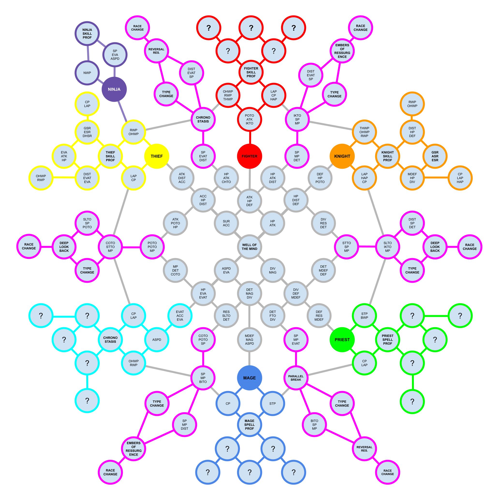

# Well of the Mind and Guiding Lights

## Well of the Mind

The Well of the Mind is a unique main character customization element accessible from the Ruins where you can unlock classes, skills, spells, and stat increases using "Mind Pearls".  

You start with 4 Mind Pearls. More are obtained by collecting ["Guiding Lights" through progressing in the main story](./well-of-the-mind#guiding-lights). Guiding lights are used by unlocking a color-matching clouded area of the Well after activating a node adjacent to that clouded area.  

Node layout and Mind Pearl costs are noted on the node map below, with node border colors matching the Guiding Light needed for unlocking that area.  For the meaning of each node, see [the Acronym/Node label description table]((./well-of-the-mind#wotm-acronym-node-labels-table)).

[Work In Progress](https://docs.google.com/drawings/d/1vpO4_4Z8DE4ba7NVDWpWgkeXaeyBkpAGcC0YTr0XzeQ/edit)  

!!! warning
    Skill, spell, proficiency, and class nodes are always in the same location. Every time you reset the Well, however, content of stat and type change nodes reset randomly. For example, it is possible to have 3 Surety nodes on one reset and just 1 Surety node on another reset.

## Guiding Lights

| Guiding Light | Method to Obtain                                                                                                                                                                                                            |
|:------------- |:--------------------------------------------------------------------------------------------------------------------------------------------------------------------------------------------------------------------------- |
| STR           | Obtained after unlocking the Cursed Wheel                                                                                                                                                                                   |
| VIT 1         | Complete the Beginning Abyss and save the king                                                                                                                                                                              |
| VIT 2         | Activate the Golem before the boss fight in Guarda Fortress Abyss                                                                                                                                                           |
| PIE           | Beat Melgina for the first time, regardless of missing person request taken                                                                                                                                                 |
| IQ            | Save the missing person, including speaking to him on deck, prior to killing either Melgina or Octo for the second time. This must now be done on your second or third route. It cannot be done on your first route anymore |
| SPEED         | 3rd District - Iron Gate Street. Complete the inspection on Guane territory (first time on any path).                                                                                                                       |
| DEX 1         | 4th District - Boulevard. After solving the drowning water god statue trap, go back to town and something will have changed in the Well of the Mind                                                                         |
| DEX 2         | Get the "Good" Ending in Guarda Fortress Abyss.                                                                                                                                                                             |
| SHADOW         | Complete the 2nd Part of the [Plot of the Sand Shadow Quest](../events/plot-of-the-sand-shadow/plot-of-the-sand-shadow.md#guide-for-2nd-part)                                                                                  |
| LUCK 1        | Get the perfect ending (+Albano quest) in Beginning Abyss                                                                                                                                                                   |
| LUCK 2        | Save [Bonnie and Clyde](../abyss-guides/2-port-town-grand-legion/requests.md#delivering-chamomile-for-the-dead)                                                                                                             |
| LUCK 3        | Get all three best endings on [Viscount Guane request](../abyss-guides/2-port-town-grand-legion/requests.md#viscount-guane)                                                                                                 |
| LUCK 4        | Defeat Octanarus                                                                                                                                                                                                            |
| LUCK 5        | Clear all 3 main Port Town requests                                                                                                                                                                                         |
| LUCK 6        | Clear the Monster Soup quest for Pickerel                                                                                                                                                                                   |
| LUCK 7        | [Stop the Mastermind and Save the Duke](../abyss-guides/3-guarda-fortress/important-request-gwo.md#stop-the-mastermind-and-save-the-duke) ending in Guarda Fortress Abyss                                                   |
| LUCK 8        | Get the perfect ending for all three [Slum Faction Requests](../abyss-guides/3-guarda-fortress/requests.md#old-district-slum-faction-quests)                                                                                |

??? warning "Help, I'm Missing Guiding Lights!"
    If you met the requirements to obtain a guiding light but don't have it actually available in the Well for use, try exiting and restarting the game. Some of them seem to need a reboot to show up properly.

    

| Acronym / Node Label  {id="wotm-acronym-node-labels-table}| DESCRIPTION                                                                                                     |
|:------------------ |:--------------------------------------------------------------------------------------------------------------- |
| STR | Strength |
| IQ | Intelligence |
| PIE | Piety |
| VIT | Vitality |
| DEX | Dexterity |
| SPD | Speed |
| LUC | Luck |
| | |
| HP | Increases Hit Points |
| MP | Increases Magic Points |
| SP | Increases Skill Points |
| | |
| ACC | Increases Accuracy |
| ASPD | Increases Action Speed |
| ATK | Increases Attack Power |
| DEF | Increase Defense Power |
| DET | Increases Detection |
| DIST | Increases Disarm Trap |
| DIV | Increases Divine Power |
| EVA | Increases Evasion |
| EVAT | Increases Evade Trap |
| MAG | Increases Magic Power |
| MDEF | Increases Magic Defense |
| RES | Increases Resistance |
| SUR | Increases Surety |
| | |
| FIGHTER | Enables Class Change to Fighter |
| KNIGHT | Enables Class Change to Knight |
| MAGE | Enables Class Change to Mage |
| NINJA | Enables Class Change to Ninja |
| PRIEST | Enables Class Change to Priest |
| THIEF | Enables Class Change to Thief |
| | |
| FIGHTER SKILL PROF | Reduces SP cost of Fighter Skills |
| KNIGHT SKILL PROF | Reduces SP cost of Knight Skills |
| MAGE SPELL PROF | Reduces the MP cost of mage spells |
| NINJA SKILL PROF | Reduces SP cost of Ninja Skills |
| PRIEST SPELL PROF | Reduces the MP cost of priest spells |
| THIEF SKILL PROF | Reduces SP cost of Thief Skills |
| | |
| OHWP | One-Handed Weapon Proficiency - Increases Attack Power and Accuracy when equipped with a dagger, one-handed sword, or one-handed axe |
| THWP | Two-Handed Weapon Proficiency - Increases Attack Power and Accuracy when equipped with a two-handed sword, two-handed spear, or two-handed axe |
| STP | Staff Proficiency - Increases Magic Power and Divine Power when equipped with a one-handed or two-handed staff |
| BWP | Blunt Weapon Proficiency - Increases Attack Power and Accuracy when equipped with a one-handed or two-handed blunt weapon |
| RWP | Ranged Weapon Proficiency - Increases Attack Power and Accuracy when equipped with a bow |
| NWP | Ninja Weapon Proficiency - Increases Attack Power and Surety when equipped with a dagger, kunai, or ninja katana |
| | |
| CP | Cloth Proficiency - Increases Defense Power and Magic Defense when equipped with cloth |
| LAP | Light Armor Proficiency - Increases Defense Power and Magic Defense when equipped with light armor |
| HAP | Heavy Armor Proficiency - Increases Defense Power and Magic Defense when equipped with heavy armor |
| | |
| RACE CHANGE | Changes the MC's Race to one of the types listed (Human, Dwarf, Elf, or Beastfolk) |
| TYPE CHANGE | Changes MC's Type (Element) to one of the types listed (E.g., Air, Earth, Fire, Dark, etc.) |
| RACE SLAYER-RESISTANCE| MC gains increased damage versus, and reduced damage from, one of the monster races listed (E.g., entity, demon, demihuman, giant, adventurer, beast, etc.) |
| | |
| FTO | Increases Fear Tolerance |
| IDTO | Increases Instant-Death Tolerance |
| IKTO | Increases Insta-Kill Tolerance |
| SLTO | Increases Sleep Tolerance |
| STTO | Increases Stun Tolerance |
| CHTO | Increases Charm Tolerance |
| COTO | Increases Confusion Tolerance |
| POTO | Increases Poison Tolerance |
| BITO | Increases Bind Tolerance |
| | |
| EMBERS | Embers of Resurgence increased by 1 |
| PARALLEL BREAK | Chance to inflict multiple status afflictions (Sleep, Stun, Fear. Confusion) on 1 enemy row |
| REVERSAL RESONANCE | Chance to resurrect an additional ally when using right hand of reversal on an ally who died in battle. |
| DEEP LOOK BACK | Chance that time will feel slower when using the Right hand of reversal to resurrect an ally who died in battle |
| CHRONOSTASIS | Minor physical attack that always hits 1 enemy. High chance of greatly slowing target's Action Order |

