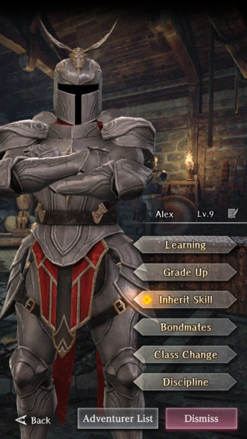

# Alex

**Race**: Human  
**Gender**: Male  
**Type**: Fire  
**Personality**: Good  
**Starting Class**: Knight  
**Class Change**: Fighter  
**Role**: Support, Damage

!!! info "Portraits"
    === "Knight"
        

    === "Fighter"
        

## Skills

!!! info "Inheritable Skill"
    === "Stun Bash"
        Moderate physical attack on 1 enemy. Chance to stun based on Defense Power. Efficacy and probability increased based on skill level.
        <Close/mid-range weapon-specific/>

!!! info "Unique Skill (Not Inheritable)"
    === "Fire Formation"
        Increases damage to wind type enemies for user and adjacent fire type allies if there are at least 2 fire type allies adjacent to the user.

!!! info "Discipline Skill"
    === "Royal Knight Aspirant"
        Continuously increases each stat, SP and Accuracy increased further.