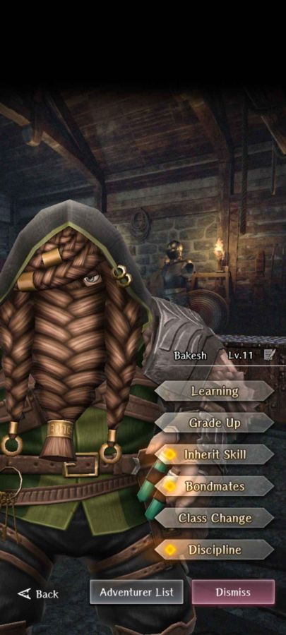
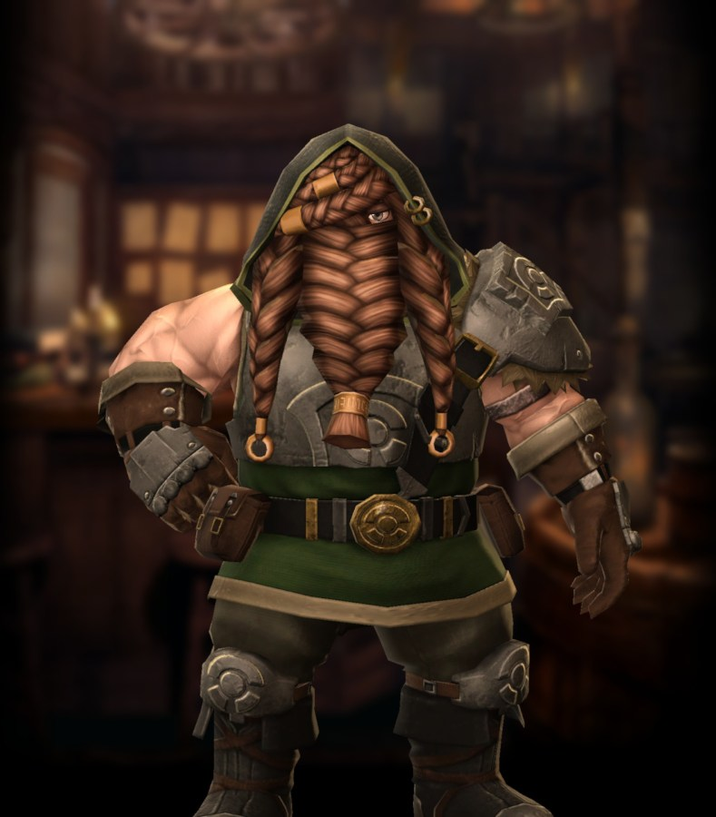

# Bakesh

**Race**: Dwarf  
**Gender**: Male  
**Type**: Air  
**Personality**: Evil  
**Starting Class**: Thief  
**Class Change**: Fighter  
**Role**: Damage, Support

??? info "Portraits"
    === "Thief"
        

    === "Fighter"
        

## Skills

!!! info "Inheritable Skill"
    === "Treasure Trap Detection Skill"
        {{ get_skill_description("Treasure Trap Detection Skill") }}

!!! info "Potential Inherit"
    === "Passive Action Speed Up (Thief)"
        {{ get_skill_description("Passive Action Speed Up (Thief)") }}        

!!! info "Unique Skill (Not Inheritable)"
    === "Earth-Kin Blessing"
        {{ get_skill_description("Earth-Kin Blessing") }}
        
!!! info "Discipline Skill"
    === "Talented Trapsmith"
        {{ get_skill_description("Talented Trapsmith") }}
