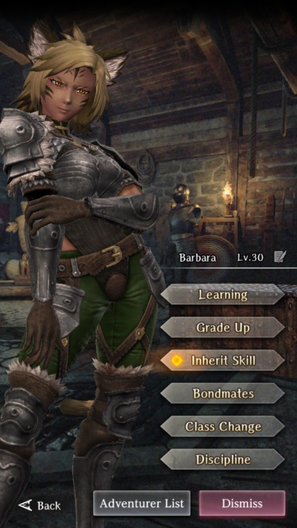

# Barbara

**Race**: Beastfolk  
**Gender**: Female  
**Type**: Air  
**Personality**: Neutral  
**Starting Class**: Knight  
**Class Change**: Thief  
**Role**: Support, Damage

??? info "Portraits"
    === "Knight"
        

    === "Thief"
        
		
## Skills

!!! info "Inheritable Skill"
    === "Assault Guard"
        {{ get_skill_description("Assault Guard") }}

!!! info "Potential Inherit"
    === "Passive Magic Defense Up (Knight)"
        {{ get_skill_description("Passive Magic Defense Up (Knight)") }}

!!! info "Unique Skill (Not Inheritable)"
    === "Wild Knight"
        {{ get_skill_description("Wild Knight") }}
        
!!! info "Discipline Skill"
    === "Defense of House Zart"
        {{ get_skill_description("Defense of House Zart") }}
