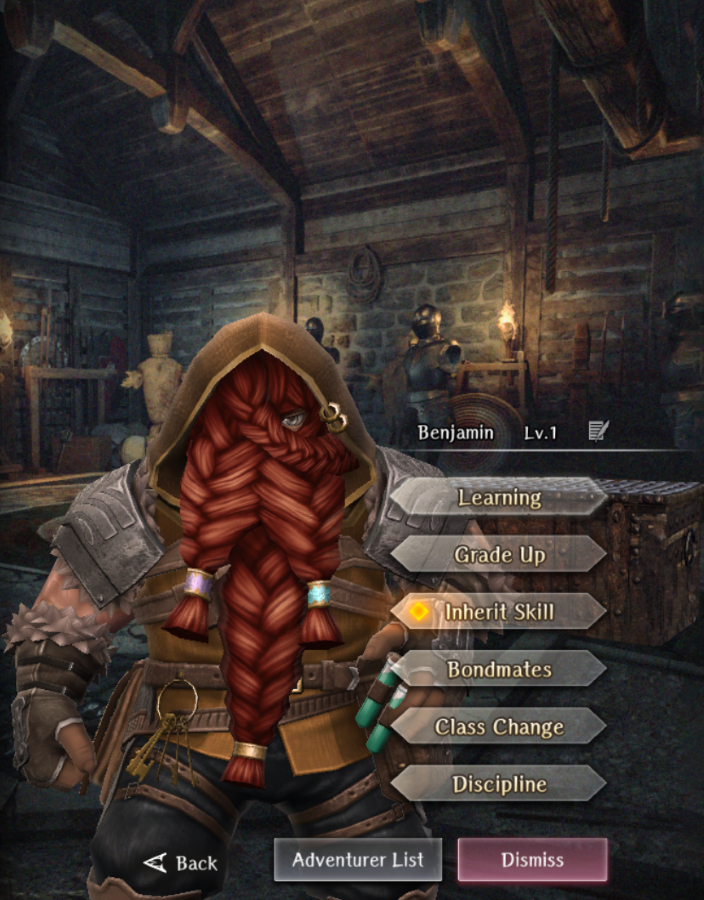

# Benjamin

**Race**: Dwarf  
**Gender**: Male  
**Type**: Earth  
**Personality**: Neutral  
**Starting Class**: Fighter  
**Class Change**: Thief  
**Role**: Damage, Support

??? info "Portraits"
    === "Fighter"
        

    === "Thief"
        

## Skills

!!! info "Inheritable Skill"
    === "Passive HP Up (Fighter)"
        Continuously increases HP. HP increased further based on skill level.

!!! info "Unique Skill (Not Inheritable)"
    === "Planed Hunting"
        Increases damage dealt to magical beast enemies and takes less damage from them.

!!! info "Discipline Skill"
    === "Strongest in the Village"
        Continuously increases each stat, Attack Power and Defense increased further.