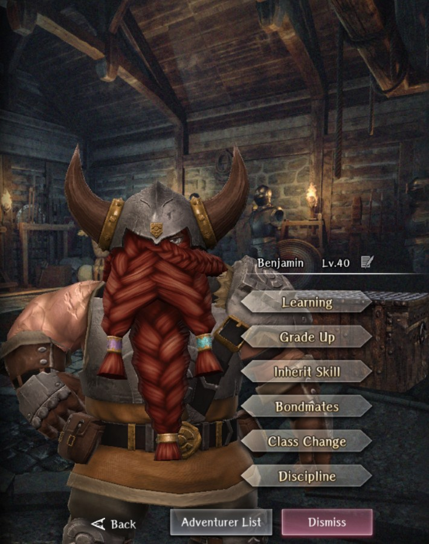

# Benjamin

**Race**: Dwarf  
**Gender**: Male  
**Type**: Earth  
**Personality**: Neutral  
**Starting Class**: Fighter  
**Class Change**: Thief  
**Role**: Damage, Support

??? info "Portraits"
    === "Fighter"
        

    === "Thief"
        

## Skills

!!! info "Inheritable Skill"
    === "Passive HP Up (Fighter)"
        {{ get_skill_description("Passive HP Up (Fighter)") }}

!!! info "Potential Inherit"
    === "Wild Strike"
        {{ get_skill_description("Wild Strike") }}
        
!!! info "Unique Skill (Not Inheritable)"
    === "Planned Hunting"
        {{ get_skill_description("Planned Hunting") }}
        
!!! info "Discipline Skill"
    === "Strongest in the Village"
        {{ get_skill_description("Strongest in the Village") }}

## Adventurer Reviews

??? info "Shiro's Analysis"

    We start with a really strong passive that works against the same enemy as Abenius - magical beast. It’ll be not only a passive that’ll be helpful in the third abyss thanks to this enemy type being rather common. It also will carry you over the whole second abyss if you decide to use Ben there.

    Moving to his discipline there’s nothing special going about it. On top of that his inheritance is something really good for any of the characters so it’s not really worth considering.

    As for his class change, he gets access to thief-class that synergize really well with fighters for pushing his damage potential further.

    To sum it up. Benjamin is dwarf with earth element which makes him quite bulky and har hitting especially in the second abyss. Furthermore his passive boosts his performance over there even more making him one of the best possible options for clearing second abyss turning it into easy mode. But even after it thanks to his setup and passive he performs well as a fighter in third abyss. If you’re considering general adventurers he’s definitely one of the best options out there. He’s one of our better generalists amongst them.