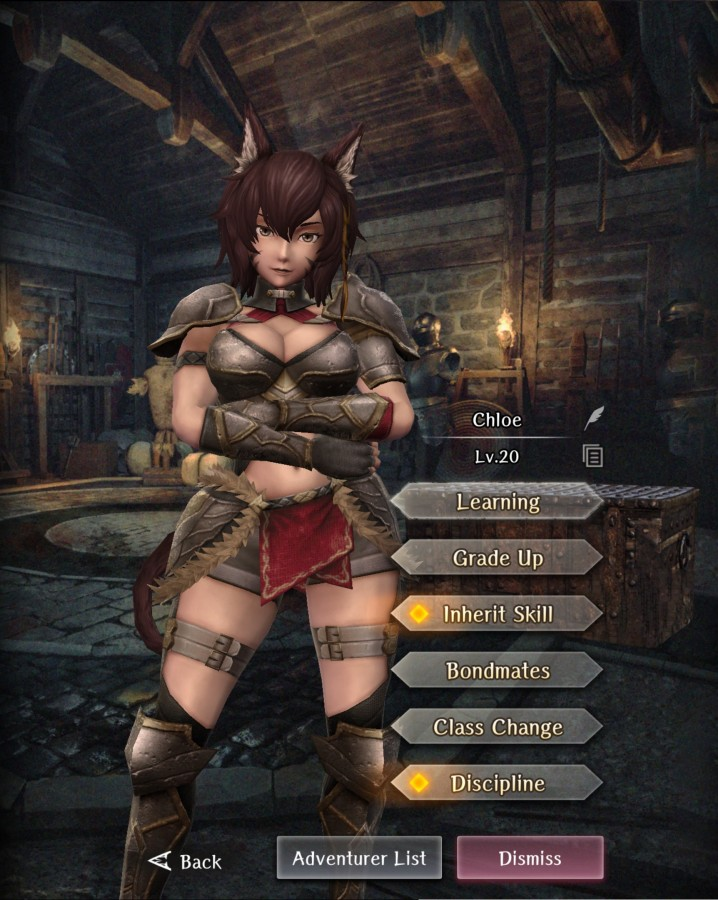
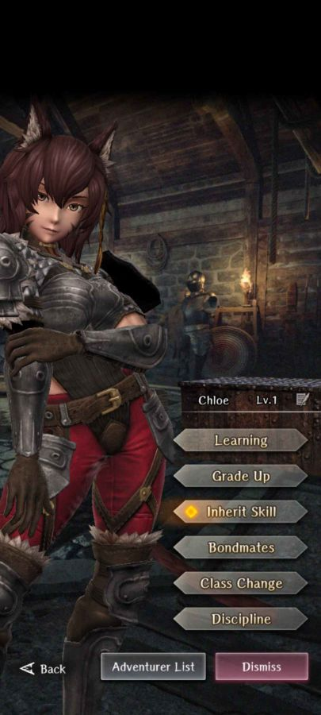
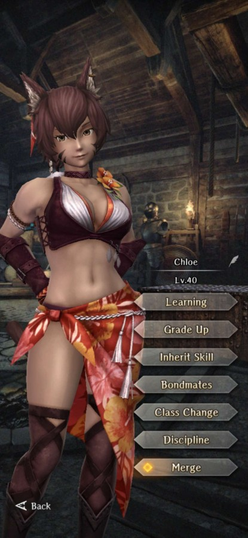

# Chloe

**Race**: Beastfolk  
**Gender**: Female  
**Type**: Fire  
**Personality**: Good  
**Starting Class**: Fighter  
**Class Change**: Knight  
**Role**: Damage, Support

??? info "Portraits"
    === "Fighter"
        

    === "Knight"
        

    === "Everdistant Summershade"
        
      

## Skills

!!! info "Inheritable Skill"
    === "Warrior's Battle Cry"
        {{ get_skill_description("Warrior's Battle Cry") }}

!!! info "Potential Inherit"
    === "Passive Accuracy Up (Fighter)"
        {{ get_skill_description("Passive Accuracy Up (Fighter)") }}

!!! info "Unique Skill (Not Inheritable)"
    === "Interpersonal Combat Technique"
        {{ get_skill_description("Interpersonal Combat Technique") }}

    === "Interpersonal Combat Technique (Everdistant Summershade)"
        {{ get_skill_description("Interpersonal Combat Technique (Everdistant Summershade)") }}

!!! info "Discipline Skill"
    === "Practical Self-Defense"
        {{ get_skill_description("Practical Self-Defense") }}

    === "Midsummer Valor (Everdistant Summershade)"
        {{ get_skill_description("Midsummer Valor") }}
        
