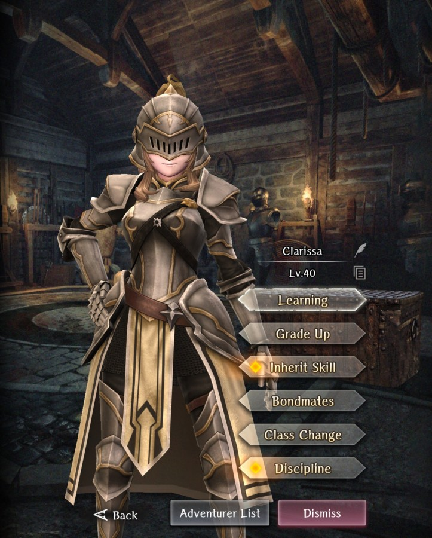

# Clarissa

**Race**: Human  
**Gender**: Female  
**Type**: Light  
**Personality**: Neutral  
**Starting Class**: Knight  
**Class Change**: Fighter  
**Role**: Support, Damage

!!! info "Portraits"
    === "Knight"
        

    === "Fighter"
        

## Skills

!!! info "Inheritable Skill"
    === "Self-Healing"
        Continuously restores own minor HP for 3 turns. Recovery amount increased based on skill level.

!!! info "Unique Skill (Not Inheritable)"
    === "Oath of Fortitude"
        Increases Tolerance of Confusion, Charm, and Fear for user and all adjacent neutral allies.

!!! info "Discipline Skill"
    === "Knight's Oath"
        Continuously increases each stat, SP and Resistance increased further.