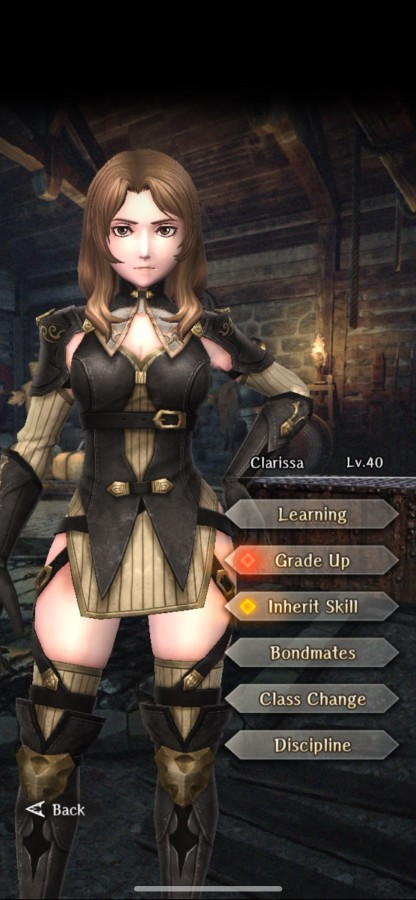

# Clarissa

**Race**: Human  
**Gender**: Female  
**Type**: Light  
**Personality**: Neutral  
**Starting Class**: Knight  
**Class Change**: Fighter  
**Role**: Support, Damage

??? info "Portraits"
    === "Knight"
        

    === "Fighter"
        

## Skills

!!! info "Inheritable Skill"
    === "Self-Healing"
        {{ get_skill_description('Self-Healing') }}

!!! info "Potential Inherit"
    === "Self-Defense"
        {{ get_skill_description("Self-Defense") }}
        
!!! info "Unique Skill (Not Inheritable)"
    === "Oath of Fortitude"
        {{ get_skill_description('Oath of Fortitude') }}
        
!!! info "Discipline Skill"
    === "Knight's Oath"
        {{ get_skill_description("Knight's Oath") }}

## Adventurer Reviews

??? info "Shiro's Analysis"

    While back in the days her passive served next to no value. But thanks to how the third abyss looks, now Clarissa's ability to raise your resistance to specific effects can be something that turns the fight around. Only issue? Said allies need to be a neutral element.

    Moving to her discipline. It helps with her SP pool while being easy to consider looking at what inheritance she has. Worth to upgrade if you’ll use her.

    Her class change is a fighter which allows you to use Clarissa as a damage dealer that works for your team as a charm/confusion totem. It's a really good alternative if you consider using Clarissa as something more than a Knight Defense spammer.

    To sum it up. While Clarissa is a rather niche pick with not the best setup for either fighter or knight. Still, her discipline helps with it. On top of that her role in your team will be as a passive totem to make your fights in castle ruins/against Doll or Sealed Demon much more consistent. If you’re struggling with either of those and you want to clear those, definitely consider raising her. Otherwise she’s an option for an easy pass. But hey, if you’re not using Self-Healing then why not upgrade her anyway.