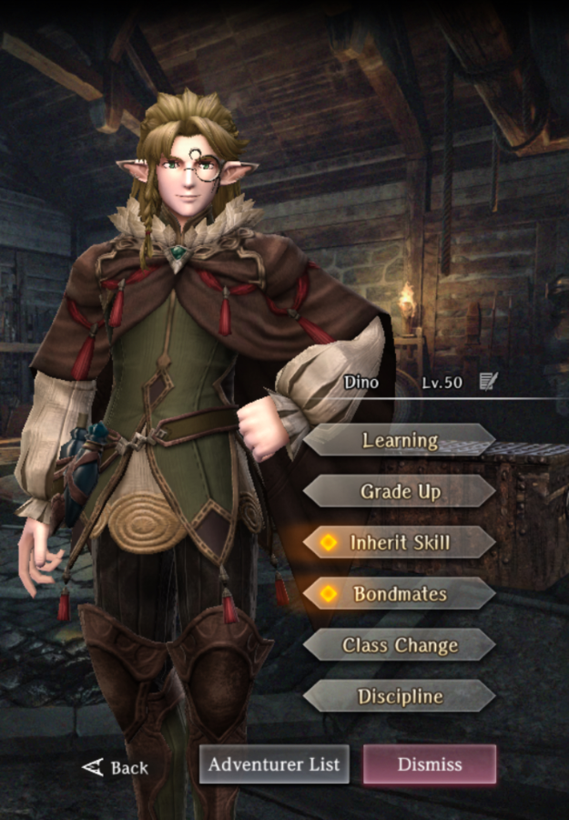

# Dino

**Race**: Elf  
**Gender**: Male  
**Type**: Air  
**Personality**: Neutral  
**Starting Class**: Mage  
**Class Change**: Thief  
**Role**: Damage, Support

??? info "Portraits"
    === "Mage"
        

    === "Thief"
        

## Skills

!!! info "Inheritable Skill"
    === "MONTINO"
        {{ get_skill_description('MONTINO') }}

!!! info "Potential Inherit"
    === "BALAFEOS"
        {{ get_skill_description("BALAFEOS") }}

!!! info "Unique Skill (Not Inheritable)"
    === "Magical Being Knowledge"
        {{ get_skill_description('Magical Being Knowledge') }}
        
!!! info "Discipline Skill"
    === "Unstoppable Curiosity"
        {{ get_skill_description('Unstoppable Curiosity') }}
