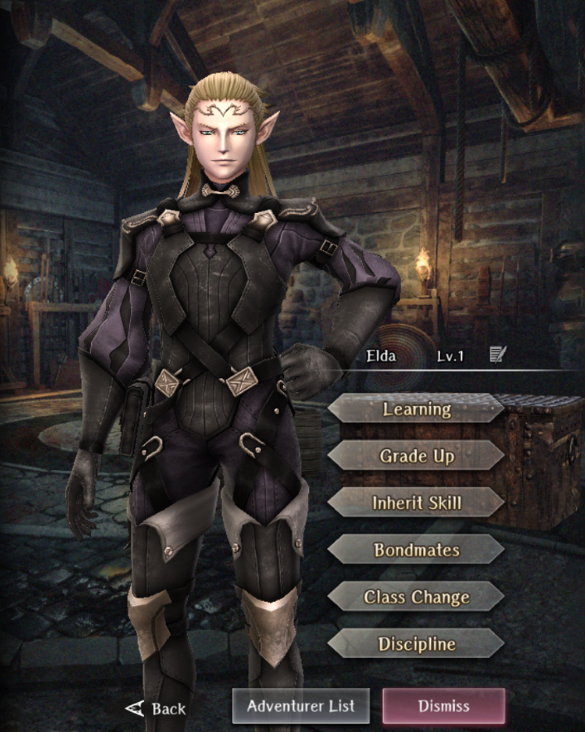

# Elda

**Race**: Elf  
**Gender**: Male  
**Type**: Dark  
**Personality**: Evil  
**Starting Class**: Fighter  
**Class Change**: Mage  
**Role**: Damage, Support

!!! info "Portraits"
    === "Fighter"
        

    === "Mage"
        

## Skills

!!! info "Inheritable Skill"
    === "Follow-Up Attack"
        Chance to increase Attack Rate during normal attacks (affected by luck). Probability increased based on skill level.

!!! info "Unique Skill (Not Inheritable)"
    === "Dark-Kin Blessing"
        Reduces dark type damage for elves in the same row.

!!! info "Discipline Skill"
    === "Cold-Blooded Elf"
        Continuously increases each stat, Surety and Sleep Tolerance increased further.