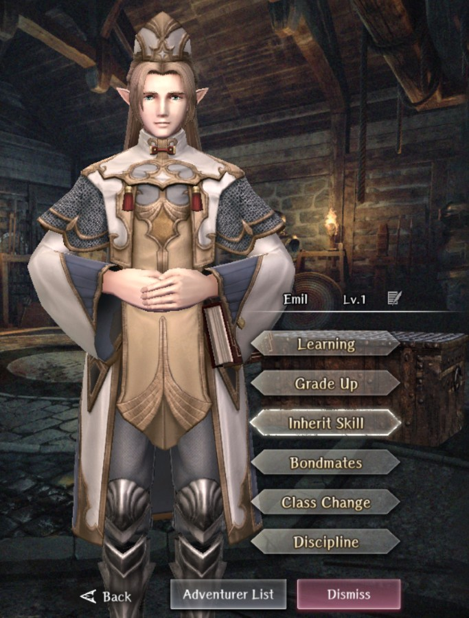

# Emil

**Race**: Elf  
**Gender**: Male  
**Type**: Light  
**Personality**: Good  
**Starting Class**: Priest  
**Class Change**: Mage  
**Role**: Healing, Support, Damage

??? info "Portraits"
    === "Priest"
        

    === "Mage"

## Skills

!!! info "Inheritable Skill"
    === "MADIOS"
        {{ get_skill_description('MADIOS') }}

!!! info "Potential Inherit"
    === "DIALKO"
        {{ get_skill_description("DIALKO") }}
        
!!! info "Unique Skill (Not Inheritable)"
    === "Light-Kin Blessing"
        {{ get_skill_description('Light-Kin Blessing') }}
        
!!! info "Discipline Skill"
    === "Pursuit of Prayer"
        {{ get_skill_description('Pursuit of Prayer') }}
