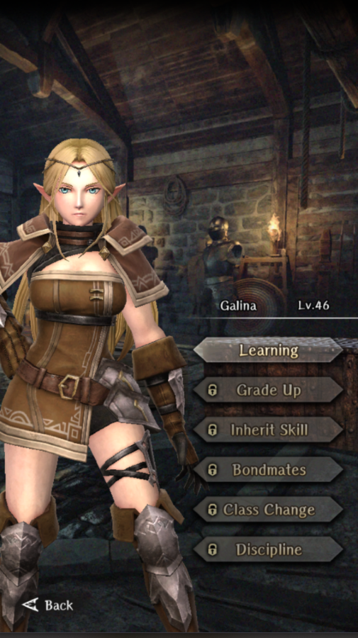

# Galina

**Race**: Elf  
**Gender**: Female  
**Type**: Earth  
**Personality**: Evil  
**Starting Class**: Priest  
**Class Change**: Fighter  
**Role**: Support, Damage

??? info "Portraits"
    === "Priest"
        

    === "Fighter"
        

## Skills

!!! info "Inheritable Skill"
    === "DIOS"
        Words of blessing that restore minor HP to 1 ally. Recovery amount increased based on skill level.

!!! info "Unique Skill (Not Inheritable)"
    === "Faith of the Wicked"
        Increases Critical Tolerance and Insta-Kill Tolerance for user and all adjacent evil allies.

!!! info "Discipline Skill"
    === "Unwavering Faith"
        Continuously increases each stat, Divine Power and Critical Tolerance increased further.