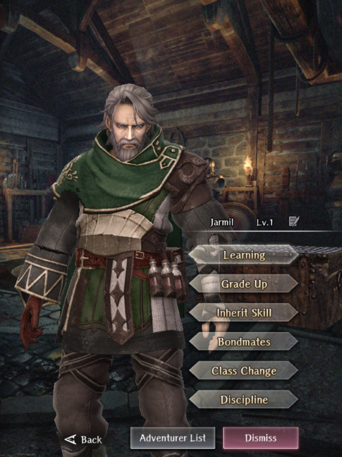

# Jarmil

**Race**: Human  
**Gender**: Male  
**Type**: Air  
**Personality**: Evil  
**Starting Class**: Mage  
**Class Change**: Thief   
**Role**: Damage, Support

!!! info "Portraits"
    === "Mage"
        

## Skills

!!! info "Inheritable Skill"
    === "FERU"
        Launches an orb of air that deals minor air spell damage to 1 enemy. Efficacy increased based on skill level.

!!! info "Unique Skill (Not Inheritable)"
    === "Air Formation"
        Boost damage dealt to earth type enemies to self and adjacent air type allies when there are at least 2 air type allies adjacent to the user.

!!! info "Discipline Skill"
    === "Crafty Old Mage"
        Continuously increases each stat. Magic Defense and Magic Power increased further.
