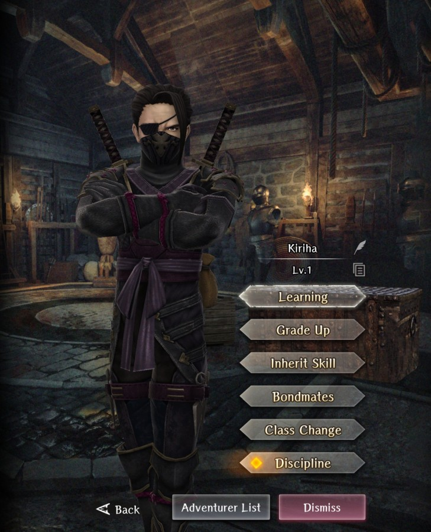
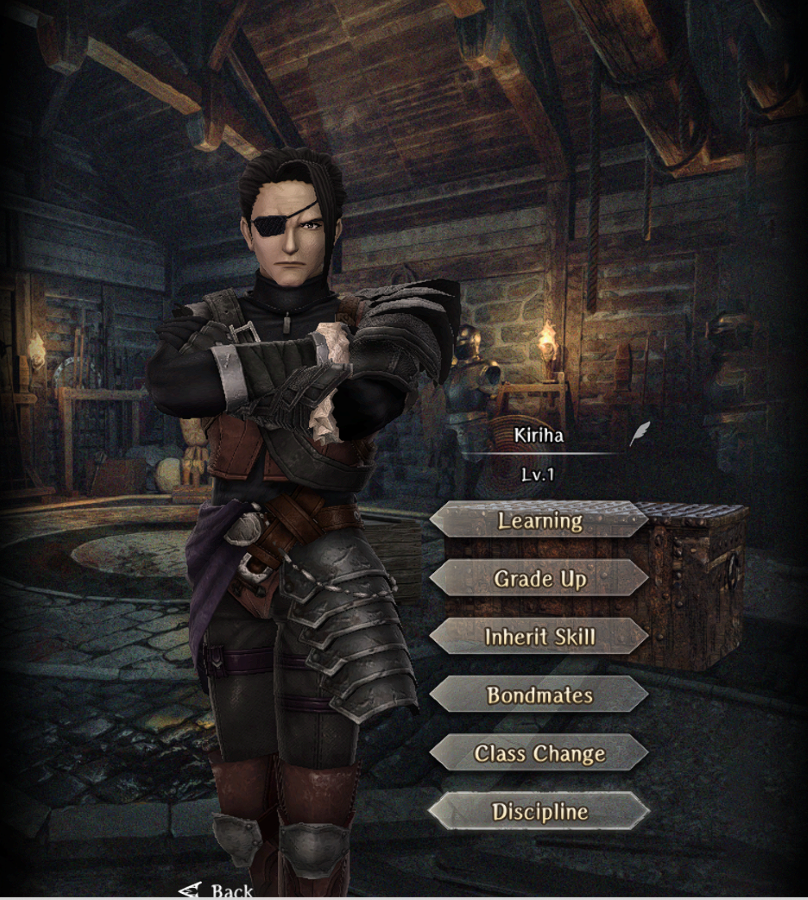

# Kiriha

**Race**: Human  
**Gender**: Male  
**Type**: Dark  
**Personality**: Evil  
**Starting Class**: Ninja  
**Class Change**: Fighter  
**Role**: Damage, Support

??? info "Portraits"
    === "Ninja"
        

    === "Fighter"
        

## Skills

!!! info "Inheritable Skill"
    === "Armor Pierce"
        {{ get_skill_description('Armor Pierce') }}
        
!!! info "Unique Skill (Not Inheritable)"
    === "Shadowy Alignment"
        {{ get_skill_description('Shadowy Alignment') }}
        
!!! info "Discipline Skill"
    === "Tradition in Shadows"
        {{ get_skill_description('Tradition in Shadows') }}
