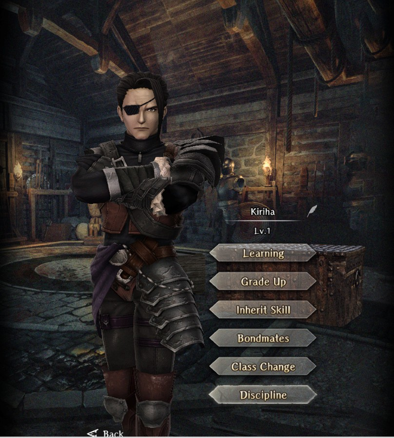

# Kiriha

**Race**: Human  
**Gender**: Male  
**Type**: Dark  
**Personality**: Evil  
**Starting Class**: Ninja  
**Class Change**: Fighter  
**Role**: Damage, Support

??? info "Portraits"
    === "Ninja"
        

    === "Fighter"
        

## Skills

!!! info "Inheritable Skill"
    === "Armor Pierce"
        {{ get_skill_description('Armor Pierce') }}

!!! info "Potential Inherit"
    === "Wild Throw"
        {{ get_skill_description("Wild Throw") }}

!!! info "Unique Skill (Not Inheritable)"
    === "Shadowy Alignment"
        {{ get_skill_description('Shadowy Alignment') }}
        
!!! info "Discipline Skill"
    === "Tradition in Shadows"
        {{ get_skill_description('Tradition in Shadows') }}

## Adventurer Reviews

??? info "Shiro's Analysis"

    Starting with his passive it’s great if we use Kiriha as ninja… otherwise he needs to play as a dagger fighter to benefit from it. Which isn’t the best option as for now.

    Moving to his discipline. It’s nothing amazing but a slight boost in evasion shows further that the idea about Kiriha was to make him as evasive as possible. I’m quite surprised devs didn’t go further to make him a thief.

    His class change is a fighter which is great because he can benefit well from few ninja passives while holding emergency buff cleanse from the enemy. Other than that he’s mostly just your normal dark fighter which is great for third abyss.

    To sum it up. Kiriha is one of your best options when you’ll be facing dark enemies and you’ll need a fighter. If you’re looking for one of the options for a general fighter he’s there. If you need a ninja and you don’t have Rinne or Yuzu, then it’s even better. Definitely one of your better choices all around especially if you feel that your MC is not enough as the only buff remover in your team.