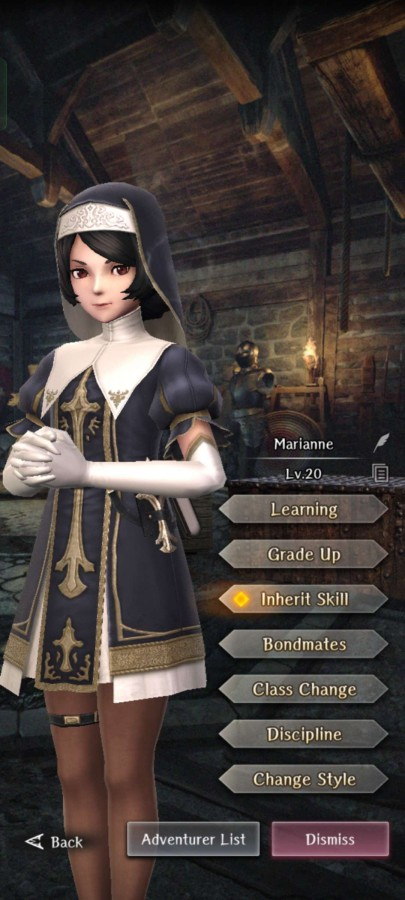

# Marianne

**Race**: Human  
**Gender**: Female  
**Type**: Air  
**Personality**: Good  
**Starting Class**: Priest  
**Class Change**: Mage  
**Role**: Healing, Support, Damage

??? info "Portraits"
    === "Priest"
        

    === "Mage"
        
<!--
    === "Greedy Saintess"
        
-->

## Skills

!!! info "Inheritable Skill"
    === "LATUMOFIS"
        {{ get_skill_description('LATUMOFIS') }}

!!! info "Potential Inherit"
    === "Way of the Priest"
        {{ get_skill_description("Way of the Priest") }}

!!! info "Unique Skill (Not Inheritable)"
    === "Frugal Faith (Standard)"
        {{ get_skill_description('Frugal Faith') }}

    === "Sacred Healer (Greedy Saintess)"
        {{ get_skill_description('Sacred Healer') }}

!!! info "Discipline Skill"
    === "Salvation through Wealth (Standard)"
        {{ get_skill_description('Salvation through Wealth') }}

    === "Sanctified Prayer (Greedy Saintess)"
        {{ get_skill_description('Sanctified Prayer') }}
