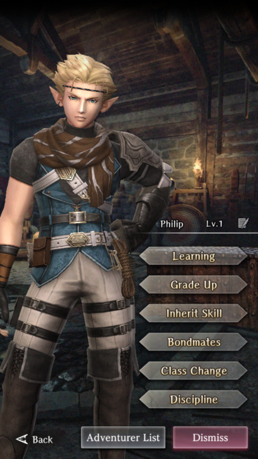

# Philip

**Race**: Elf  
**Gender**: Male  
**Type**: Water  
**Personality**: Neutral  
**Starting Class**: Thief  
**Class Change**: Fighter  
**Role**: Damage, Support

!!! info "Portraits"
    === "Thief"
        

    === "Fighter"

## Skills

!!! info "Inheritable Skill"
    === "Delay Attack"
        Minor physical attack on 1 enemy. Chance to decrease Action Speed based on the user's Dexterity. Efficacy and probability increased while Action Speed further decreased based on skill level.

!!! info "Unique Skill (Not Inheritable)"
    === "Presence of Mind"
        Attacks become more likely to hit, even enemies that are out of range.

!!! info "Discipline Skill"
    === "Master of the Hunt"
        Continuously increases each stat, Attack Power and Action Speed increased further.