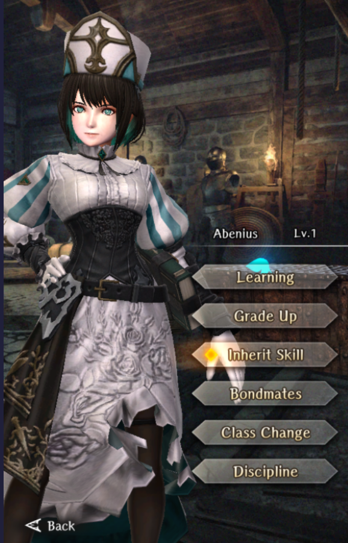

# Abenius

**Race**: Human  
**Gender**: Female  
**Type**: Light  
**Personality**: Good  
**Starting Class**: Fighter  
**Class Change**: Priest 
**Role**: Damage, Support

!!! info "Portraits"
    === "Fighter"
        

    === "Priest"
        

## Skills

!!! info "Unique Skill (Inheritable)"
    === "Flutterdream Flash"
        Minor physical attack on 1 enemy at the start of battle. Low chance decreasing Accuracy Rate. Activation rate reduction, and the amount damage and Accuracy Rate decrease, are reduced if learned by someone other than Abenius.

!!! info "Unique Skill (Not Inheritable)"
    === "Flickering Fang"
        Increases damage against magical beasts and decreases damage from magical beasts.

!!! info "Discipline Skill"
    === "Blessing of Owen"
        Continuously increases each stat, Attack Power and Confusion/Charm Tolerance increased further.

## Adventurer Reviews

??? info "TheAxolotl's Analysis"

    Abenius is a strong damage dealer with the potential to provide some buff support, which is very welcome. Being a Fighter, she gains access to the highest Strength -> Attack Power conversion, on top of some solid damage multipliers and Full-Power Strike. Furthermore, she gains Attack Power with her Discipline levels, which is great.

    The passive damage boost from her Flickering Fang skill appears to be roughly in the 20% ballpark, although we're still testing out slayer sill damage. This has the potential to be a solid damage increase for her given how frequently we run into magical beasts. The big difference between this and something like a damage boost to Entites or Undead is that the latter start out with innate resistance to physical weapons, while the former doesn't. In many cases, this could end up as a "kill harder" bonus where the damage boost is effectively wasted because you already would have done enough damage to the enemy. It'll definitely be more valuable against magical beast bosses, though. Unfortunately, this skill only boosts her own damage and does not extend to party members.
    
    Her Flutterdream Flash skill is extremely unique and fun. It's a "Minor physical attack" that has enough potency to outright kill a weaker enemy at the start of battle or to take out a nice chunk of health. In addition, the accuracy debuff can be very handy, especially when stacked with something like DILTO. It's unfortunate that this skill is only one use per fight. Abenius will always trigger this skill at the start of the battle unless the battle starts with an ambush, however when inherited to another adventurer, the activation rate and damage drops significantly (roughly 20% on the activation and damage is reduced to roughly 60% of a basic attack). Note that skill inheritance increases the damage of the skill, as well as the amount of accuracy reduced, but it does not increase activation rate or the chance to trigger the accuracy reduction.

    Abenius' class change of a Priest may seem like an odd one at first glance, but it's worth dipping into for some added buff support on top of gaining Priest Weapon Mastery for a minor passive Attack Power increase. Given that we now have seen katanas with Attack Power and Magic Power on them, it's not outside of the realm of possibility that we'll get future weapons with Attack Power and Divine Power, which would be a perfect fit for Abenius to use.

    One of the things I really like about Abenius is that her signature skill does not lose value as additional skills get released in the future due to its nature of being an automatic trigger at the start of battle and not an active skill that could become easily powercrept by future active skills (I'm looking at you, Gerard).

??? info "Frobro's Analysis"
    
    Certainly more interesting than most other figures. For starters, Like Yekaterina, Abenius has been extremely lucky with the kinds of enemies and events that have been common in the game from Abyss 2 to 3. Abenius does extra damage and receives reduced damage from solid chunk of common enemies thanks to her, Magical Beast-slayer passive. This feels even stronger with the ease of farming and crafting the perfect Horned Eagle Sword from Fordraig.

    Flutterdream Flash may seem low impact in a vacuum, but if you stop and realize that it is a guaranteed turn 0 hit in every single non-ambush battle, you notice that Abenius likely has done more lifetime damage of most units in the game. I understand the hesitation, but this is a solid use for Codexes assuming you use Abenius often. You’ll get your money’s worth from it so to speak.

    The discipline is cool, it seems like with the release of abyss 3, going forward we can expect to see more enemies use status ailments against us. Being resistant to 2 of the more debilitating statuses for physical attackers (Charm/Confuse) while getting more attack comes off as better than most. 

    Simple but effective. Not exactly flashy, but still one of the best fighters in the game.

## Adventurer Pull Plans

??? note "TheAxolotl's Pull Plan"
    I like Abenius' kit so I pulled three copies - one for the base, one for the OCD Discipline, and one to inherit to MC.

??? note "Lynd's Pull Plan"
    She's hot so I pulled immediately. At some point I blanked out and she had some discipline levels and Inherit leveled. I'll max her when she rolls around again.
    
## Duplicate Usage

* Increasing her Discipline to increase her Attack Power.
* Inherit on her own skill will increase the damage and accuracy reduction amount of her Flutterdream Flash.