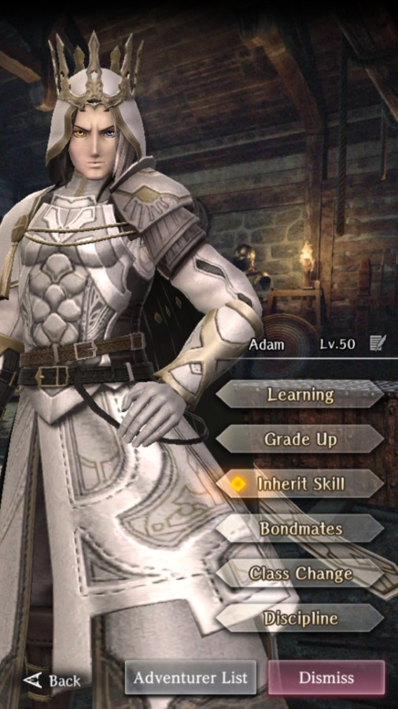
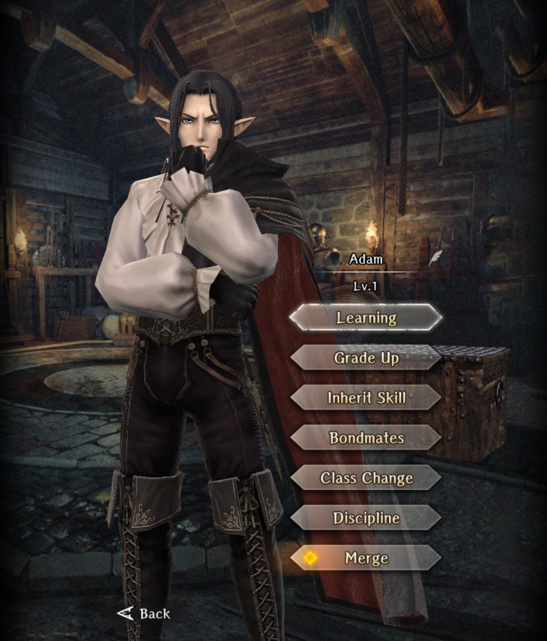

# Adam

**Race**: Elf  
**Gender**: Male  
**Type**: Light  
**Personality**: Evil  
**Starting Class**: Mage  
**Class Change**: Priest  
**Role**: Damage, Support

??? info "Portraits"
    === "Mage"
        

    === "Priest"
        

    === "Mage After Personal Request"
        

    === "Priest After Personal Request"
        

    === "Millennial Lord"
        
        
## Skills

!!! note
    If standard Adam and Millennial Lord Adam are merged, changing styles will swap each skill.

!!! info "Unique Skill (Inheritable)"
    === "Wisdom of Truth"
        {{ get_skill_description('Wisdom of Truth') }}

    ??? note "This skill removes the dampening from spells that deal element type damage as well as the damage caused by element type skills and when using elemental weapons."

!!! info "Unique Skill (Not Inheritable)"
    === "Knowledge of the Millennial Lord (Standard)"
        {{ get_skill_description('Knowledge of the Millennial Lord') }}
    
    === "Light Shaft's Radiance (Millennial Lord)"
        {{ get_skill_description("Light Shaft's Radiance") }}

        !!! note
            This damage increase is two-part, with the first part being approximately 10% and the second part being approximately 15%.

!!! info "Discipline Skill"
    === "Will of the Millennial Lord (Standard)"
        {{ get_skill_description('Will of the Millennial Lord') }}

    === "Twilight of the Long-Lived Race (Millennial Lord)"
        {{ get_skill_description('Twilight of the Long-Lived Race') }}

## Adventurer Reviews

??? info "TheAxolotl's Analysis"

    === "Standard"

        Adam provides very consistent damage and longevity for a mage due to his two unique skills. Reducing the dampening of damage means he's not as impacted when fighting enemies that are strong against Light damage. His main downside is that he innately only can deal Light damage. This can be offset by inheriting some single target spells that deal other elements of damage, however without the inheritance, he will only have an elemental advantage against enemies weak to light.

        Changing his class to Priest will give him a wider selection of spells, as well, making him a very well-rounded Adventurer for support or damage purposes.

        His inheritable unique skill gets an extra nod in that if it is inherited by another character, that character will receive the full bonus of the damage dampening. This has some nice quality of life potential to boost the damage dealt by the MC (or your favorite damage dealers) against unfavorable element type matchups when they weild elemental weapons. Note that this skill does not have any impact on Undead or Entity resistance to non-spell attacks.

        Compared to Yekaterina, his damage will generally be more consistent, and he will be able to cast more spells overall, however he will be missing out on the bonus damage to undead and multiple innate elemental type coverages. This can be overcome by inheriting other spells on him to give him additional elemental coverage. Early game, the extra longevity will be nice, but will become less relevant as MP pools get higher and MP potions become obtainable. Still, he's an excellent pull and you have many options for spending his duplicates.

    === "Millennial Lord"

        Millennial Lord Adam is our third mergeable adventurer and a surprisingly solid sidegrade to the standard Adam. Madam's Discipline is weaker and may present a mental hurdle for folks that have invested heavily into the Standard Discipline, however his gains conditionally offset that loss.
        
        In particular, Light Shaft's Radiance gives a nice conditional damage boost that has two primary components to it. The first is an Elise and Milana-style column boost of ~10% to himself and the paired Light adventurer. This skill is not like Rinne's where it's active for her all the time. Adam must be paired with a Light type adventurer for either of them to see the bonus. As of now, the biggest candidate for this pairing is Abenius. The second component of this buff kicks in when facing a Dark type enemy, and that's an additional ~15% damage boost that behaves similarly to the Formation skills.

        Unlike Holiday Flut, who was generally considered worse than standard Flut, this skill change makes Adam a solid conditional support for Abenius (and other future Light type adventurers), even more so when facing Dark type enemies. One big consideration, though, is that his damage buff does nothing to reduce damage received from Dark type enemies, so running Adam in situations where he could die quickly (such as late in the Fortress and Catacombs) would still be just as risky. The second big consideration is right now, there are very few situations where you'd really be able to take advantage of the additional ~15% damage due to there not being too many major Dark type fights. The biggest one at the moment is going to be Morgus.

        Personally, I actually think Madam is stronger than Adam since I put relatively little value on Discipline, however I still probably wouldn't have a spot for him in my party unless I was building something explicitly for a single fight.

??? info "Frobro's Analysis"

    === "Standard"

        Seriously, how is this guy evil-aligned again? Whatever, I’ll try to make this one short, Shelirionach took his job!

        Adam is positioned as this sorta damage-focused Mage compared to others. As a light element mage, his spells tend to hit most things for neutral, but in the rare occasion that it is resisted, his Wisdom of Truth overrides it. Because his Knowledge of the Millennial Lord passive gives him a cost reduction in the narrow band of 3-10MP cost spells, he is allowed to use single-target and row-target damaging spells a little more carelessly than other mages even when the type matchups are out of his favor. With the stacked MP savings, he is also slightly more enabled to use his “delete all” button, Secrets of Laforos which he has just ‘cuz.

        To offset his fragility as a elf mage he has an RNG-based damage mitigation skill baked into his inherit skill. This means he can feel that much tankier than other mages when using a 2-hand staff instead of a 1-hander and shield. Adam also has a strong discipline focus of Magic Power and Action Speed. Hit harder and faster, no complaints.

        Now, do you know who else is damage spell spamming, RNG damage mitigating, Mag Power + ASPD focused demon from hell? It doesn’t help that she uses Adam’s Wisdom of truth better than he does. Adam could just cast other elemental spells when needed, but Shelirionach’s Slumbering Darkness is always dark. In the end, there are worse things to be than the 2nd best at a particular role.

    === "Millennial Lord"

        I figured Legendary alts would be straight upgrades after Wandering Princess Lanavaille, but this is a sidegrade at best and a downgrade if you already have high discipline on Adam. This new discipline focus is worse; MP & ASPD would have suited him better if they wanted to go for something that’s good for both Priest & Mage. The column buff is cool, but it really only has 3 good targets for it right now and light in particular feels like the worst elemental type to be.

        If you want to switch MC to light and pretend you and your husbando are righting wrongs, holding hands and spreading light throughout the world of Wizardy; this is the unit for you! Otherwise, a mage who isn’t Shelirionach? SKIP!

??? info "Karkarov's Analysis"

    === "Millennial Lord"

        "So the new alt skin character is revealed and it is ... MADAM!  For some this may be bad news, but Adam as a character has always been underrated in my view.

        Only two things have changed (outside aesthetics) for Madam, the discipline is now MP and Resistance boosted, and the unique skill gives a column damage buff if both members of the column are Light Element.  Compare this to original Adam whose discipline is argueably the best a Mage can get Magic Power and Action Speed boosted, and a unique skill that reduces MP cost on spells that are 3-10 MP.

        As a result, it is clear that Madam on paper is not a straight upgrade to Adam unlike Wana and Lana.  The discipline is simply worse than normal Adam, but Madam has a superior unique skill with damage buff potential, even more so when fighting Dark Element enemies.  It is situational however and relies on your party comp using a strong front line Light character such as Abenius.  If you do have the party make up to support it, there is more long term value there than the normal Adam's MP reduction skill.  Also who knows what characters will be introduced long term and how this will impact future value.

        Ultimately I think Madam is a better character than Adam, and I would rate him from a ""just the character"" evaluation as the second best Mage in the game at this time (6/19/25).  He is still not up to par with our Sleepy Queen Sheli, but he is closer than other Mages.  Madam is a character that will show their true value months after their release, it will depend on what Drecom releases and if more strong Light front liners are imminent."									

??? info "Shiro's Analysis"

    === "Standard"

        Starting with inheritance we got one of best possible picks in the game that I absolutely recommend to have on everyone you use on at least lvl 1. Not only it removes dampening of damage but it gives you (rng based) reduction of damage and bonus MP. The removal of dampening is game changing for any elemental skills/weapons/mages which lets you go against enemies that usually would resist you without DMG drop. On top of that damage reduction while rng based gives you better long run survivability especially if you have other sources of damage reducing passives/skills. At the same time it’s Adam's weak point because his inheritance is so good that it’s generally better to invest it in your team over investing in him.

        Moving on his passive it's a great economy helper that shines mostly in first and second abyss. Sadly for whatever reason it’s capped on 10 cost abilities thus reducing its impact on third abyss. Unless the values won’t change it basically means that from the third abyss onward his passive is basically non existent.

        Moving to discipline while it’s great to have magic power and SPD the difference between it and base disc stat growth is minimal so it’s nothing to write poems about. It’s nice but that’s all.

        His class change is priest which is the best available class change for mages. It gives access to MP based cleanse and supportive skillset. And if you don’t have good gear for mages but you have some good light armor gear pieces it allows you for more flexibility when you stay in this class. Absolutely one of best class synergies in the game.

        To sum it up Adam is an amazing mage and I’d say he’s among five best mages we have in the game right now (2025). If you do like him then he’s definitely worth investing and using. But if you want to go for the best pick it might be better to use him as inheritance and go with other mages like Alice, Miliana or Sheli. In the end it's a matter of personal preference. But Adam is never a wrong choice or bad pull.

    === "Millennial Lord"
    
        Madam is a great alternative to Adam. That’s if you use his passive. Basically if you use Debra, Clarissa or Abenius as damage dealer you can push their DMG really hard against dark enemies just by having him behind them which is a really solid option and upgrade over his normal passive in later parts of the game. But that’s only if you have a light adventurer to support.

        As for his discipline it’s downgraded for mage class while it’s upgraded towards his priest class. You can’t go wrong with more MP and having a bit more resistance even if highly unlikely might make a difference one day.

        To sum up Adam's alternative costume is much less of a solo/ego character and seems to lean to be a good priest option, and honestly? It’s one of the best ones if you can make use of it. Definitely a must pull for Adam fans but in the end it matters how well you can fill him in the team and whenever you have or not other options that fit you better.

## Adventurer Pull Plans

??? note "TheAxolotl's Pull Plan"
    While I like the changes to Adam's kit here, he's likely a pass for me just because I'd be hard-pressed to fit him in my party most of the time. There's a chance I'll decide to try to pull just for the situational use in the future, but it's fairly unlikely.

??? note "Karkarov's Pull Plan"
    Do you love goth boys with a strong boot game and cape?  Is Abenius a mainstay in your parties front line?  Do you actually need a strong Mage and have not fully invested in one yet, and this banner is running?  Then Madam is the man for you!  However if none of that applies... then you should give this banner a pass in my opinion. Madam on his own is not strong enough to be a recommended pull, but if your party comp synergies with his unique skill you should definitely consider pulling for this fine gentleman.									

## Duplicate Usage

* If you like Adam and plan to use him on your team, boosting his Discipline level will increase his damage
* Inherit his skill on your MC for some nice QoL gains
* Inherit his skill on your other favorite damage dealers or save for future use
