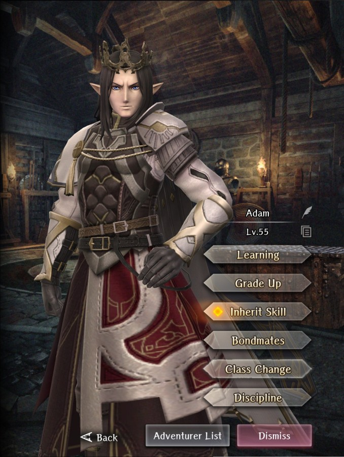
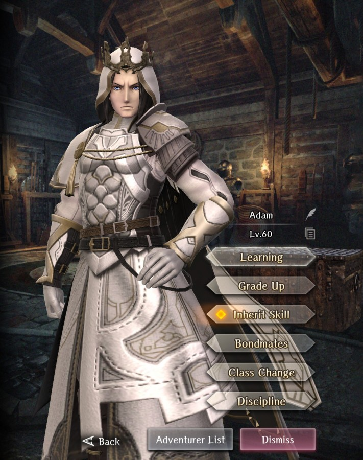
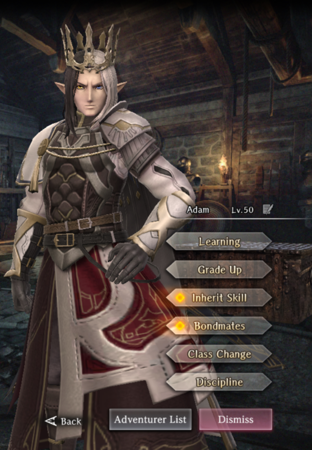
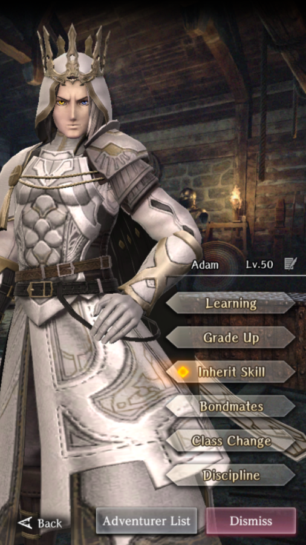

# Adam

**Race**: Elf  
**Gender**: Male  
**Type**: Light  
**Personality**: Evil  
**Starting Class**: Mage  
**Class Change**: Priest  
**Role**: Damage, Support

??? info "Portraits"
    === "Mage"
        

    === "Priest"
        

    === "Mage After Personal Request"
        

    === "Priest After Personal Request"
        
        
## Skills

!!! info "Unique Skill (Inheritable)"
    === "Wisdom of Truth"
        {{ get_skill_description('Wisdom of Truth') }}

!!! info "Unique Skill (Not Inheritable)"
    === "Knowledge of the Millennial Lord"
        {{ get_skill_description('Knowledge of the Millennial Lord') }}

!!! info "Discipline Skill"
    === "Will of the Millennial Lord"
        {{ get_skill_description('Will of the Millennial Lord') }}

## Adventurer Reviews

??? info "TheAxolotl's Analysis"

    Adam provides very consistent damage and longevity for a mage due to his two unique skills. Reducing the dampening of damage means he's not as impacted when fighting enemies that are strong against Light damage. His main downside is that he innately only can deal Light damage. This can be offset by inheriting some single target spells that deal other elements of damage, however without the inheritance, he will only have an elemental advantage against enemies weak to light.

    Changing his class to Priest will give him a wider selection of spells, as well, making him a very well-rounded Adventurer for support or damage purposes.

    His inheritable unique skill gets an extra nod in that if it is inherited by another character, that character will receive the full bonus of the damage dampening. This has some nice quality of life potential to boost the damage dealt by the MC (or your favorite damage dealers) against unfavorable element type matchups when they weild elemental weapons. Note that this skill does not have any impact on Undead or Entity resistance to non-spell attacks.

    Compared to Yekaterina, his damage will generally be more consistent, and he will be able to cast more spells overall, however he will be missing out on the bonus damage to undead and multiple innate elemental type coverages. This can be overcome by inheriting other spells on him to give him additional elemental coverage. Early game, the extra longevity will be nice, but will become less relevant as MP pools get higher and MP potions become obtainable. Still, he's an excellent pull and you have many options for spending his duplicates.

??? info "Frobro's Analysis"

    Seriously, how is this guy evil-aligned again? Whatever, I’ll try to make this one short, Shelirionach took his job!

    Adam is positioned as this sorta damage-focused Mage compared to others. As a light element mage, his spells tend to hit most things for neutral, but in the rare occasion that it is resisted, his Wisdom of Truth overrides it. Because his Knowledge of the Millennial Lord passive gives him a cost reduction in the narrow band of 3-10MP cost spells, he is allowed to use single-target and row-target damaging spells a little more carelessly than other mages even when the type matchups are out of his favor. With the stacked MP savings, he is also slightly more enabled to use his “delete all” button, Secrets of Laforos which he has just ‘cuz.

    To offset his fragility as a elf mage he has an RNG-based damage mitigation skill baked into his inherit skill. This means he can feel that much tankier than other mages when using a 2-hand staff instead of a 1-hander and shield. Adam also has a strong discipline focus of Magic Power and Action Speed. Hit harder and faster, no complaints.

    Now, do you know who else is damage spell spamming, RNG damage mitigating, Mag Power + ASPD focused demon from hell? It doesn’t help that she uses Adam’s Wisdom of truth better than he does. Adam could just cast other elemental spells when needed, but Shelirionach’s Slumbering Darkness is always dark. In the end, there are worse things to be than the 2nd best at a particular role.

## Duplicate Usage

* If you like Adam and plan to use him on your team, boosting his Discipline level will increase his damage
* Inherit his skill on your MC for some nice QoL gains
* Inherit his skill on your other favorite damage dealers or save for future use
