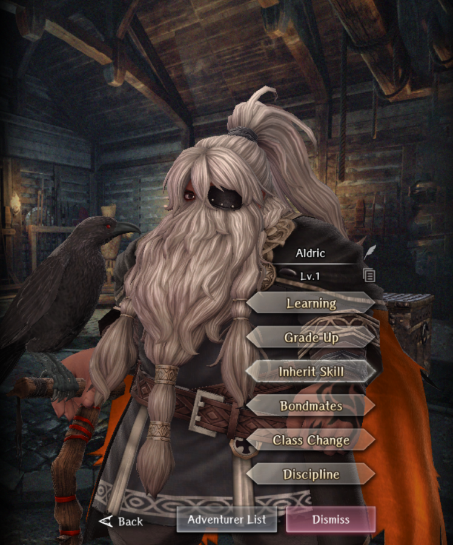

# Aldric

**Race**: Dwarf  
**Gender**: Male  
**Type**: Air  
**Personality**: Neutral  
**Starting Class**: Thief  
**Class Change**:  
**Role**: Support, Damage

??? info "Portraits"
    === "Thief"
        

## Skills

!!! info "Unique Skill (Inheritable)"
    === "Wisdom of the Crafty Old Dwarf"
        {{ get_skill_description('Wisdom of the Crafty Old Dwarf') }}

        | Level | Detect/Disarm Trap/Evade Trap (self) | Detect/Disarm Trap/Evade Trap (inherited) |
        |:-----:|:------------------------------------:|:-----------------------------------------:|
        |   1   |                 2/5/2                |                   1/3/1                   |
        |   2   |                                      |                   2/5/2                   |
        |   3   |                                      |                   4/9/4                   |
        |   4   |                                      |                   6/11/6                  |
        |   5   |                                      |                   8/15/8                  |
        |   6   |                                      |                  10/17/10                 |
        |   7   |                                      |                     -                     |

!!! info "Unique Skill (Not Inheritable)"
    === "Blunt Combo Strike"
        {{ get_skill_description('Blunt Combo Strike') }}

!!! info "Discipline Skill"
    === "Adept's Rule of Thumb"
        {{ get_skill_description("Adept's Rule of Thumb") }}

## Adventurer Reviews

??? info "TheAxolotl's Analysis"

    Aldric has the potential to be a solid addition to our legendary adventurer lineup, despite the fact that so many people thought he was going to be a Samurai for some reason. Thank you devs for teasing everyone with your silhouettes. There are quite a few unknowns around his damage scaling, but in general, I personally think Aldric is the first legendary thief that actually looks like they're great at doing what thieves are supposed to do, which is opening chests.

    His damage skill, Blunt Combo Strike, is very unique, but it is also what we're currently least clear on. First, what we do know:
    
    * Both the initial minor attack and the crow attack are impacted by weapon range and surety, as well as Slayer buffs, with the caveat that weapon range is currently being treated as if holding a Spear. Not sure if this is by design or a bug.
    * The initial minor attack can trigger procs like Corrosion Dagger, Mace of Tumult, and Staff of Weakness, but the crow attack cannot.
    * The initial minor attack is not forced to a single hit and instead uses the number of hits provided by the weapon, plus an additional hit for the crow. For example, using a 2-hit weapon, his skill hits a total of 3 times and using a 3-hit weapon, his skill hits a total of 4 times
    * Despite the `Details` page of this skill indicating that there are efficacy increases with higher skill levels, since this is his non-inheritable skill, it is currently locked at level 1, so we can't actually increase its skill level.

    The evade and counter component of this skill is also pretty negligible. While it is boosted by an Alice inherit, it's only actually going to provide damage if he evades something, which means he needs to be attacked by an attack that can be evaded and countered. If this does actually happen, it'll be crow damage, which is nice. Unfortunately, it's not going to be too reliable.

    As far as what we don't know, we really have no idea how the damage of either component scale at higher attack power levels. Since the initial attack on his skill is credited as a `Minor` attack, my suspicion is it'll see its power soft cap at around 300-350 attack power. The crow component on the other hand is different and I suspect behaves more like Sheli's sleepy nuke. More testing needs to be done here, though. I'll update this section as we learn more.

    Moving on to his inheritable skill, Wisdom of the Crafty Old Dwarf is tailored towards being a thief, which is great. That being said, the actual increases are pretty small. On him at skill level 1, it increases his Detect and Evade Trap each by 2 and his Disarm Trap by 5. These are reduced to 1, 1, and 3 respectively when inherited to someone else. The table above will gradually get filled out as we see what the inherited value increases are. The downside of this skill is that it's a pretty low value - on him, it's roughly equivalent to a single Bakesh inherit and a bit over 2 Jean inherits. One someone else, it's roughly equivalent to 1/2 Bakesh and 1 Jean inherit.
    
    His Discipline skill, Adept's Rule of Thumb, is going to be very similar to his inherit in that it'll be improving his disarming abilities at a minor rate. Detect and Disarm Trap are definitely two of the stats that get better value out of Discipline, but it's still going to be a relatively low value per dupe in general.

    The biggest hurdles that Aldric needs to overcome are the fact that he's a thief and the fact that there's already a lot of competition for both rows within a party. Many veteran players stopped using thieves quite a long time ago and have instead made MC or a ninja their disarmer. As such, his value is going to be relatively low for parties with established disarmers. Given the uncertainty at this point around his damage longevity, it's hard to immediately recommend him as a long-term member in a party since thief damage drops off pretty significantly in the later content. That being said, if you want to run a thief, he's going to be the best thief in the game right now at doing a thief's job of disarming traps. If you use a ninja like Rinne as your disarmer instead, inheriting him to her definitely couldn't hurt, but he's also a fairly easy skip.

??? info "Frobro's Analysis"

    Well, well well; he’s a thief alright. If opening chests is what you need, this guy has the capacity to be the best in the game at it. Both a chest opening-based discipline focus and inherit; all function, no flash. It's not a particularly tempting offer given the alternative of “git gud” costs $0, but maybe future chests will be difficult for non-chest specialized thieves to open? Is this what the streets wanted; A chest opening legendary?

    Now that unique is something; it’s kinda like Sheli’s if you squint. It's a decently strong attack that kinda costs 0sp to use but has a prerequisite attached to it and you can’t cast it directly…mostly. I am of course referring to the Bird-counter part of the attack specifically. After the turn you use the skill, you need to be targeted by an attack that can be evaded & counter-attacked and you must evade the attack. A few things need to go your way to get more than 1 bird hit, but it is possible and you are guaranteed 1 on the turn you use the skill so it can seem like an equivalent to Sheli’s at a glance. Defense penetration can be incredibly strong. The Bird’s damage is subject to the range penalty if you don’t have a bow equipped and its damage doesn’t seem tied to ATK power. Exactly how good this skill is, and by extension how good Aldric’s damage is relative to the field, depends heavily on how much damage Bird does at higher levels as some part of it scales with DEX. 

    Beyond that, as a standalone skill…yikes. It’s Black Beast Feint that replaces the row aggro ailment with a minor attack + 1 bird hit for 5 more SP. You’d have to use high-leveled Attract Hit or Defensive Provoke separately to expect to get max value from this skill. So now you need to inherit an Alice to extend the buffs for maximum effect. Also, this skill cannot be leveled up with codexes so it really relies on how Bird scales with DEX. Compared to Slumbering Darkness’s easy prerequisite, direct MAG power scaling and negative MP cost, it really feels like the devs dropped some hot “mid” again.

    Despite the rant, Aldric is probably the best thief in the game, but not so much so that many veteran players are replacing their invested thief over.

## Adventurer Pull Plans

??? note "TheAxolotl's Pull Plan"
    I'm likely going to skip him. Maybe I'll get lucky with the free bones, but unless his damage proves to be somehow incredible at higher power levels, I don't see a good way to fit him into my current party. His inherit would be nice to throw on my Rinne, but I don't think the actual value increases are enough for me to want to spend my gems on.
    
## Duplicate Usage

* If you use him, increasing his Discipline is potentially going to be more effective for his disarming capabilities than his inherit is, but not 100% sure on this yet.
* If you don't plan to use him but end up pulling a few copies, might as well give them to your favorite established disarmer.