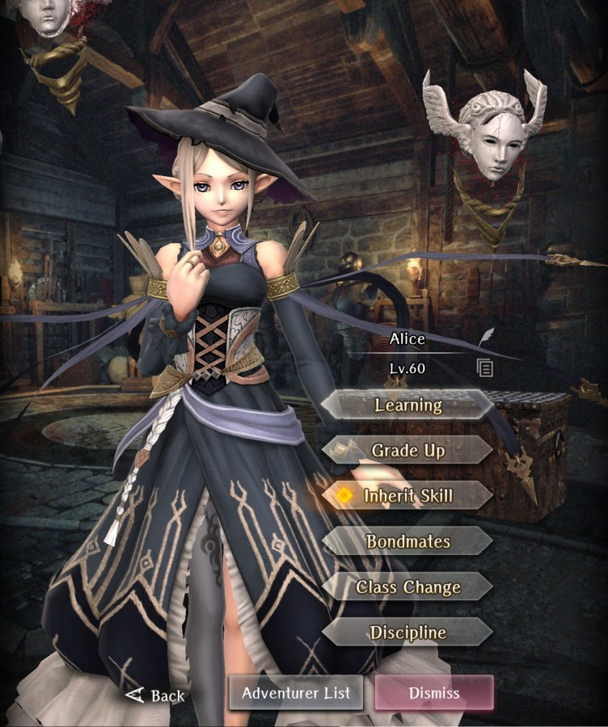

# Alice

**Race**: Elf  
**Gender**: Female  
**Type**: Water  
**Personality**: Evil  
**Starting Class**: Priest  
**Class Change**: Mage  
**Role**: Healing, Support, Damage

??? info "Portraits"
    === "Priest"
        

    === "Mage"
        

## Skills

!!! info "Unique Skill (Inheritable)"
    === "Blessing of Agora"
        {{ get_skill_description('Blessing of Agora') }}
        
        | Level | Turn Count Increase (self) | Cumulative Turn Count Increase (self) | Turn Count Increase (inherited) | Cumulative Turn Count Increase (inherited) |
        |:-----:|:--------------------------:|:-------------------------------------:|:-------------------------------:|:------------------------------------------:|
        |   1   |              1             |                   1                   |                1                |                      1                     |
        |   2   |              0             |                   1                   |                0                |                      1                     |
        |   3   |              1             |                   2                   |                0                |                      1                     |
        |   4   |              0             |                   2                   |                0                |                      1                     |
        |   5   |              1             |                   3                   |                1                |                      2                     |
        |   6   |              0             |                   3                   |                0                |                      2                     |
        |   7   |              1             |                   4                   |                -                |                      -                     |

!!! info "Unique Skill (Not Inheritable)"
    === "Agent of Heresy"
        {{ get_skill_description('Agent of Heresy') }}

        !!! note
            This damage increase is approximately 10%.

!!! info "Discipline Skill"
    === "Magic of the Dark One"
        {{ get_skill_description('Magic of the Dark One') }}

## Adventurer Reviews

??? info "TheAxolotl's Analysis"
    
    Alice is a fantastic unit to pull, and will likely be a staple in most folks' parties for a long while. Not only is she our first Legendary priest, but both of her skills are fantastic. Increasing her buff/debuff turn count by 1 means she gets an extra turn to heal, deal damage, or apply another buff/debuff before needing to reapply the initial. Furthermore, her damage increase to a row can apply to many af our strongest damage dealers.

    Changing her class to Mage will give her a wider selection of spells, as well, making her a very well-rounded Adventurer for support or damage purposes.

    To make things even better, many other characters will benefit from Alice duplicates. Inheriting her skill on your other favorite buffers/debuffers will allow them to each provide an extra turn for their buffs/debuffs!

    The turn duration increase from her Blessing of Agora skill adds one to the counter at rank three (on Alice, rank 5 on non-Alice), so it's possible to get at least a 5-turn duration on buffs and debuffs, which adds to the strength increasing her skill through inheritence.

    If you pull Alice, she will be a fantastic addition to your team!

??? info "Frobro's Analysis"

    Simple but effective. It didn’t take much to be the best in slot at what she does. Optimized stat line from Water/Elf/Female and has the ideal double caster class set. The best buffer/debuffer in the game; being able to reach a turn cap that other characters cannot. A rock-solid unit when used and desirable inherit when not. 

    A passive 10% damage increase with an easily met condition for the whole row. Has access to an, as of now unreleased spell with her Secrets of Labadios just ‘cuz. An alright discipline focus with Divine Power and Magic Def; not good, not bad. The MP gains from leveling up Blessing of Agora feels like she has 3rd discipline anyway.

    You can change her into a mage (after learning all priest spells first) and sacrifice some HP/armor and gain some MP and the entire suite of mage spells, with practically no loss of healing potency.

    There isn’t much to say; this chick excels in the roles that units like her were designed to play and has some staying power with her inherit should the game ever shift to being more buff/debuff-centric.

## Duplicate Usage

* Inherit her skill on other buffers/debuffers you use. This is a great inherit for almost any adventurer, and extends the duration of most time-based abilities including Warrior's Battle Cry, Mental Unity, and even the Knight's three Cover skills.
* If you plan to use Alice, increasing her Discipline will increase her damage and healing.
* Save for future use.