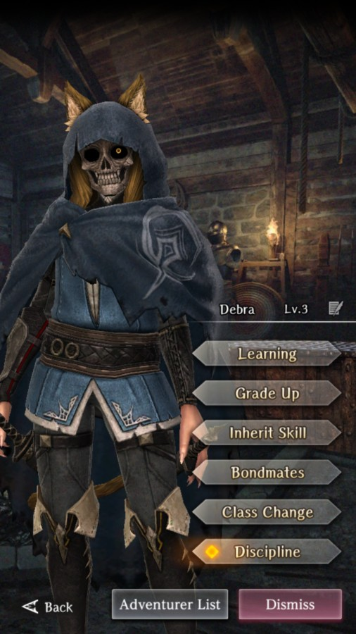

# Debra

**Race**: Beastfolk  
**Gender**: Female  
**Type**: Light  
**Personality**: Neutral  
**Starting Class**: Thief  
**Class Change**: Knight  
**Role**: Support, Damage

??? info "Portraits"
    === "Thief"
        

    === "Knight"
        

    === "Thief Unmasked"
        

    === "Knight Unmasked"
        
    
    === "Gold Maiden"
        

## Skills

!!! info "Unique Skill (Inheritable)"
    === "Blessing of the Beastfolk Goddess"
        {{ get_skill_description('Blessing of the Beastfolk Goddess') }}

        | Level | SP recovery amount (self) | SP recovery amount (inherited) |
        |:-----:|:-------------------------:|:------------------------------:|
        |   1   |             4             |                2               |
        |   2   |             5             |                3               |
        |   3   |             7             |                4               |
        |   4   |             8             |                5               |
        |   5   |                           |                6               |
        |   6   |                           |                7               |
        |   7   |             13            |                -               |

!!! info "Unique Skill (Not Inheritable)"
    === "Skull Study"
        {{ get_skill_description('Skull Study') }}

!!! info "Discipline Skill"
    === "Blessing of the Beast God"
        {{ get_skill_description('Blessing of the Beast God') }}

## Adventurer Reviews

??? info "TheAxolotl's Analysis"
    
    === "Standard"

        Debra is our first Legendary thief, and she is great at it. She can deal strong damage for a thief, particularly later on when you have both Hiding and Sneak Attack unlocked. Her skills also allow her to regularly use Precision Strike to kill enemies for a net 0 SP use. When fighting bosses, her debuffs can be very helpful, with an extra nod to Delay Attack.

        That being said, it's very likely that other thieves might be released in the future that end up providing more damage or utility than she does. Her SP restoration becomes less crucial as she gets higher up in levels, as well, due to the high SP pool that Thieves have. She's extremely helpful to have now, but it's hard to say if she'll remain strong in the future.

        If you inherit her skill to other Adventurers, the restore amount will be cut in half, with skill level 1 returning 2 SP instead of 4.

    === "Golden Maiden"

        Debra's second style is here and boy is she okay. Setting aside the appearance factor, which is going to make every degen playing this game pull for her, the Golden Maiden style is a very minor upgrade in damage dealing potential to an adventurer that is rarely used for damage dealing.

        Golden Maiden Debra is focused on having very high surety, which is great until it isn't. Most of the hardest fights, where you'd want to see sure hits, have extremely high sure evasion values, which makes Debra's gains less impactful. In addition, her emphasis is on the 1h + Shield combination which is a weird mix given the recent 2h changes that push 2h (including bows) into the upper echelons of damage dealing potential.

        Looking at her skills, Dance of the Bold Advance gives her an unknown boost to Surety, Sure Damage, and Evasion while in battle. I suspect it's relatively minor, similar to all other passives like this, but hard to say for sure. It's certainly not a bad passive.

        Her new active, Mirage Hunting, is similarly okay. Early testing indicates that when it lands a sure hit, it's comparable in damage to Heavy Attack at the same skill level, but when it's not a sure hit, Heavy Attack deals more. This effectively makes it useless as an inherit to others due to the ~35-40% drop in effectiveness of active skills, which inherited Heavy Attack does not have.

        Her Discipline, Dancer of Liberation, boosts Surety, so it's already a non-garbage Discipline, and since it also boosts evasion, it's solidly synergistic with Mirage Hunting, effectively giving the skill a second minor surety boost. As with all other Discipline skills, though, it's a very low value per dupe, so keep that in mind.

        If you use Debra, her Golden Maiden form is a damage upgrade over her standard form, as long as you're using daggers or swords. The bigger question is whether or not she's worth a valuable first row slot in your party, and that's much more up in the air. She certainly won't compete with other heavy damage dealers such as Fighters and Samurai. We're also very close to the anniversary, so this banner is pretty much a big bait banner that many folks will be pulling on.

??? info "Frobro's Analysis"

    === "Standard"

        Talk about suffering from success. An inherit so desirable that people prefer to give it to other units rather than build it up on the unit who gets the most potency out of it. Debra is a more damage-oriented thief than her peers not unlike how Adam is with mages. Her Skull Study reduces, the cost of “thief spells/skills that cost 3-10 MP/SP” and when coupled with Blessing of the Beastfolk God, she can use Precision Strike as a replacement for her basic attack extremely early in the game. At those early sections of the game, that +30 surety from Precision Strike is outrageous. 

        As a side note, Precision Strike is in the daily shop rotation, which makes it a surprisingly easy skill to level up for being a premium skill with no inheritor. Another idea is to inherit heavy attack instead as she can still more freely use it with her high SP pool and SP regen. While on the subject, her high dexterity makes her a good candidate for inheriting high levels of Armor Break which will also synergize with Cunning Pursuit for even more damage. Who cares about the discipline, when you can level up the inherit on anyone?

        Plus she’s neutral aligned which lets her be compatible in the front row with Lana as a dodge tank with her high evasion, or as a bow user in the back with Alice. She is held back by her 2nd class being knight. I wonder what the people would think about her if it were fighter instead…

## Adventurer Pull Plans

??? note "TheAxolotl's Pull Plan"
    I might snag a copy just for the merge, but in general, I'd rather save for the anniversary. Nothing about this kit is going to make me use her more than I already occasionally do.

## Duplicate Usage

* Golden Maiden dupes could be used to boost her signature skill damage or her Discipline. I'd lean skill over discipline, but you do you. It is not worth inheriting her skill to other adventurers, as Heavy Attack is much more easily available and will outperform Mirage Hunting in most scenarios.
* Standard style duplicates are greatly desired by any SP-users you run. Pretty much everyone wants at least one copy of her, if not more
* Increasing her standard style Discipline will increase her damage, while inheriting her skill to herself will increase the SP restore amount
