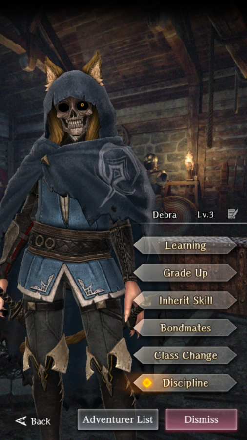

# Debra

**Race**: Beastfolk  
**Gender**: Female  
**Type**: Light  
**Personality**: Neutral  
**Starting Class**: Thief  
**Class Change**: Knight  
**Role**: Support, Damage

!!! info "Portraits"
    === "Thief"
        

    === "Knight"
        

    === "Thief Unmasked"
        

    === "Knight Unmasked"
        

## Skills

!!! info "Unique Skill (Inheritable)"
    === "Blessing of the Beastfolk Goddess"
        Defeating an enemy restores minor SP to self. Recovery amount is reduced if learned by someone other than Debra.

        !!! note
            The restored amount at skill level 1 is 4 SP.

        | Level | SP recovery amount (self) | SP recovery amount (inherited) |
        |:-----:|:-------------------------:|:------------------------------:|
        |   1   |             4             |                2               |
        |   2   |             5             |                3               |
        |   3   |             7             |                4               |
        |   4   |             8             |                5               |
        |   5   |                           |                6               |
        |   6   |                           |                7               |
        |   7   |             13            |                -               |

!!! info "Unique Skill (Not Inheritable)"
    === "Skull Study"
        Continuously reduces the MP/SP cost of Thief spells/skills that cost 3-10 MP/SP.

!!! info "Discipline Skill"
    === "Blessing of the Beast God"
        Continuously increases each stat, Attack Power and Paralysis tolerance increased further.

## Adventurer Reviews

??? info "TheAxolotl's Analysis"
    
    Debra is our first Legendary thief, and she is great at it. She can deal strong damage for a thief, particularly later on when you have both Hiding and Sneak Attack unlocked. Her skills also allow her to regularly use Precision Strike to kill enemies for a net 0 SP use. When fighting bosses, her debuffs can be very helpful, with an extra nod to Delay Attack.

    That being said, it's very likely that other thieves might be released in the future that end up providing more damage or utility than she does. Her SP restoration becomes less crucial as she gets higher up in levels, as well, due to the high SP pool that Thieves have. She's extremely helpful to have now, but it's hard to say if she'll remain strong in the future.

    If you inherit her skill to other Adventurers, the restore amount will be cut in half, with skill level 1 returning 2 SP instead of 4.

??? info "Frobro's Analysis"

    Talk about suffering from success. An inherit so desirable that people prefer to give it to other units rather than build it up on the unit who gets the most potency out of it. Debra is a more damage-oriented thief than her peers not unlike how Adam is with mages. Her Skull Study reduces, the cost of “thief spells/skills that cost 3-10 MP/SP” and when coupled with Blessing of the Beastfolk God, she can use Precision Strike as a replacement for her basic attack extremely early in the game. At those early sections of the game, that +30 surety from Precision Strike is outrageous. 

    As a side note, Precision Strike is in the daily shop rotation, which makes it a surprisingly easy skill to level up for being a premium skill with no inheritor. Another idea is to inherit heavy attack instead as she can still more freely use it with her high SP pool and SP regen. While on the subject, her high dexterity makes her a good candidate for inheriting high levels of Armor Break which will also synergize with Cunning Pursuit for even more damage. Who cares about the discipline, when you can level up the inherit on anyone?

    Plus she’s neutral aligned which lets her be compatible in the front row with Lana as a dodge tank with her high evasion, or as a bow user in the back with Alice. She is held back by her 2nd class being knight. I wonder what the people would think about her if it were fighter instead…

## Duplicate Usage

* If you use her, increasing her Discipline will increase her damage, while inheriting her skill to herself will increase the SP restore amount
* Inherit her skill on your MC (or other physical damage dealers) for the SP restore
* Save for future use. It's possible that she'll end up becoming a good candidate in the future to dismiss for Grade tags.
