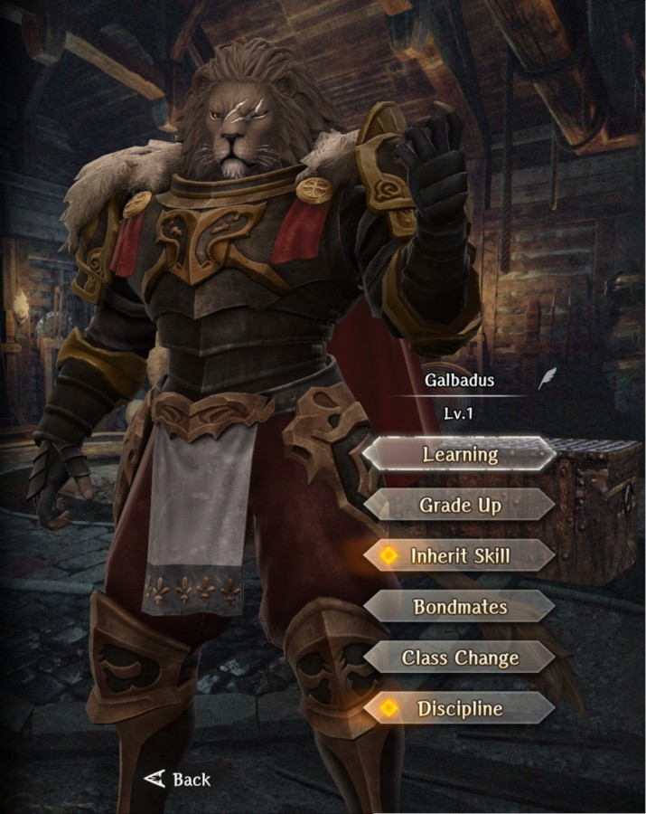

# Galbadus  

**Race**: Beastfolk  
**Gender**: Male  
**Type**: Dark  
**Personality**: Evil  
**Starting Class**: Knight  
**Class Change**:   
**Role**: Damage, Support

??? info "Portraits"
    === "Knight"
        

## Skills

!!! info "Unique Skill (Inheritable)"
    === "Raging King I"
        {{ get_skill_description("Raging King I") }}

!!! info "Unique Skill (Not Inheritable)"
    === "Tyrant's Gravity"
        {{ get_skill_description("Tyrant's Gravity") }}

!!! info "Discipline Skill"
    === "Bestial Roar"
        {{ get_skill_description("Bestial Roar") }}

## Adventurer Reviews

??? info "TheAxolotl's Analysis"

    Galbadus is interesting, and my initial opinion of him is different than my "upon consideration" opinion of him, with his kit being simultaneously contradictory and synergistic. Let's jump in!

    First, Tyrant's Gravity is...probably a waste of a skill slot. The initial "taunt" (Attract-hit style) isn't bad, but it's limited by the fact that it only lasts 3 hits and is not guaranteed. Initial reports put it as "better than Attract Hit" but it's hard to measure how much. If you're fighting a single difficult enemy, this has the potential to last for 3 turns, but in other fights, it could be gone in half a turn, so keep that in mind. Not bad. Not great. Doesn't hurt anything. Hard to say if it'll really help much.

    Raging King is very interesting. This skills has a unique charge-up mechanic that actually changes the skill name per hit received in a turn from Raging Skill I through Raging Skill V and into Raging Skill Fury (6 total power levels) every time he gets attacked within a turn. The skill then resets itself on his next turn, whether or not he uses the skill. The key thing to note here is that any enemies that attack before his turn do not trigger the charge-up. This means you want him to be faster than your enemies. As far as damage goes, it's hard to measure the effectiveness of active skills, but initial testing shows an inherited Raging King I to be between Heavy Attack 2 and 3 - essentially inherited Raging King = Heavy Attack at the same SP level. When kept on him, it will be ~35-40% stronger, which is quite substantial.

    The odd part about this is his base class of Knight, which makes you want to treat him as a defensive adventurer. Don't! That's not his role. Instead, treat him like a damage dealer as you would Shiou or Fighter Lana. On turn one, use any skill - it doesn't matter too much - it could be an inherited buff such as Warrior's Battle Cry (or even better, Lingering Blossom, if you have a spare Shiou) or it could be something from his own kit like Attract Hit or Knight's Defense. From turn 2 and on, just spam Raging King until things are dead or you have no more SP.

    A few additional things to keep in mind.
    
    - Depending on the fight you're in, it's very possible that Raging King will stay at I or II the entire fight. Some fights might let it climb up to Fury level, but the fewer collective hits coming his way, the less charging up he's able to do.
    - Similarly, if he's protected will, in a fight like Emergency Occurrence, you can expect to see his skill be charged up fairly high every turn, so expect high levels of damage when he's at risk of getting hit multiple times.
    - Knights typically don't have the greatest SP pools. This is somewhat offset by the lower skill cost, but something to keep in mind.
    
    For those that like Discipline, Bestial Roar is pretty solid - what's not to like about Attack Power and HP?

    In general, Galbadus is a fairly future-proof adventurer. The charge-up mechanic of his active skill isn't likely to be powercrept by future skills, and most future class options will enhance his combat abilities. Since you'd want to treat him as a damage dealer, his place in your party would be comparable to that of a Fighter or Samurai. Comparing him to Fighter Lana, he gains more personal damage but loses out on the end of battle heal and the row-level ~8% damage boost. Comparing him to Shiou, he gains more survivability and isn't quite as high risk. His damage level for the average player likely falls somewhere between the two, and it rivals and can potentially surpass Shiou if he's using a Cuisinart with the equipment available at the time of his release. Also, he looks pretty bad-ass.

    When deciding to pull, the biggest question you want to ask yourself is if you have room in your party for him. If you're already running a party consisting of Fighter Lana and Shiou, you probably don't need him. If you've missed out on Shiou, he could be an excellent high single target damage substitute.

??? info "Karkarov's Analysis"

    Ok it is time to do an analysis of Savi.... oh wait this is a different dark element, knight, evil, beastfolk, legenday... huh.  So if there was something we did not need it was another knight legendary with the exact same alignment, element, and race as another knight legendary.  Meanwhile they chose to go ham on the design and create a legitimately beastly bad ass cool character.  (pun intended)

    Unfortunately his appearance is also the best thing about him.

    I won't go into it but from a "meta" perspective the use for knights is superbosses to control aggro and use knights defense.  Galbadus is no better in this role than any other knight honestly.  His passive skill to draw three hits at the start of combat free is nice... but it is just three hits.  Meanwhile his inheritable skill Raging King is actually good... but I don't recall people bringing knights in their party for damage.  As a skill Raging King costs more SP than the equivalent level Heavy Attack, but can do a little more damage than same level Heavy Attack as well.  If Galbadus gets attacked in the round before using the skill this makes it even better than Heavy Attack as it's damage gets buffed.

    The problem is this means you need him to get attacked, which after those first three hits need taunt moves, and once again knights aren't there to attack.  Also the damage is a little better than Heavy Attack, but it is no Bamboo Splitter, and may not even be on par with Torso Strike.  It's a better heavy attack that's harder to level.

    Insult to injury, he does not play nicely with either the Elise or Lana synergy damage buffs due to his alignment.  So the best thing about him (a damage skill) only works with one of the three best formation synergy skills for damage.  You could argue using the Milana synergy here, but again, who does Milana not work with.... Lana.  So he is not compatible with the best front row damage buff, as a knight kind of works better in the back anyway, but his key skill is for dps which doesn't synergize well with knight in general.

    Discipline wise it is ... ok.  Greatly boosted HP and Attack Power.  Not terrible, not top tier either.  Not much to say here, it could have been worse for sure.

    With the unique skills he has Drecom should have made him a fighter.  As a fighter it would have been somewhat dicey due to the formation issues, but there would have been room to make him work and recommend him.  As he stands now I can't say he is any better for knight Superboss duty than El Dorado who isn't even a legend, or Savia.  In fact they are probably better due to their additional buffs from class swaps.  This guys entire value rides on what alt class he gets in who knows how long from now.  If it is fighter, post class swap, we are looking at a character that may be worth serious consideration.  As he stands now.... his best use is as a skill inherit on a fighter to replace heavy attack. Of course it doesn't help that for abyss three and beyond duty you will need to level Raging King to level three or higher to maintain viability....

    Don't get me wrong.  Galbadus is not a bad character, or near the bottom of the legendary pile, but for his skill set he is the wrong class and a sub optimal alignment.

## Adventurer Pull Plans

??? note "TheAxolotl's Pull Plan"

    While his active skill seems fun and is potentially very powerful, I don't know that I'd necessarily have a place for him in my party, so I'm likely going to skip.

??? note "Karkarov's Pull Plan"

    I can't suggest you pull this character.

    Ironically his shield is actually a good piece of gacha gear that works fantastic because it procs taunt on attacking (this includes SP based skills), pair that with his skill Raging King and you are cooking.  But I did say "gacha gear".  I can't in good faith advise spending real money on purple bones to hope you get a nice version of one specific gacha gear, or advise you drop enough resources to get a copy of him and the tokens to grab a shield and pray it doesn't pop out 1 star white.  

    If you love the design, and boy do I understand if you do it's very well done, go ahead and pull.  Maybe in the future he gets fighter and it all works out.  But otherwise this is a whale banner or at the very least for people willing to risk real money to get him and his shield, cause to be better than ""eh off duty fighter"" he kinda needs both.  Even then... I am still not sold his inherit and the shield aren't doing better work on a fighter (especially fighter Lana) over Galbadus himself right now.

## Duplicate Usage

- If you use him, there's really no reason to use dupes on anything other than his skill inherit. Boost that skill as much as you can, as it's very powerful.
- If you don't want to use him but want his skill on someone else, do the same thing. Get that skill level as high as you can - you'll probably want to inherit to level 3 at least in order to offset the damage loss from the inheritance
- If you're whaling, might as well throw some Discipline in, but only after you've maxed out the skill. If you're not whaling but pulled multiple copies, skip the Discipline and go for the skill inheritance