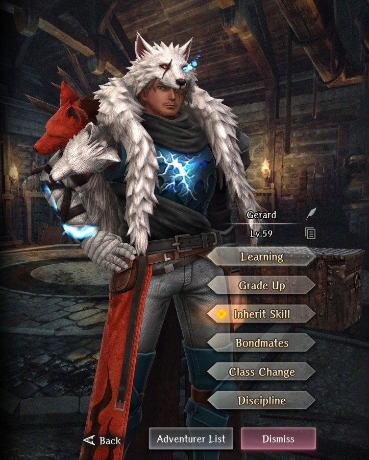
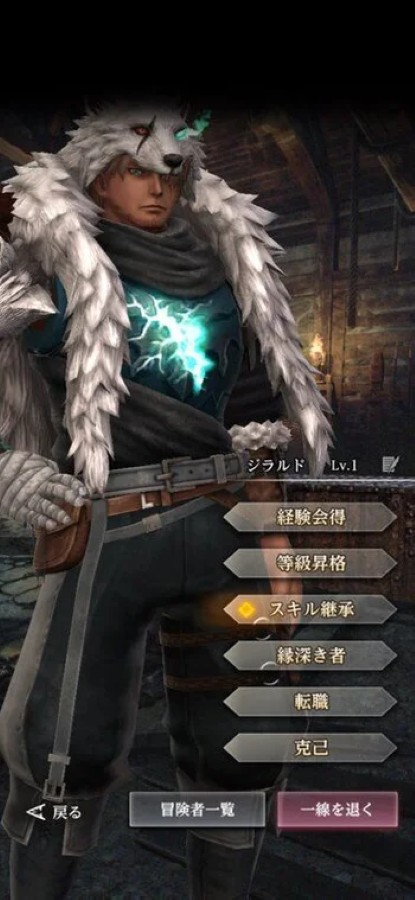

# Gerard

**Race**: Human  
**Gender**: Male  
**Type**: Dark  
**Personality**: Good  
**Starting Class**: Knight  
**Class Change**: Fighter 
**Role**: Damage, Support

??? info "Portraits"
    === "Knight"
        

    === "Fighter"
        

## Skills

!!! info "Unique Skill (Inheritable)"
    === "Thunderstrike"
        {{ get_skill_description('Thunderstrike') }}

!!! info "Unique Skill (Not Inheritable)"
    === "Lightning Celerity"
        {{ get_skill_description('Lightning Celerity') }}

!!! info "Discipline Skill"
    === "Thundersmiter's Protection"
        {{ get_skill_description("Thundersmiter's Protection") }}

## Adventurer Reviews

??? info "TheAxolotl's Analysis"

    Poor Gerard has not aged that well. He's not a bad legendary by any means, but many of his initial advantages have been relegated to less impactful now that we have new adventurers and skills available to us. I wouldn't go as far as saying he's been powercrept, but he's definitely lost a bit of his luster in comparison to when he was initially released.

    His Thunderstrike skill is very potent when hitting weaknesses, and having the chance to paralyze your foes can be a nice added bonus. Unfortunately, with the addition of Full Power Strike to the Fighter arsenal, even if class changing Gerard to Fighter, his signature skill becomes a conditional attack at best. Full Power Strike will be both more efficient and overall higher consistent damage than Thunderstrike. Another key thing to note is that he is a Dark type adventurer with a Air type skill, which means he misses out on a same-type damage multiplier when hitting weaknesses, which is unfortunate.

    Lightning Celerity is fine - it's a passive personal evasion increase, however it's a static increase and not a percentage, so it will lose value as stats increase.

    Gerard's biggest disadvantage is that he is designed to do damage, but his signature skills don't contribute much in the way towards dealing most of his damage. He has a small niche in that as of his first rerun, he's still our highest damaging Knight adventurer, but his access to a Fighter class change largely renders his Thunderstrike skill obsolete in a large majority of current content.

??? info "Frobro's Analysis"

    This game’s poster boy for “Mid. A good aligned, front-row knight with a Heavy Attack but green skill that doesn’t even match his element. What is there to say? At least his 2nd class is fighter, so he isn’t truly bottom tier. His passive and discipline aren’t bad, but they’re not impressive enough to salvage this guy.

    This guy’s job is to be the resident low-value buzzkill, when pulling for some other legendary once limited legends get added to the pool. Outclassed by general adventurers, what a life.

??? info "Shiro's Analysis"

    Starting with inheritance… It was made for Helmut alone in mind for early game… but for whatever reason Gerard himself is dark. So it never was a good synergy or good damage option. One of the most niche at best inherits.

    Moving on passive. It’s good, especially in the earlier part of the game. Having more EVA is not a bad choice and helps especially in the early part of the game. Sadly it falls off heavily later on.

    His discipline further pushed the idea of him being a dark evasion tank… which wasn't a bad idea I guess? But hey… Savia exists… So I’m unsure how to feel about it.

    His class change is fighter which is his saving point. His passive and discipline come more at play there making him easier to build. Nothing amazing honestly but it’s still a really solid option if you like his design.

    To sum it up. Gerard is a solid pick that’s mostly mediocre when it comes to everything. His inheritance wants Reaven Dagger to proc more paralysis and synergy good with wind damage… but we don’t have earth enemies to play on it too much. On top of that he's a dark element so he’s out of synergy with his own skill… but it’s something that saves him later on making him a solid fighter option for abyss 3 where dark damage is quite present… The issue is that he’s not unique in it and Gandolfo or Elda fit the same role. While I do think that Gerard got way more hate from the playerbase than he should, he's still… just solid. Maybe in future when we’ll get access to farmable 3 hit weapons his inheritance will shine with more common paralysis procs but as for now… there are other options.

## Adventurer Pull Plans

??? note "TheAxolotl's Pull Plan"
    Gerard was a solid pass for me. Nothing about his kit was interesting enough for me to pull for.

??? note "Lynd's Pull Plan"
    Gerard is my boy. So I maxed his discipline because every adventurer needs a fully obedient dog. Side note: he was my mvp for killing the dragon during the collab.
    
## Duplicate Usage

* Inherit on his own skill will increase the damage and cost of his Thunderstrike. This will result in more damage than increasing his Discipline will.
* If you've maxed out his Thunderstrike, increase his Discipline to increase his speed and evasion, which are both great skills to boost.
