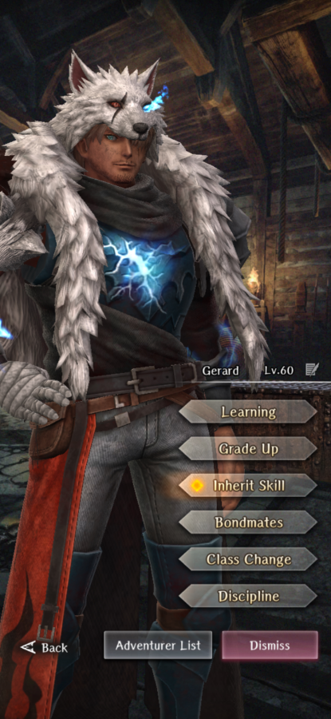

# Gerard

**Race**: Human  
**Gender**: Male  
**Type**: Dark  
**Personality**: Good  
**Starting Class**: Knight  
**Class Change**: Fighter 
**Role**: Damage, Support

!!! info "Portraits"
    === "Knight"
        

    === "Fighter"
        

## Skills

!!! info "Unique Skill (Inheritable)"
    === "Thunderstrike"
        Moderate air type physical attack on 1 enemy. Low chance of inflicting Paralysis on target. Damage is reduced if learned by someone other than Gerard.

!!! info "Unique Skill (Not Inheritable)"
    === "Lightning Celerity"
        Increases Evasion when equipped with a one-handed sword.

!!! info "Discipline Skill"
    === "Thundersmiter's Protection"
    Continuously increases each stat, Evasion and Action Speed increased further.

## Adventurer Reviews

!!! info "TheAxolotl's Analysis"

    Poor Gerard has not aged that well. He's not a bad legendary by any means, but many of his initial advantages have been relegated to less impactful now that we have new adventurers and skills available to us. I wouldn't go as far as saying he's been powercrept, but he's definitely lost a bit of his luster in comparison to when he was initially released.

    His Thunderstrike skill is very potent when hitting weaknesses, and having the chance to paralyze your foes can be a nice added bonus. Unfortunately, with the addition of Full Power Strike to the Fighter arsenal, even if class changing Gerard to Fighter, his signature skill becomes a conditional attack at best. Full Power Strike will be both more efficient and overall higher consistent damage than Thunderstrike. Another key thing to note is that he is a Dark type adventurer with a Air type skill, which means he misses out on a same-type damage multiplier when hitting weaknesses, which is unfortunate.

    Lightning Celerity is fine - it's a passive personal evasion increase, however it's a static increase and not a percentage, so it will lose value as stats increase.

    Gerard's biggest disadvantage is that he is designed to do damage, but his signature skills don't contribute much in the way towards dealing most of his damage. He has a small niche in that as of his first rerun, he's still our highest damaging Knight adventurer, but his access to a Fighter class change largely renders his Thunderstrike skill obsolete in a large majority of current content.

??? note "TheAxolotl's Pull Plan"
    Gerard was a solid pass for me. Nothing about his kit was interesting enough for me to pull for.

??? note "Lynd's Pull Plan"
    Gerard is my boy. So I maxed his discipline because every adventurer needs a fully obedient dog. Side note: he was my mvp for killing the dragon during the collab.
    
## Duplicate Usage

* Inherit on his own skill will increase the damage and cost of his Thunderstrike. This will result in more damage than increasing his Discipline will.
* If you've maxed out his Thunderstrike, increase his Discipline to increase his speed and evasion, which are both great skills to boost.
