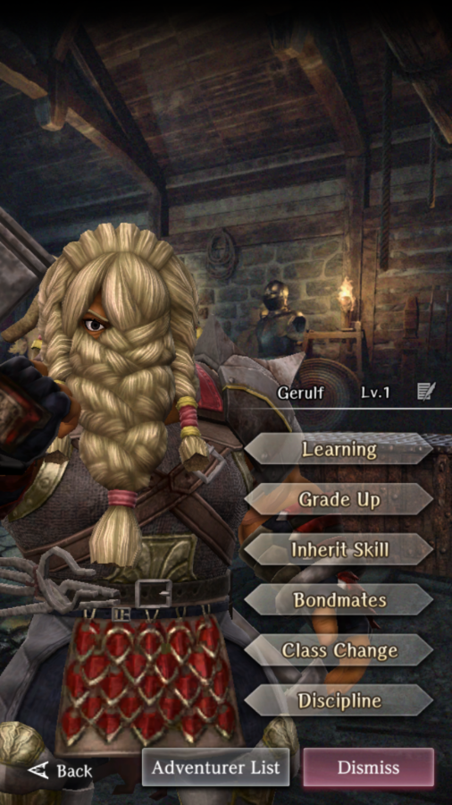

# Gerulf

**Race**: Dwarf  
**Gender**: Male  
**Type**: Fire  
**Personality**: Evil  
**Starting Class**: Fighter  
**Class Change**: Priest  
**Role**: Damage

??? info "Portraits"
    === "Fighter"
        

    === "Priest"
        

    === "Fighter After Personal Request"
        

    === "Priest After Personal Request"
        

## Skills

!!! info "Unique Skill (Inheritable)"
    === "Eruption Strike"
        {{ get_skill_description('Eruption Strike') }}

!!! info "Unique Skill (Not Inheritable)"
    === "Branded Hands"
        {{ get_skill_description('Branded Hands') }}

!!! info "Discipline Skill"
    === "Fire Demon’s Brand"
        {{ get_skill_description("Fire Demon's Brand") }}

## Adventurer Reviews

??? info "TheAxolotl's Analysis"

    Gerulf does one thing and one thing well. He hits hard with a 2h mace. If you're not using him with a 2h mace, he's not living up to his full potential. Unfortunately, there are some things that work against him right now. Since he's evil, he will actually hinder a party that uses Lanavaille, as both of them want to be in the front row and having them both there will negate Lanavaille's row buff. This likely won't be a permanent limitation, though, since in the future we should be able to build a strong Neutral/Evil front row.

    You can get around this by putting him in the back row with a spear, but that will limit the effectiveness of Eruption Strike.

    One other thing going against him is that the Port Town Grand Legion is full of water enemies, including the bosses, which will increase the damage he takes and reduce his Eruption Strike damage unless you inherit Adam to him.

    With the release of Rinne, Gerulf finally gets some solid Evil support from her Surety buff, which is a welcome addition to Evil teams!

??? info "Frobro's Analysis"

    This guy is a Min/Max stat gremlin with an uninspired kit. Aside from his discipline (Attack + Surety), there isn’t anything worth writing home about. That accuracy boost when using a 2 handed weapon is a joke. Why not accuracy, surety and attack; at least something comparable to the blessings he can get from a shield! Might as well pretend he doesn't have a unique passive.

    As for Eruption Strike, it’s basically Heavy Attack 3 but red and you gotta use a 2-handed hammer. Even if you use Gerulf in your party, you’re still gonna use Full Power Strike over this. An inherit skill so bad that even the owner doesn’t use it, wow. Beyond that, an evil front liner ruins the feng shui for many players, which makes his whole thing a no-go. Honestly, is this guy really any better than Benjamin?

## Duplicate Usage

* Inherit on his own skill will increase the damage and cost of his Eruption Strike.
* Once his Eruption Strike is maxed out, increase his Discipline to increase his damage further.
* Save for future use or dismiss for Grade tags.