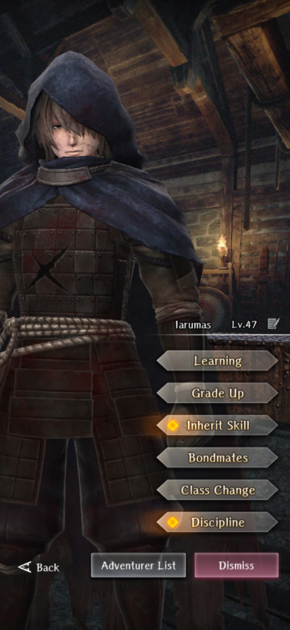

# Iarumas

**Race**: Human  
**Gender**: Male  
**Type**: Void  
**Personality**: Neutral  
**Starting Class**: Mage of the Black Rod  
**Class Change**:  
**Role**: Damage, Support

??? info "Portraits"
    === "Mage of the Black Rod"
        

## Skills

!!! info "Unique Spell (Inheritable)"
    === "TZALIK"
        {{ get_skill_description('TZALIK') }}

!!! info "Unique Skill (Not Inheritable)"
    === "Mage of the Black Rod"
        {{ get_skill_description('Mage of the Black Rod') }}

!!! info "Discipline Skill"
    === "Amnesiac Corpse Retriever"
        {{ get_skill_description('Amnesiac Corpse Retriever') }}

## Adventurer Reviews

??? info "TheAxolotl's Analysis"

    Iarumas is a bit of an interesting adventure. First, to mention the elephant in the room, he is not an actual Samurai despite the belief many folks had that the Samurai class would release with him. Instead, a new precedent was set where the collab adventurers were released with their own unique classes. In this case, The `Mage of the Black Rod` class is a mix between a Fighter and a Mage, gaining some interesting versatility while losing some key passive skills. Notably, Iarumas does not naturally have access to the damage multiplier provided by `Way of the Warrior`, nor does he naturally have access to the MP cost reduction provided by `Way of the Mage`. He also does not have access to the new `Full Power Strike` skill, which means he's missing the Fighter's most efficient physical damage attack. Iarumas' assortment of skills and spells makes him a unique and versatile damage dealer that can provide some additional support.

    Mage of the Black Rod is a very unique passive skill, as its function changes based on whether Iarumas is in the front row or the back row. Since a component of this skill requires being in combat, we can't see exact numbers of the stat increase and some of them are harder to calculate, but rough early math seems to indicate that this skill provides a boost of 15 Attack Power. This skill does appear to provide a static boost, which makes him hit comparatively strong with basic attacks early on, but that tapers off as he gains levels.

    His unique spell TZALIK has the potential to be extremely powerful. The fact that it deals major damage will put it above LA-spells in terms of magnitude, and its Magic Defense penetration will go ever farther to make it hit hard. The mana cost of 20 at base puts it roughly in line with a level 5 basic spell. This spell is a bit of a double edged sword, though. Like the CONES line, it's untyped which means it won't encounter any element type resistances. On the other hand, it won't deal weakness damage to anything. Furthermore, due to the lack of weakness damage, he won't be able to take advantage of the same type multiplier for having his element type match his attack's element type. One important thing to note is that this spell deals sure hits more frequently than other spells, both when Iarumas casts it and when it's inherited to another adventurer, regardless of the weapon equipped. It is unclear at this time if this is intended functionality. We know spells can sure hit, but we do not know if TZALIK is supposed to have an increased sure hit rate over other spells or not.

    Iarumas has quite a powerful kit and can fill the role of a very versatile damage dealer. Here are a few considerations in general:

    * He does not have Full Power Strike, but he can gain access to Way of the Warrior through skill inheritance, which gives him a nice damage boost for his melee capabilities.
    * He has the CONES line as well as TZALIK, which really emphasizes his magic damage, however his passive skill boosting stats while using 1h swords or staves puts him ideally in the front row with magic-based equipment, which is a potentially unique niche. He can exist in the back row, but that will effectively render his access to Follow-Up Attack and Counterattack irrelevant as sources of supplemental damage.
    * He has Neutral typing, so he can benefit from Lanavaille, Alice, and Elise synergy buffs, as well as be relatively protected against row-switching mechanics.
    * He has no Way of the Mage, so he might become MP starved in long fights. Furthermore, there is currently no easy or convenient way to regain MP while in dungeons, which could negatively impact his longevity. Hopefully this will be remedied with a future skill inherit.

    One big unknown is that we don't know if he will end up getting the Samurai class when that gets released in early Summer. We also don't know what future katanas will look like. His current role seems to be one of a front line magical damage dealer, which could be very fun and powerful, but he might have issues in longer dungeons or prolonged boss fights. Gearing him could also prove problematic since gearing for Magic Power is going to decrease his physical effectiveness, while gearing for Attack Power is going to decrease his magical effectiveness, and most of his current kit seems to support Magic Power being a focus. His lack of a heavy-hitting physical damage skill, outside of inheriting levels to Wild Strike, hinders his physical damage a bit, but not enough to render him obsolete by any means.

    Duplicate usage is also going to be unique with him. Normally, I like to prioritize inherits over discipline for duplicates, however high levels of TZALIK could result in a currently unsustainable MP cost, while discipline would give him a low amount of extra Attack Power, Magic Power, SP, and MP. On the other hand, if you're intending to use TZALIK as a situational nuke, increasing the damage it deals could be very impactful, despite the added cost.

    Iarumas is a very strong multi-purpose damage dealer with excellent Neutral and Void typing, and his kit is quite unique. You'll want to decide if his uniqueness and versatility is worth including in a party, though, as he faces some strong competition from more specialized adventurers.

??? info "Frobro's Analysis"

    At present, I’m not a fan of these phys/mag hybrid units. In practice, they are middling fighters who lack Full Power Strike, have gear restrictions and effectively learn their mage spell tree without needing to class change. I think it’s pretty telling that the unit that’d be the best at this kind of setup, MC, doesn’t get built like this because (unless your name is TheAxolotl) there are better ways to build him. Iarumas is getting access to samurai proper at a later date, so my mind may change.

    Judging him as he is, not bad. Drecom loaded his passives and gear with stats to ensure he could at least keep up with mages as a caster and fighters as a basic physical attacker. They did everything in their power to make him interesting. Tzalik is extremely strong and stat-creep-proof with the magic defense penetration effect and I guess the ability for it to surety is intended since they never patched it out. Being void is…different, and being neutral aligned makes him splashable with most team comps.

## Adventurer Pull Plans

??? note "TheAxolotl's Pull Plan"
    I like the Iarumas/Berkanan banner, so I pulled a decent amount on this one. I ultimately wanted to get multiple levels to TZALIK to the MC and I wanted to build Berk as an adventurer for occasional use.

??? note "Lynd's Pull Plan"
    Mostly Tzalik bait but he looked cool too so I threw some to get a meager maxed discipline because I'm inefficient.

## Duplicate Usage:

* Inherit his spell to himself for increased damage on his heavy hitting single target spell
* Discipline for small gains to four very important stats
* Inherit his spell to the MC. Even with a ~40% damage reduction, the Major base damage and Magic Defense piercing should still result in a very respectable single target damage spell