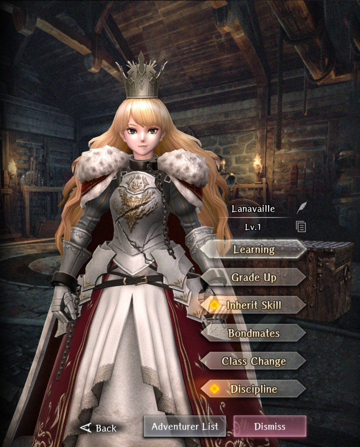
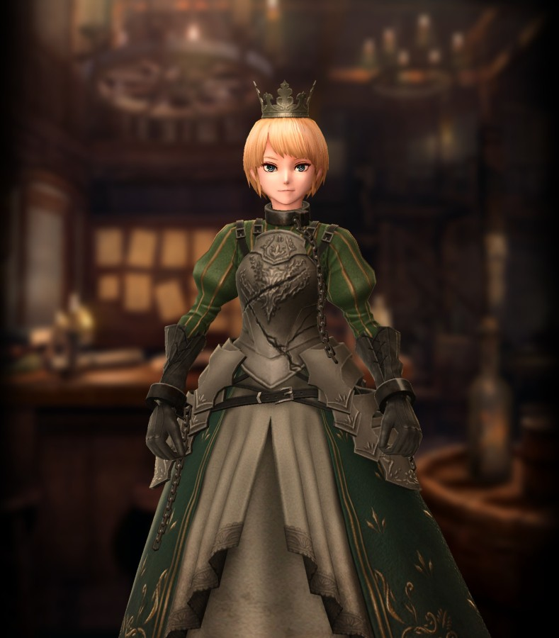
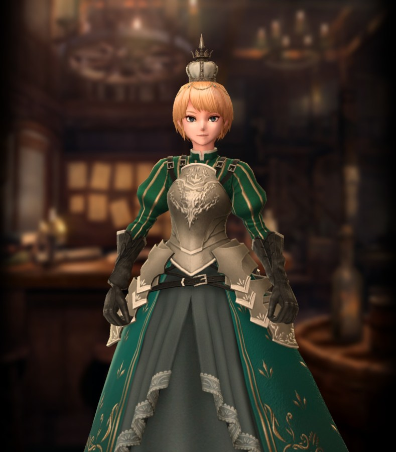
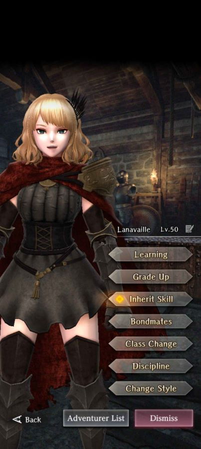

# Lanavaille

**Race**: Human  
**Gender**: Female  
**Type**: Fire  
**Personality**: Good  
**Starting Class**: Knight  
**Class Change**: Fighter  
**Role**: Support, Damage

??? info "Portraits"
    === "Knight"
        

    === "Fighter"
        

    === "Knight After Personal Request"
        

    === "Fighter After Personal Request"
        

    === "Wandering Princess"
        

## Skills

!!! note
    If standard Lanavaille and Wandering Princess Lanavaille are merged, changing styles will swap each skill.

!!! info "Unique Skill (Inheritable)"
    === "Queen of War and Love"
        {{ get_skill_description('Queen of War and Love') }}

        

        | Level | HP recovery amount (self) | HP recovery amount (inherited) |
        |:-----:|:-------------------------:|:------------------------------:|
        |   1   |             12            |                6               |
        |   2   |             22            |               11               |
        |   3   |             34            |               17               |
        |   4   |             44            |               23               |
        |   5   |             58            |               30?              |
        |   6   |             68            |               38               |
        |   7   |             85            |                -               |

        

        
!!! info "Unique Skill (Not Inheritable)"
    === "Stirring Righteousness (Standard)"
        {{ get_skill_description('Stirring Righteousness') }}
        
        !!! note
            This damage increase is approximately 8%.

    === "Valiant Righteousness (Wandering Princess)"
        {{ get_skill_description('Valiant Righteousness') }}

!!! info "Discipline Skill"
    === "Warrior Princess of Resolution and Love (Standard)"
        {{ get_skill_description('Warrior Princess of Resolution and Love') }}

    === "Flawlessly Composed Warrior Princess (Wandering Princess)"
        {{ get_skill_description('Flawlessly Composed Warrior Princess') }}
## Adventurer Reviews

??? info "TheAxolotl's Analysis"

    === "Standard"

        Lanavaille is our first Legendary Knight, and she brings some pretty solid utility to your party. Not only does she provide defensive capabilities, her ability to buff a Good/Neutral row can be very powerful, particularly if you have a Good/Neutral MC. A front row of Lanavaille - MC - Debra/Gerard is very common at the moment, and all three units would benefit from the increased damage.

        In addition to her battle prowess, Lanavaille's end of battle heal is extremely valuable early game. While the initial heal amount is only 12, increasing the inheritance level will boost the heal value up to stay competitive as you progress throughout the game. This heal is often potent enough to allow you to save your healer's MP while grinding/farming or progressing through the story. The heal won't provide any real value during boss fights, but her damage boost will.

        If you have an evil MC, however, her value drops significantly.

    === "Wandering Princess"

        The newly fixed skills for Wandering Lanavaille are quite interesting, as they provide some nice minor buffs without fundamentally changing the character itself. The ASPD boost on Valiant Righteousness is very minimal at 2 ASPD per slot, however it only considers the weapon and chest armor slots. This means at most, you'll see a 4 ASPD boost.

        The changes to her Discipline nice - you should never say no to more HP, and Critical Tolerance will help prevent instant death, which is always good.

        Neither of these skill changes are game-breaking by any means, so if you don't like Lanavaille as an adventurer or you prefer her standard style, you won't really be missing out on anything by skipping her. If you like her, though, her Wandering Princess form is all around better than her standard form and going for a couple copies wouldn't be a bad idea at all.

        Wandering Lanavaille is the first adventurer that enables the [merge](../../../frequently-asked-questions.md#what-is-merging-and-should-i-do-it) option in the training room. This combines the two styles into a single adventurer and adds another passive skill that provides a very minor boost to a few stats. There is no real reason not to merge the two styles together. From there, you can choose which style you want to use.

        One key thing to note is that Discipline is tied to the particular style, so standard Lana dupes cannot be used to increase the Discipline of Wandering Princess Lana. This actually makes it an easy choice for standard dupe usage if you use Wandering Princess Lana, as inheriting standard Lana dupes to the merged Wandering Princess Lana will give the best value.

??? info "Frobro's Analysis"

    Do I even need to explain this one? One of the few well-aligned party buffs in the game. That post-battle healing is incredibly strong. At level 1 it falls off after the early game which makes people think lowly of it, but it is great even at level 60 with just a few more levels. Assuming you use Lana, this isn’t the worst use of Codexs around. I don’t even bring a healer when auto-farming events anymore.

    The real kicker here is that to reach her full potential, you gotta switch Lana to fighter. (After learning all the knight stuff first) The downside is having to look at dork fighter Lana. The upside is that Wana exists. Besides looking better as a fighter, Wana also gets an ASPD boost with a gear-based conditional and turns Lana’s “whatever” discipline focus into “whatever…but better”. When merged, you only need to level the Queen of War and Love skill on one unit to apply it to both styles.

## Adventurer Pull Plans

??? note "TheAxolotl's Pull Plan"
    I pulled for a couple copies of Wandering Lana. My main goal was a base copy plus a single copy for the OCD Discipline. Getting rid fo the OG Lana's voice was a big enough reason for me to pull.

## Duplicate Usage:

* If you use her Wandering Princess style
    * Inherit her standard style dupes to her own skill to increase its healing power.
    * Wandering Princess dupes can either go towards Discipline or inherit. While Discipline boosts are minimal, you'll likely reach inheritance cap eventually from standard Lana pulls over time.
* If you use her standard style and not her Wandering Princess style, Discipline and skill inherit are both good options, although I'd probably slightly favor skill inherits.
* Inherit her skill to the MC.
* Save for future use or dismiss for Grade tags.
