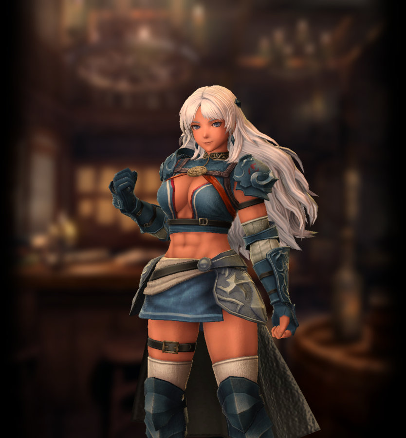
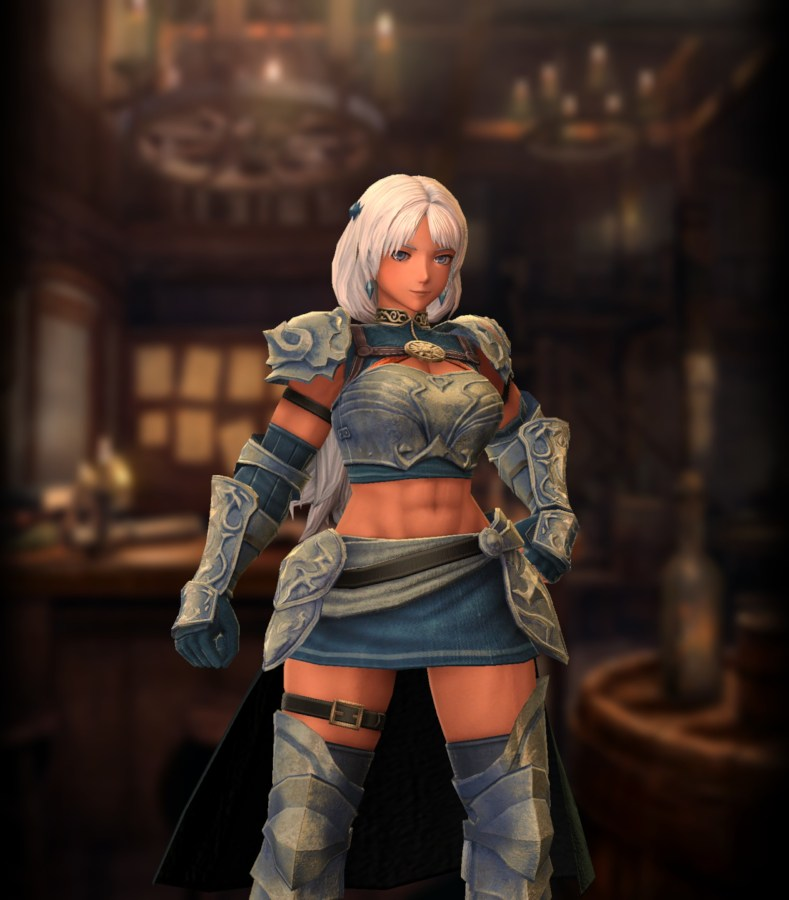

# Livana

**Race**: Human  
**Gender**: Female  
**Type**: Water  
**Personality**: Good  
**Starting Class**: Fighter  
**Class Change**: Knight  
**Role**: Damage

??? info "Portraits"
    === "Fighter"
          

    === "Knight"
        

## Skills

!!! info "Unique Skill (Inheritable)"
    === "Moonlit Pool of the White Daemon"
        {{ get_skill_description('Moonlit Pool of the White Daemon') }}

!!! info "Unique Skill (Not Inheritable)"
    === "The One Who Enforces"
        {{ get_skill_description('The One Who Enforces') }}

!!! info "Discipline Skill"
    === "Bloodline of the Mirror-Mere"
        {{ get_skill_description('Bloodline of the Mirror-Mere') }}

## Adventurer Reviews

??? info "TheAxolotl's Analysis"

    Oh Livana, we had high hopes for you. As a big fan of 2h weapons in general, I've been exited about the idea of a 2h-focused Fighter since the game came out, and...this one is not what I had in mind at all.

    First, as a passive, `The One Who Enforces` is somewhat decent. Surety and Accuracy are two solid stats to increase for 2h axe usage, and the increase itself is a flat +7 of each. This is roughly equivalent to the gains of a Discipline 2 featured stat, being somewhat higher than Discipline 2 but not quite to the same value of Discipline 3.

    And while I'm mentioning Discipline, `Bloodline of the Mirror-Mere` is not that great. Accuracy is fine, but Magic Defense is lackluster, and neither are really worth focusing on. Discipline her if you want, but just remember that the gain per duplicate value is low.

    Her `Moonlit Pool of the White Daemon` is a fantastic skill. I'm not a huge fan of active skills as the signature skill on a damage-dealing adventurer in general since we never know what future skill could come along to render a signature skill largely irrelevant (I'm looking at you, Gerard), but I'm not quite as bothered by it in this case. This is mainly because her signature skill isn't going to be your main focus for dealing damage - instead, it'll be a situational utility attack. Being a moderate attack, the damage should be comparable to Gerulf's Eruption Strike and Gerard's Thunderstrike. As a water attack, it will also deal type-effective damage on par with Gerulf and stronger than Gerard due to Livana herself also being a water type. Just remember to inherit in Adam if you plan to use her to fight earth type enemies. In addition to ignoring range, this skill can apply Spell-Binding and is our first debuff focused on reducing an enemy's Magic Power.
    
    `Moonlit Pool of the White Daemon` will ultimately allow you to treat her 2h axe (or whatever weapon, but if you're running her, you should be using a 2h axe) as a Bow and hit at any range. There is one big limitation with this skill, though - it is a forced single hit attack, which means if you're using her with a dagger or sword and a shield, she will still only deal one attack with it. That's pretty much a non-issue if you're using a 2h axe, but it's something to keep in mind, particularly if you want to inherit this skill to someone else. Unfortunately, this skill also does not seem to gain the damage increase that `Way of the Warrior` provides, likely due to it not being considered dealing close-range damage.

    One potential use case of inheriting `Moonlit Pool of the White Daemon` to a non-Livana adventurer would be to give it to a back-row adventurer (such as a mage, priest, knight, or thief) using the Staff of Weakness. Since this is a skill and not a spell, it would allow the adventurer to apply the Staff of Weakness debuff from the back row without an accuracy loss. Likely not the best action for a turn in most cases, but could occasionally be useful. With the latest 2h weapon changes, this becomes a substantial damage dealer even when inherited, and is widely considered a Priest's best source of single target damage.

    Also with the release of her second class as a Knight, she's arguably one of the best Legendary Knights in the game. On encounters such as 0 Corruption, superbosses, and sentries, it's practically impossible for Knight Livana to have a dead turn. Moonlit Pool allows her to deal full damage with her signature skill from the back row on turns when using Knight's Defense or Cover skills are not needed, which is a massive boon over many other Knights.

??? info "Frobro's Analysis"

    Full Disclosure: This unit’s release prompted me to begin articulating my thoughts on how Drecom designs units with these reviews. Previously, Livana was aggressively mid. Now that 2-handed weapons got buffed with basically double damage and increased blessing values are on the way, this one needs to be re-evaluated.

    Problem 1: An awful discipline focus. Accuracy and Mag Def…not Attack or Surety, even Action Speed would have been fine. Something unusual, like Luck, could have been strong to pair with Follow-up Attack. Mag Def on a premium unit…What a joke!

    Problem 2: That active skill, Moonlit Pool of the White Daemon. Fighters want to use Full Power Strike when sustained damage is needed and Heavy Attack 3 when they need damage quickly. With all the data the devs have showing that skills like Thunder/Eruption Strike aren’t used by players, why did they create a skill in the same vein but blue? Post-2-hand weapon buff, this skill is outrageous. It seems that the soft cap for this skill is incredibly high or nonexistent. Even when inherited, Mages/Priests with 2-hand staves can get relatively high damage from just lvl 1 of this skill (and surety). It does have some utility with ignoring the distance penalty, and the Magic Power debuff seems consistent even when inherited, but that part is less useful as there are few enemies you’d really want that for. 

    Problem 3: That Passive skill. +7 Accuracy and Surety when using a 2-handed axe is a joke. How did they release something like this when they already got it right with Iarumas’s & Berkanan’s version of this? Their passives give them a boost to more than 2 stats at a potency comparable to decent blessings as if it were a shield or 2nd accessory and isn’t limited to 1 weapon type. 

    I anticipate this banner will be one of the worst-performing banners yet for Drecom. This is unadulterated “Mid”; general adventurers like Elise and Benjamin are better than this. I have no idea what the devs were thinking when they came up with this; I guess they weren’t. My best guess is that they are thinking ahead to what the legendary pool will look like when previous legends get mass demoted to the base pool and felt the need to dilute it with a new stinker. My bad; she’s got a job now: Big Damage for 9sp.(need to use a 2-hand weapon)

??? info "Karkarov's Analysis"

    Livana is the poster child of "If only Drecom changed one thing this character would be good!"  With Livana on release two handed weapons just weren't good, and she is clearly designed to be using a two handed axe.  She needed two handed axes to be viable for her character design to work well.  As many have noticed by the time of this analysis (10/9/25), Drecom has changed the viability of two handed weapons in a big way.

    So let's get the bad out of the way first.  Livana, your discipline is ASS!!!1!111!  Ok it honestly is nowhere near as bad as people claim.  First off, you have to understand Legendaries have a higher base stat gain than non-legendaries on discipline.  A Livana at D9 gets the same Attack Power and Speed as a non-legendary Fighter who gets boosted Attack Power and Speed.  She would just also cremate them on every other stat and really crush them on Accuracy and Magic Defense.

    Wait did you say accuracy?  Isn't one of the biggest issues of two handers the fact that they only hit once, so a miss is far more damaging than with a multi-hit weapon?  So maybe boosted Magic Defense and Accuracy isn't as bad as people say, but yes it could have been better.  It's her worst feature, but it isn't a damning weakness, or two useless boosts like Magic Defense and Poison Resistance would have been.

    So let's get to the good.  She may have no Surety in her discipline but she sure gets free Surety when using a two hand axe thanks to her passive "The One Who Enforces".  It even gives more Accuracy with a two handed axes as well.  Considering two handed axes also have defense pen this kind of makes them the best front line two handed weapon, so this is a great uninheritable passive for a Fighter or Knight.

    Next we have her element.... Water.  This isn't blowing my mind or anything, but considering there are earth users in abyss 1 and 3 I don't see it being much of a thing in abyss 4.  Also while water isn't beastly for Abyss 2, you certainly won't be weak to much in there either.  The fact that the easiest and lowest level Den is also Earth.... well Water probably has some legs on it for the future and isn't a handicap in any of the nastiest content right now.  Also worth a fast mention... Good Alignment means she plays nice with the Lana buff as well.

    How about that "Moonlit Pool of the White Daemon" her inheritable attack?  Well it comes with free range on it so it can be used from the back row or front safely.  On the damage front when used with a two hander it outperforms Heavy Attack and basically everything not called Full Power Strike from an SP to Damage perspective.  (Catch 22, Raging King if buffed by attacks does out perform SP to Damage here, but again, it needs the buff from being attacked).  It can also debuff with Magic Attack Down and outright Magic Skill lock an enemy, even better.... this is actually a fairly common event.  I would say at least 50% of the time it applies one or the other assuming it doesn't kill the enemy.  It can also apply both on one hit if you get really lucky.  The skill bind does seem to be rarer of the two though.  The only real draw back is that it is a water elemment attack, so you probably want to inherit 1 Adam just to ensure you never have a water resist issue with the skill.  That said it does so much damage it can easily score over 2k surety hits at level 1 with a two hander even with only so-so 500 attack power gear.  At higher levels it has shown over 4k with 800+ attack and no other set up or buffs on surety.  In short, for Livana, you really never need to FPS anymore unless you want to conserve SP.  Even if for some reason you hate Livana as a character this skill is so good serves as a viable inherit option for your priests, mages, or other back row DPS because it has the range built into it even when procced with a melee weapon.

    In short, this skill by itself is a great reason to pull Livana, because while it does lose some damage on inherit, it is not so much that it ceases to be viable.  In fact testing shows it still keeps up with or beats heavy attack as an inherit until Heavy Attack passes it in SP cost.  IE HA 5 VS Moonlit 3.  It is simply one of the better attack inherits in the game.  Much like Raging King.

    So we have a great passive uninheritable skill, a great inherit skill, her alt class is revealed as Knight which has strong fighter synergy, and her Moonlit toss is so good you kinda don't miss FPS on knight anymore.  Even as a Fighter you will prefer the toss over FPS except in extreme SP conservation situations.  I hate to say it everyone, but Livana is an ugly duckling that grew into a sexy swan. As far as I am concerned she is now one of the best fighters in the game, and from a raw DPS perspective might be the best Fighter in the game.  She definitely has the highest Knight DPS potential as a stock character save maybe Galbadus after he gets attacked say 3 times.  Best part, all she needs is normal fighter inherits and 1 Adam.  She might have some spotty moments with some enemies in Abyss 3, but she should be good to go everywhere else in current game content.  Sure her discipline could be better, but there is nothing else wrong with her in todays two hander economy, and a whole lot that is very right. 

## Adventurer Pull Plans

??? note "TheAxolotl's Pull Plan"
    Her kit is just interesting enough to me that I might pull a bit in anticipation of having to worry about long range damage in the future. If I snag a copy with the free bones, I'll likely pull another for the OCD Discipline. If I don't, I'll wait and decide for sure later.

??? note "Lynd's Pull Plan"
    I wasn't totally convinced to pull but I showed my friend her art and he responded with "Step on me, dommy mommy." So I pulled out of respect for his lack of shame until I got a copy.

??? note "Karkarov's Pull Plan"
    Livana can work well in your party at Discipline 0, and really only needs Moonlit Toss to get to level 3 to cover all the content currently in game.  Aka, at 3 copies pulled (which is the number you should get by average at 100, 2 pulled + 1 token buy), she is good to go for inclusion in any party, even a party in late game.  At 1 copy she is ready to go for anything up to current (10/9/25 at the time of this post) content, save maybe the high end stuff.  You can also get her skill to level 3 with scrolls without too much effort.  Great as an inherit for back row units, great as a character herself, doesn't need anything special inherit-wise but 1 Adam, can even do great DPS as a Knight, yeah, I am going to say it...

    I think Livana is a recommended pull for anyone who wants to add a quality Fighter/Knight to their roster regardless of their current place in game content.  Also, on the Abs tier list she is SSSSSSSSSSSGODTIERMASTEROFALLBOWDOWNUPEASANT tier.  If you care about that tier list you better pull, just saying.  It's official, the Age of the Bronze Skinned Muscle Mommy has begun.
    
## Duplicate Usage

* Inherit on her own skill will increase the efficacy of `Moonlit Pool of the White Daemon`
* Discipline is nothing stellar, but will boost some of her stats a bit
* Inheriting to the MC or another favorite damage dealer is an option, but I'd personally avoid that due to the damage loss, forced single it, and lower chance of applying the bind or debuff
