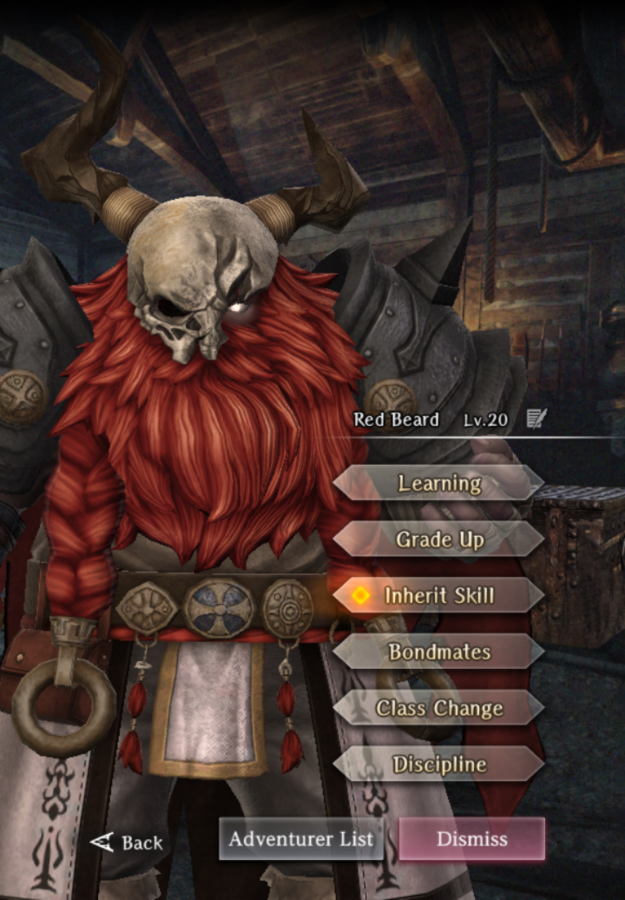

# Red Beard

**Race**: Dwarf  
**Gender**: Male  
**Type**: Dark  
**Personality**: Neutral  
**Starting Class**: Priest  
**Class Change**:   
**Role**: Support

!!! info "Portraits"
    === "Priest"
        

## Skills

!!! info "Unique Skill (Inheritable)"
    === "Prayer of Rebellion"
        Generates flames of rebellion that increase the Attack Power and Resistance of 1 row of allies for 3 turns. Attack Power and Resistance increase amount and number of turns are reduced if learned by someone other than Red Beard.

!!! info "Unique Skill (Not Inheritable)"
    === "Apostle of Breaking"
        Increases Tolerance of Insta-Kill, Skill-Binding, and Spell-Binding for user and all adjacent dark type allies.

!!! info "Discipline Skill"
    === "Traitor to Gods"
        Continuously increases each stat, Divine Power and Attack Power increased further.

## Adventurer Reviews

??? info "TheAxolotl's Analysis"

    Red Beard has an interesting and somewhat contradictory skill set that make him simultaneously unique and difficult to optimally use.

    First, in his favor, is his Neutral personality. This lets him fit well in the front row with Lana or in the back row with Alice and not mess up their row buffs.

    His Apostle of Breaking skill provides some nice resistances for himself and any adjacent dark allies. The weird thing about this is that as a priest, he's usually going to be in the back row, which can force you to decide between placing him in the middle to allow him to buff three dark allies, which prevents you from placing a mage in the middle to leverage their secret art. If you place him on an edge, he can only buff two allies. You can also place him in the front row, but the limitation there is that Priests have limited equipment options compared to other physical damage dealers and they have a reduced Strength to Attack Power modifier, which means he'll have overall lower attack and not be able to take full advantage of his own unique spell.

    His Prayer of Rebellion spell, in a vacuum, is very powerful since it provides both a powerful offensive buff and a conditionally useful defensive buff for three turns. As a row-wide attack power boost that can be targeted, it allows you to cast this on your front line in turn 1 and have that line start attacking on turn 1 with boosted attack power. No need to spend a turn casting Warrior's Battle Cry first.
    
    In practice, though, there are a few major limitations with it that make it less appealing. The first is that you can only apply three buffs at a time. You'll likely want to be using MACALDIA, which already takes up two slots, so the order you apply the two buffs is crucial. I haven't confirmed this myself, but apparently the Resistance buff ends up ahead of the Attack buff on the list, so if you want to keep the Attack Power, Accuracy, and Surety buffs from the combination of MACALDIA and Prayer of Rebellion, you MUST cast Prayer of Rebellion first, that way MACALDIA will knock the Resistance buff off the list. If Red Beard is your only buffer, this isn't really an issue however if you're using two buffers, you'll need to pay close attention to speed tuning so Red Beard always goes first, assuming you want to apply both buffs on the same turn.

    The magnitude of the Attack Power boost from Prayer of Rebellion seems to be comparable to, if not a bit lower than that of Warrior's Battle Cry at the same skill level, with Warrior's Battle Cry significantly easier to get a higher skill level of through inheritance. It is possible to stack Warrior's Battle Cry with Prayer of Rebellion, which can be great if you don't need the Surety or Accuracy from MACALDIA, but most people are probably not in that situation, so MACALDIA would likely still be more valuable to them.

    If inherited to a different adventurer, Prayer of Rebellion will see a reduction in magnitude of the buff as well as a 1 turn count reduction. This turn count reduction is less than ideal since that can mess with your buff rotation and force you to delay reapplying it if you don't want to knock an important buff off the list. If inherited to Alice or someone with her skill, the two will offset each other at level 1, resulting in the buff lasting 3 turns while other buffs would last 4 turns.

    He's a solid pass for me, personally. I think his buff, while nice, is limited from its full potential by core game mechanics and he won't provide anything overly unique to my party that can't already be achieved, with potentially better and easier-to-work-with results, with other party members like Alice.

??? note "TheAxolotl's Pull Plan"
    Red Beard was a skip for me. His buff is strong, but I didn't want to have to fight the 3 buff limit and buying Scrolls of Shared Power from the shop could cover any same-turn attack power buffing I wanted.

??? note "Lynd's Pull Plan"
    Now I have nothing against dwarves, I was a Gerulf truther and still use him ocassionally to this day. Redbeard though? One copy for collection because Alice looks better in my backline.

## Duplicate Usage

* Inherit on his own skill will increase the magnitude of his buff. If you're using him in your party, this should absolutely be your top priority.
* Inherit his skill to other adventurers for a less effective version of the buff.
* Increase his Discipline level.
* Save to inherit to future adventurers.