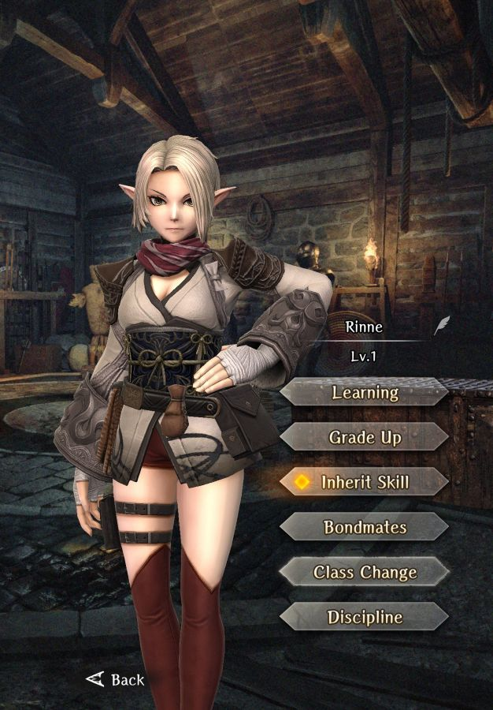

# Rinne

**Race**: Elf  
**Gender**: Female  
**Type**: Dark  
**Personality**: Evil  
**Starting Class**: Ninja  
**Class Change**: Thief
**Role**: Damage, Support

??? info "Portraits"
    === "Ninja"
        

    === "Thief"
        

## Skills

!!! info "Unique Skill (Inheritable)"
    === "Moment of Finality"
        {{ get_skill_description('Moment of Finality') }}

!!! info "Unique Skill (Not Inheritable)"
    === "Enlightenment of the Brink of Death"
        {{ get_skill_description('Enlightenment of the Brink of Death') }}

!!! info "Discipline Skill"
    === "Inheritor of the Secret Arts"
        {{ get_skill_description('Inheritor of the Secret Arts') }}

## Adventurer Reviews

??? info "TheAxolotl's Analysis"

    Rinne is our first legendary ninja, and she's an incredible way to introduce the class. In addition to the ninja skill kit, which is already strong, Rinne has a few really big standouts.

    Enlightenment of the Brink of Death is the first true support we get for an Evil MC (and Evil characters in general). While the magnitude is tricky to determine, increasing Surety is always good. The buff will always be active for her, and "adjacent" in this game means on either side, as well as in front or behind. This gives her a lot of versatility in terms of position placement. Right now, the prime targets for her buff are an Evil MC, Gerulf, and Milana. This actually enables us to run aa full Evil party that could consist of Evil MC, Rinne, and Gerulf in the front row, and Milana, Alice, and Adam in the back row. This party would have both rows buffed by Alice, Milana providing an additional damage buff to the Evil MC, and Rinne providing a Surety buff to Evil MC, herself, and Gerulf in the front. One important thing to note is that she will always receive the Surety buff from this skill - it won't disappear if she's surrounded by Neutral or Good adventurers.

    Moment of Finality is a very unique ability. It is a skill that deals untyped spell damage on an entire enemy row, which initially is pretty solid, but is made stronger by the fact that it bypasses the enemy Magic Defense AND is based on Attack Power instead of Magic Power. Based on the skill details, the Magic Defense bypass rate is increased based on skill level, so while this needs testing, it likely behaves in the same way that Precision Strike and Armor Pierce do, but targeting Magic Defense instead of Defense. This gives a fantastic way for Rinne to get around high defense enemies, and it also gives us one of our first row attacks based on Attack Power. Furthermore, since it's based on SP, inheriting Debra to Rinne will allow for a boost to longevity through restoring SP on kill. This skill is likely not as valuable when inherited due to the damage loss, however it is a solid target for duplicate usage on Rinne herself.

    Rinne's Inheritor of the Secret Arts Discipline skill is also pretty solid in that it boosts her Surety, which is always welcome.

    In addition to the all-Evil party I mentioned above, Rinne can fit in a variety of teams, and she can function well in either the front row with Daggers or in the back row with Throwing Ninja Tools. She can also use Ninja Katanas effectively, as of release, we don't know if the Katanas are treated as Daggers for the Ninja Dual Wield skill or not. She can provide damage, support, and all around general utility with the other great Ninja active and passive skills.

    While Rinne herself may not be a meta-defining adventurer, the Ninja class initially seems extremely strong and Rinne provides enough uniqueness with her kit to make me highly recommend her as a pull target for those that have been saving their gems for a while.

??? info "Frobro's Analysis"

    Warning to newer players, ninjas are cool but are not for you. Their high EXP requirements will keep them under-leveled relative to the rest of your party. You will have no access to Kunai, making it so hiding them in the back row is unviable. Veteran players have access to potent exp dispatches that can get one from level 0 to 60 in ~11 days.

    Now to Rinne specifically. Because of the potency drop when inherited, Moment of Finality is really only useful when used by her, which gives her a niche as the only non-mage multitarget attacker at present. However, the skill is kinda costly at 15SP which means it isn’t the kind of skill you can use very often. Can be offset somewhat with Debra’s SP regen skill. Rinne only gets 1 recovery event if multiple units die to Moment of Finality, but will get 2 if she kills an enemy while Dual Wielding with basic attacks. Rinne also has a relatively deep pool of MP with nothing to use it on naturally. I suppose you could use her in a buffer/debuffer role by using premium scrolls like Batilgref/Dilto/Marein/Masolotu/Cortu from the daily shop on her, but her 2nd class may be mage so it’s worth holding off on that for now.

    Her Enlightenment at the Brink of Death passive gives her and adjacent Evil units free surety. Stuff like this is why Evil is drowning and Good is starving. The surety + accuracy discipline is potent for Dual Wielding Daggers or Kunai; no complaints.

    Right now, ninjas are flashy but not extremely effective or even on par with fighters. Once MC gets access to Ninja, things get even worse for Rinne as we won’t need her for Dissipation and her use case shrinks even more. An inspired voice performance and a top 5 character model on a middling unit.

## Adventurer Pull Plans

??? note "TheAxolotl's Pull Plan"
    While I'm not a whale, Rinne has easily been my biggest banner investment. I pulled enough to get a base copy, an OCD inherit, as well as level 3 Moment of Finality on both Rinne and my MC. In the process, I managed to get one extra copy to take her Discipline up to D2 since I didn't have anything else to really use it on.

??? note "Lynd's Pull Plan"
    Would've pulled if I was around. I miss her and I've never even met her. Come back soon please.

## Duplicate Usage

* Inherit on her own skill will increase the damage and Magic Defense bypass of her Moment of Finality skill. Note that as with all increased skill levels, the SP cost will increase, so inheriting a few Debra's to her can help offset this.
* Inherit on the MC. Even with the damage reduction, this skill is very viable on the MC due to the uniqueness of its mechanic.
* Increasing her Discipline to increase her Surety.