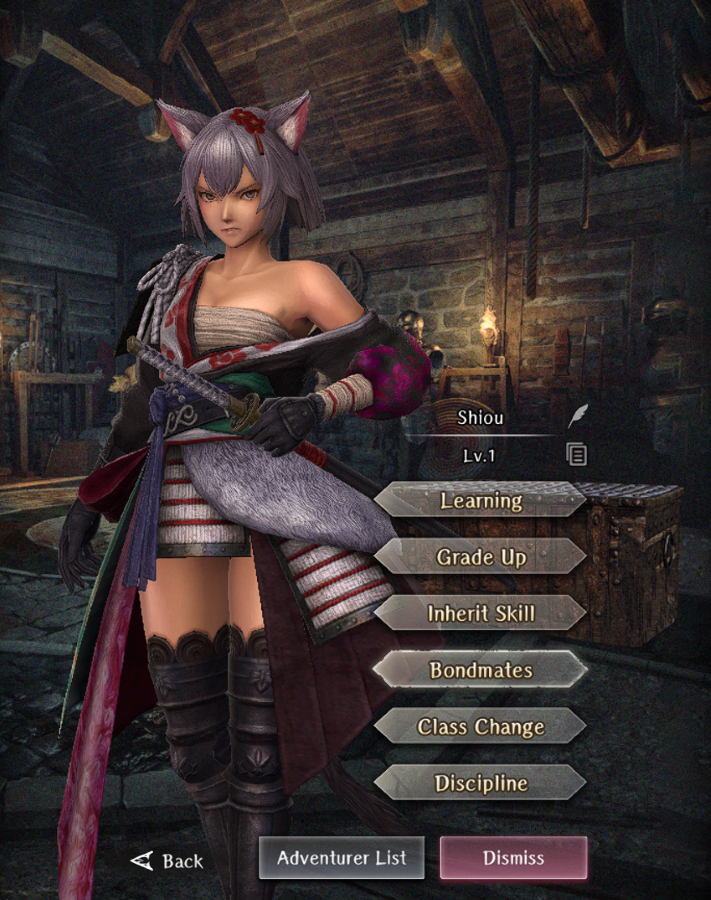

# Shiou

**Race**: Beastfolk  
**Gender**: Female  
**Type**: Air  
**Personality**: Neutral  
**Starting Class**: Samurai  
**Class Change**:  
**Role**: Damage

??? info "Portraits"
    === "Samurai"
        

## Skills

!!! info "Unique Skill (Inheritable)"
    === "Lingering Blossom"
        {{ get_skill_description('Lingering Blossom') }}

!!! info "Unique Skill (Not Inheritable)"
    === "Ephemeral Illusion Stance"
        {{ get_skill_description('Ephemeral Illusion Stance') }}

!!! info "Discipline Skill"
    === "Instruction in Inner Stillness"
        {{ get_skill_description('Instruction in Inner Stillness') }}

## Adventurer Reviews

??? info "TheAxolotl's Analysis"

    Shiou, our first legendary Samurai, has the potential to be an incredibly powerful damage dealer with a high risk and high reward play style. We won't see her true potential for a few days at least since Samurai seem to be following the Ninja's advanced class experience trend, so this review is very subject to change, but at an initial glance, I absolutely love her kit and play style.

    First, let's talk about her non-inheritable skill, Ephemeral Illusion Stance. This is our first "massive" type skill, which presumably is going to hit extremely hard with good gear. It does have some pretty big limitations, but it is complemented by the rest of the Samurai kit in general. Speed tuning your party will be quite important for this, since the 30% HP requirement can put her in "one more hit will kill me" range, so being able to heal Shiou up after she attacks but before the enemies attack will be helpful. In addition, there is a bit of anti-synergy with Lana's post-battle heal if you're looking to use this skill when farming, however it should be a non-issue during Sentry or boss fights.
    
    Moving on to her inheritable skill, Lingering Blossom is interesting. At a glance, it's a souped up Warrior's Battle Cry in that it provides an Attack Power boost, as well as a Surety boost. The additional functionality in this skill is much harder to evaluate since we are unable to see the actual magnitude of stat changes in combat, however it has great synergy with Ephemeral Illusion Stance, as well as a couple other Samurai passives. One thing to note is that the attack boost seems to be roughly comparable to a level 1 WBC, however WBC is going to be much easier to inherit to higher levels, so it likely won't stay competitive from a pure attack power boost perspective. The value prop here is in the entire host of buffs that the skill provides. If inheriting to another adventurer, the skill wording implies that the only reduction is going to be on the proc component but not on the initial Attack Power + Surety boost. That needs to be verified for sure, though. Inheriting this to another adventurer probably won't be that useful given the easier accessibility of WBC as an inherit.

    Regarding buffs, the Attack Power and Surety boosts from Lingering Blossom each take up one of the buff slots, so be careful if you're using this in combination with MACALDIA or Prayer of Rebellion, as you can inadvertently push off a buff you don't want to.

    Samurai in general appear to be at their best when actively using skills, so they might potentially be weaker than Fighters if you're just doing auto-attack farming, however Shiou's active skill use at a glance is putting out FPS levels of damage every turn, which is quite substantial.

    One thing that we still need to determine is if the normal attack that comes with Cresting Wave Stance triggers Follow-Up Attack. The wording implies that it would, but that's still to be determined.

    Regarding her Discipline, you can't do any better than Attack Power + Surety for a physical damage dealer.

    All in all, this is probably my favorite kit for a single purpose damage dealer. In many cases, Ephemeral Illusion Stance skill will not be seeing use, but the synergy she has in her kit as a whole is really exciting to me, and I'm looking forward to experimenting with her over the next couple weeks.

## Adventurer Pull Plans

??? note "TheAxolotl's Pull Plan"
    I pulled 4 copies so far. One copy went to the OCD Discipline, and I'm not entirely sure if I'm going to throw the other copies towards Discipline for the Surety, or if I'll take her Lingering Blossom up to level 3 for more active Surety. I'm leaning towards the latter, but we'll see. I also might pull more, but I'm unsure.

## Duplicate Usage

* Inherit on her own skill will increase her self-buff.
* Increasing her Discipline to increase her Surety.