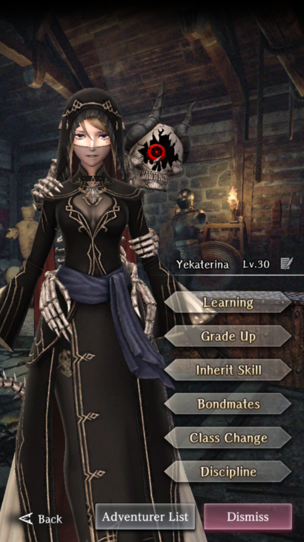

# Yekaterina

**Race**: Human  
**Gender**: Female  
**Type**: Earth  
**Personality**: Neutral  
**Starting Class**: Mage  
**Class Change**: Priest  
**Role**: Damage, Support

!!! info "Portraits"
    === "Mage"
        

    === "Priest"
        

## Skills

!!! info "Unique Skill (Inheritable)"
    === "Eye of Kalshum"
        Continuously increases Detect with a chance to nullify an enemy's ambush. Detect increase amount and chance of ambush nullification are reduced if learned by someone other than Yekaterina.

!!! info "Unique Skill (Not Inheritable)"
    === "Advice of the Skull"
        Increases damage against undead and decreases damage from undead.

        !!! bug
            There is currently a bug with this skill where the damage is displayed as if the damage were being increased, but the damage value itself does not get increased as it should.

!!! info "Discipline Skill"
    === "Future Dreamt with the Skull"
        Continuously increases each stat, MP and Skill-Bind/Spell-Bind Tolerance increased further.

## Adventurer Reviews

!!! info "TheAxolotl's Analysis"

    Yeka, like Adam, is one of our initial mages. While she will be impacted by unfavorable type matchups, she innately provides both Earth and Water damage. In addition, she can learn Fire and Wind damage through inheriting spells. This, along with her bonus damage to undead, makes her a very heavy hitting for the beginning abyss and the trade waterways. Her MP reservoir is not as deep as Adam's, but she trades the longevity for hitting harder.

    Her ambush prevention skill is also nothing to shrug off. Some people report that they don't get much value out of it, however I've personally seen roughly half of the ambushes I've had pop up be prevented, and that's pretty great. To make things even better for Yeka, she's a Neutral alignment which has the potential to make her a bit more future-proof than Adam when it comes to team formation. Lastly, if you inherit Adam's skill on her, she'll be able to get the have damage dampening, which will likely be useful, particularly when you're not sure what an enemy's weakness is. In addition that, her Neutral personality has the potential to make her more flexible for team compositions, but this may or may not be the case long-term, since we don't know what future releases will look like.

    Changing her class to Priest will give him a wider selection of spells, as well, making her a very well-rounded Adventurer for support or damage purposes.

    One big downside to Yeka is that her Discipline levels do not boost her Magic Power and Action Speed the way Adam's do, however it's very likely that having her Skill/Spell-Bind tolerance boosted will be quite useful in the future.

    Yeka is a boon to have on any team and due to the ability to hit multiple weaknesses, deal increased damage against undead, and prevent ambushes, she'll likely remain a staple member of my party for a long time!

## Duplicate Usage

* Discipline or skill inherit. This one is tough to determine since we can't see the impact of her anti-ambush skill on the character sheet. You can't go wrong with either option.
* Inherit her skill to the MC. Again, hard to evaluate because we can't see the impact and reduction of the anti-ambush skill on the MC.