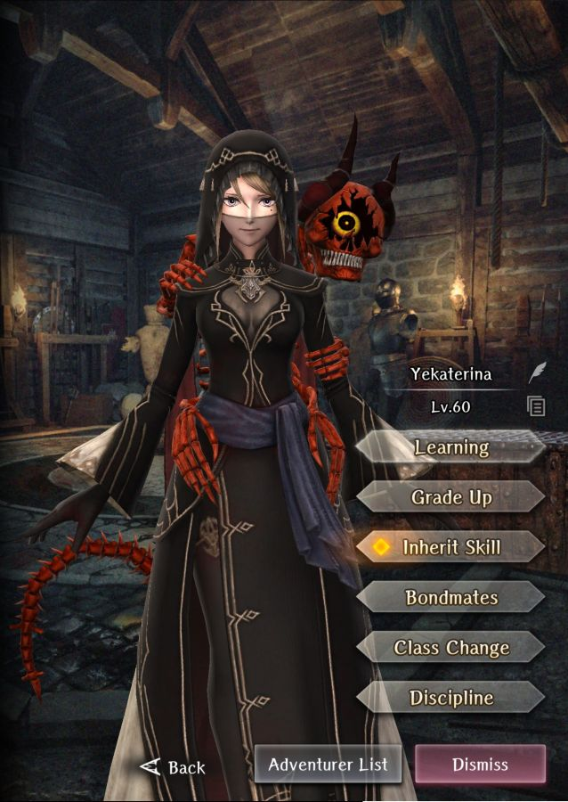
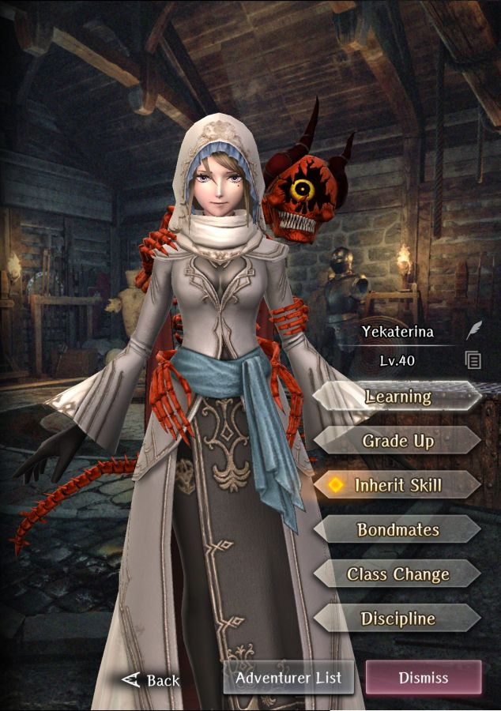

# Yekaterina

**Race**: Human  
**Gender**: Female  
**Type**: Earth  
**Personality**: Neutral  
**Starting Class**: Mage  
**Class Change**: Priest  
**Role**: Damage, Support

??? info "Portraits"
    === "Mage"
        

    === "Priest"
        

    === "Mage After Personal Request"
        

    === "Priest After Personal Request"
        

    === "Everdistant Summershade"
        

## Skills

!!! info "Unique Skill (Inheritable)"
    === "Eye of Kalshum"
        {{ get_skill_description('Eye of Kalshum') }}

!!! info "Unique Skill (Not Inheritable)"
    === "Advice of the Skull (Standard)"
        {{ get_skill_description('Advice of the Skull') }}

    === "Skull's Tutelage (Everdistant Summershade)"
        {{ get_skill_description("Skull's Tutelage") }}

!!! info "Discipline Skill"
    === "Future Dreamt with the Skull (Standard)"
        {{ get_skill_description('Future Dreamt with the Skull') }}

    === "Path Walked with a Skull (Everdistant Summershade)"
        {{ get_skill_description('Path Walked with a Skull') }}
        

## Adventurer Reviews

??? info "TheAxolotl's Analysis"

    === "Standard"

        Yeka, like Adam, is one of our initial mages. While she will be impacted by unfavorable type matchups, she innately provides both Earth and Water damage. In addition, she can learn Fire and Air damage through inheriting spells. This, along with her bonus damage to undead, makes her a very heavy hitting for the beginning abyss and the trade waterways. Her MP reservoir is not as deep as Adam's, but she trades the longevity for hitting harder.

        Her ambush prevention skill is also nothing to shrug off. Some people report that they don't get much value out of it, however I've personally seen roughly half of the ambushes I've had pop up be prevented, and that's pretty great. To make things even better for Yeka, she's a Neutral alignment which has the potential to make her a bit more future-proof than Adam when it comes to team formation. Lastly, if you inherit Adam's skill on her, she'll be able to get the have damage dampening, which will likely be useful, particularly when you're not sure what an enemy's weakness is. In addition that, her Neutral personality has the potential to make her more flexible for team compositions, but this may or may not be the case long-term, since we don't know what future releases will look like.

        Changing her class to Priest will give him a wider selection of spells, as well, making her a very well-rounded Adventurer for support or damage purposes.

        One big downside to Yeka is that her Discipline levels do not boost her Magic Power and Action Speed the way Adam's do, however it's very likely that having her Skill/Spell-Bind tolerance boosted will be quite useful in the future.

        Yeka is a boon to have on any team and due to the ability to hit multiple weaknesses, deal increased damage against undead, and prevent ambushes. She'll likely be a staple in many peoples' party, but recent additions like Shelirionach make her much less desirable than she once was.

        She still is excellent for being accompanied by Doctor, the best drinking buddy anyone can ever have.

    === "Everdistant Summershade"

        As our third legendary adventurer to get a second form, Yeka's is pretty much a textbook sidegrade from a mechanics perspective.
        
        Looking at her non-inheritable skill first, Yeka loses her bonus damage to undead, and gains more HP and damage reduction in the back row. This makes her more survivable while dealing less situational damage, however there's a big question of whether or not she needs that extra survivability. As a human, her HP is already higher than that of an Elf mage/priest, and being in the back row, she already has pretty decent survivability. More is better, but it's in no way necessary.

        On the subject of her Discipline, Yeka gains more HP but loses her Bind tolerance - again, trading something situational for something more general.

        Neither of these changes are bad, but they're also not groundbreakingly good. Her summer form is a bit more general-purpose, while her standard form has a bit more situational utility. I'd lean her summer form being maybe a hair better than her standard form, but overall nothing worth going out of your way to get.

        From a visual perspective, this is of course going to be subjective, but I'm pretty sure many people are going to pull for her legs alone.

??? info "Frobro's Analysis"

    === "Standard"
        
        Likely the single most overrated unit by the playerbase, Yekaterina. Don’t misunderstand, she is perfectly serviceable and better than many other mages, but not anywhere near as potent as people would have you believe. Not sniffing the top 3 mages…maybe not the top 5 either.

        She is positioned in a pretty good spot early game. Bonus damage to the undead at the bottom of Abyss 1 and bonus damage to Earth-weak enemies in Abyss 2 while resisting those enemy's attacks too. But that bonus damage isn’t anything crazy like 2x so it isn’t as valuable as it may sound initially. The further the game goes on the less important this early game advantage looks, even now, Shelirionach outperforms her at those stages of the game.

        Her Eye of Kalsum passive is whatever. Ideally, you don’t get ambushed ever; which you can avoid with high Detect and not strafing into enemies. I suppose it becomes a little more valuable to someone who regularly uses Morgus contracts which have a set increase to ambush chance, but even then the proc rate feels so low that it may as well not be there. Maybe it’s incredibly consistent at higher levels, but I have heard no reports of this. Her discipline focus is…something. MP + Skill/Spell-bind. It’s not exceptionally good but it’s not bad. Dark/Water Elves get more MP without needing dupes and spell-binding enemies aren’t exactly common.

        Early access to an attack all spell with Secrets of Maerlik is cool, but she doesn’t have the MP to use it often until around the time she naturally learns Maerlik anyway. But being able to cast the ~15% stronger version is cool.

        Overall, better than the riff-raff but faces some serious competition from other units that can easily outdo her with easier access to merges or access to other team synergies and utility. (Elf-Mag, Milana, Iarumas,etc)

## Adventurer Pull Plans

??? note "TheAxolotl's Pull Plan"
    Everdistant Summershade Yeka is quite pretty, so maybe I'll pull to get a single copy for that reason alone. Possibly a second for the obligatory OCD Discipline, but I'll likely just wait to see what I get from the free bones first. Her summer form definitely isn't enough to make her a regular addition to my party.

## Duplicate Usage

* Discipline or skill inherit. This one is tough to determine since we can't see the impact of her anti-ambush skill on the character sheet. You can't go wrong with either option.
* Inherit her skill to the MC. Again, hard to evaluate because we can't see the impact and reduction of the anti-ambush skill on the MC.
