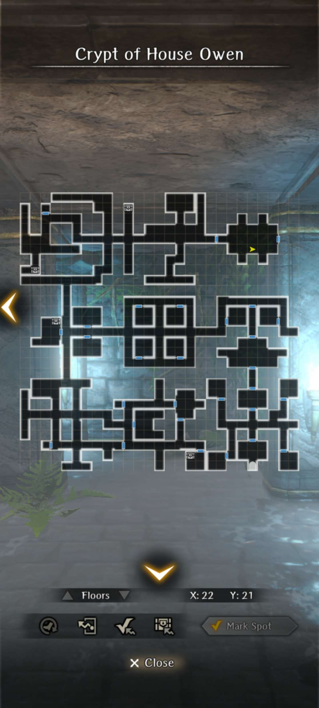

# Accompany Me to the Old Temple in My Homeland

## Request Requirements

* Abenius must in the party
* Certain Trust Level must be achieved with Abenius.
* You must have the normal Abenius and not Radiance of Owen, Abenius.

Once the requirements are met, the "request" will be available upon entering the Royal Capital and watching the cutscene with Abenius. If you don't immediately get this cutscene, you can also try going into the tavern to activate the request.

!!! warning "Important Notice"
    This "request" can only be finished **once** per character copy. If you missed something, you won't be able to go back for it. So don't rush it!

## Request Mission

1. Abenius will tell you that she wants to head to her family crypt in order to find an answer about her family. Head directly to the Temple of the Old Owen Lands in the World Map after accepting her request in the Adventurer's Guild.
2. After a short cutscene about her past, head into the crypt and immediately be met with a cutscene with a ghost. You will need to fight a relatively normal necrocore right after.
3. Proceeding deeper into the crypt will have her fight solo against various members of her family, ranging from her brother to her father, and then eventually herself. The fights are relatively straightforward as they are similar to fighting adventurer npcs of the same type. In the final fight with herself, you must select the option to let her handle the fight on her own. Attempting to help her more than once in the fight will require you to redo the process.
4. After defeating herself, which was a representation of her doubts, enter the final room where she will have a cutscene with her mother and other family members.
5. When completed, her inherit skill, Flutterdream Flash, will be upgraded to Flutterdream Flash - Lingering Mind, which has a chance to hit extra times when it activates.

## Maps:

??? note "Maps"
    
