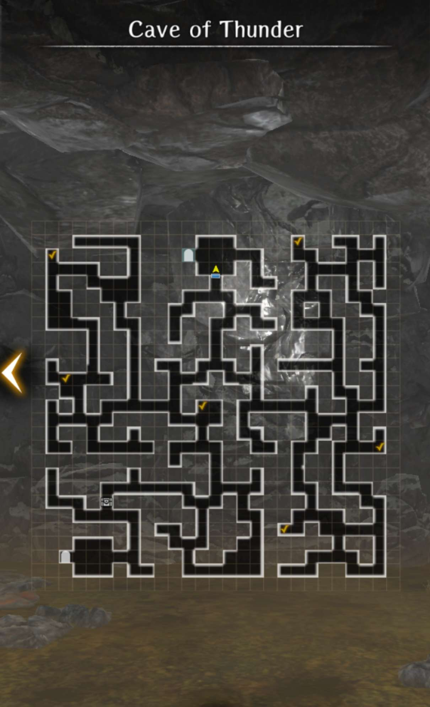

# Visit to My Homeland

## Request Requirements

* Gerard must in the party
* Certain Trust Level must be achieved with Gerard.

Once the requirements are met, the "request" will be available upon entering the Royal Capital and watching the cutscene with Gerard. If you don't immediately get this cutscene, you can also try going into the tavern to activate the request.

!!! warning "Important Notice"
    This "request" can only be finished **once** per character copy. If you missed something, you won't be able to go back for it. So don't rush it!

## Request Mission

1. After talking to Gerard, head to the world map to move to the Cave of Thunder.
2. You will need to collect offerings around the map, indicated by checkmarks. You need a minimum of 3, with 3 needing to be the same type. The type obtained does not matter. Lilies are located near the middle horizontal line of the map, while Walnuts are located at the top and bottom edges of the map. This section is also timed via # of steps, and you will be given warnings. On the third warning, you will be booted from the map and will need to re-collect everything.
3. Upon collecting enough, head to the top middle room of the map and fight a Monster Bird Variant.

    ??? danger "Lightning-Clad Monster Bird"

        

        - Has around 13k HP. Is Wind Element and is a Magical Beast.
        - Has similar moveset to typical Monster Bird, but is strong against adventurers (you and your team). Its stone breath does wind element damage.
        - After taking a certain amount of damage, will cast "Enveloping Lightning Intensifies" which is an undispellable attack and defense buff.

5. Depending on the number of offerings collected, you will be given a certain number of Cave of Thunder Junk, which contains only steel heavy armor and a steel sword. You will also unlock Gerard's alternate form which removes his hat and turns his hair white.

## Map

??? map "Cave of Thunder"

    

    

