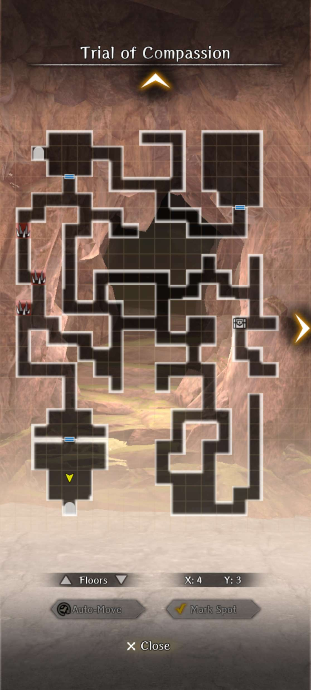
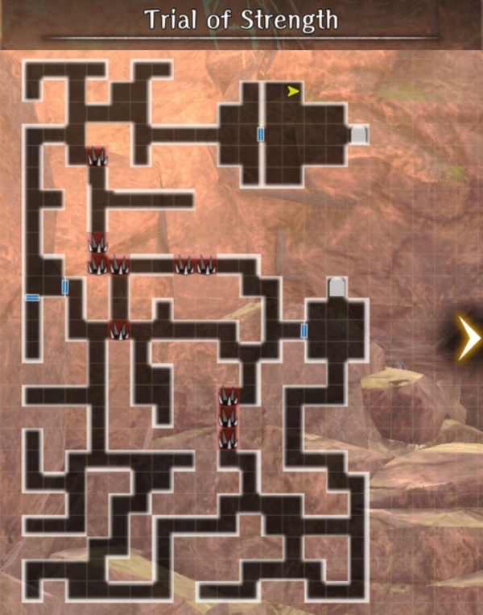
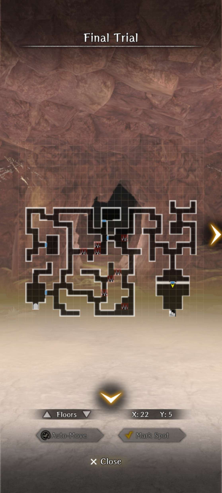

# Unnamed Request

## Request Requirements

* Lanavaille must in the party
* Certain Trust Level must be achieved with Lanavaille.
* You must have the normal Lanavaille and not Wanderer Princess Lanavaille.

Once the requirements are met, the "request" will be available upon entering the Royal Capital and watching the cutscene with Lanavaille.

!!! warning "Important Notice"
    This "request" can only be finished **once** per character copy. If you missed something, you won't be able to go back for it. So don't rush it!

## Request Mission

!!! danger "It is possible to fail this request. Upon failing the request, Lanavaille will take a large loss in Trust with you. If trust falls too low, it's not possible to try the request again until Trust has been restored to appropriate levels"

1. Lanavaille will tell you of the three trials she must undergo in order to be officially recognized as a ruler. The first two trials require adventurers to be of the correct personality, otherwise they will receive a permanent paralyze and fear debuff while inside the dungeon. In addition, there is an IQ requirement in order to have the correct options during the trials. It's hypothesized that the wrong personality type adventurers (including the MC) do not count.
2. For the Trial of Compassion, the easiest route to take is through the spikes on the left and straight to the bottom. There will be a fight with 2 succubi in the front row and 2 pixie in the back row. The answer to the trial is "Counsel the people and punish the nobles of the defeated nation."
3. For the Trial of Strength, take the left path, up, and then to the right. There is no guardian before the door. The correct answer to the trial is "Determine how much food is lacking." Afterwards, there will be a fight vs 4 guards in the front row and 4 mages in the back row.
4. For the final trial, take the right path, up, right, then down. There will be a scorpion lady as the guardian before the door. The correct answer to the final trial is "Have them cooperate on handling everything."
5. Enter the treasure room and have Lanavaille change forms. There are three chests in the room that provide some items that could be sold for gold.

## Maps:

??? note "Maps"
    
    
    

## Rewards:

- Lanavaille will now have the same voicelines as Wanderer Princess Lanavaille.
- Lanavaille will now have a different crown, shackles will be removed, and armor will no longer have cracks.
