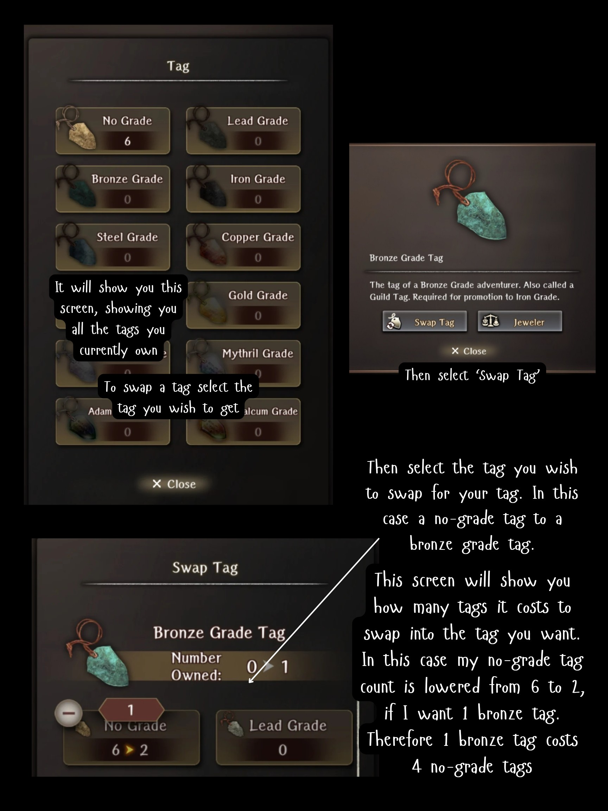
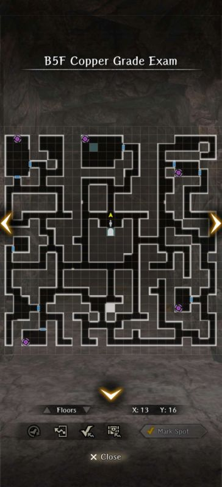

# Grade Up

At specific levels an adventurer needs to "Grade Up" to increase the level cap. The level caps are at 20, 30, 40, 50, and 60. Grading Up requires two items:

1) A Grade Tag of the appropriate level for each adventurer. The Tags are labeled: No-Grade for 20, Lead for 30, Bronze for 40, Iron for 50, and Steel for 60.
2) A Grade Marker of the appropriate level for each adventurer. The Markers are labeled: Lead for 20, Bronze for 30, Iron for 40, Steel for 50, and Copper for 60 (a bit confusing we know). 

Grade Tags can be earned in Weekly Requests (nominal, three to four), bought at the Jeweler, or by Dismissing Adventurers: 

* Anonymous Adventurers = One Grade Tag corresponding to their current grade (Human-Pri, etc).
* General Adventurers = One Grade Tag corresponding to their current grade plus One No-Grade Tag (Chloe, Clarissa, Flut, etc).
* Legendary Adventurers = One Grade Tag corresponding to their current grade plus One Iron Grade Tag (Lanavaille, Adam, etc).

Grade Markers can be bought at the Jeweler, or can be earned by taking a Grade Exam (a one-level boss dungeon). With the appropriate Tag and appropriate Marker one can visit the Training Room and *Grade Up* an adventurer. From the Grade Up dialog, Tags of lower value can *Swapped* (combined) to create higher Tags.

!!! info
    
    

Grade Exams can only be attempted as high as is the Main Character's (MC). Adventurers can take Grade Exams higher than their own level cap and pass it/them. Adventurers will still need to supply the requisite Grade Tags per Grade Up. 
    
**Notes:**

* Level Caps only occur once per character… if you Change Class you will retain your Grade Ups.
* Grading Up may have additional requirements besides reaching the level cap. Requirements like completing more Requests (to increase the adventurer's reputation) may be needed (Arna may mention these). In these situations, adventurers should try to complete as many different requests as possible.
* The MC is expected to pay the Grade Tag prior to Copper Grade Exam.
* For more details about obtaining tags and the game economy please see the [Free-to-Play Resources page](../free-to-play-economy.md#guild-tags).

## Lead Exam

*Images courtesy of [https://www.youtube.com/@Grafarya89](https://www.youtube.com/@Grafarya89)*

**Special Notes:**

- Boss summons adds every few rounds. Save AoE clears for them. If have legendary units with Secret Arts, place them in back middle position to use them here.  
- Boss is undead. Bring undead slayer weapons if possible, or a lot of magic scrolls.  
- Boss sometimes skips turn.  
- Boss only has 2 moves, both attack 1 unit on the front row. 1 is a multihit, 1 is a normal hit. Not really threatening, just heal up after.
- Running away from the fight will reset the adds he spawns with. You can use this to your advantage and keep running away until he spawns with only Vorpal Bunnies, as they can be killed very quickly and easily.

## Bronze Exam

*Images courtesy of [https://www.youtube.com/@Grafarya89](https://www.youtube.com/@Grafarya89)*

**Special Notes**:

- Boss doesn’t summon any adds  
- Boss is weak to air  
- Boss is susceptible to Opening
- Mobs on the way to boss can mostly be dealt with Scroll of Rockfall, except Air Entities. Those need Fire.  
- Boss hits like a truck.  
  - Tail Swipe AoE hits all front row with chance to stun.  
  - Jump attack hits 1 front row, swaps that column’s front and back.  
  - Buildup leads to Stinger next hit, hits 1 column with chance to fear. Block or take big damage.  
- As usual, stock inventory full of healing potions to save on MP on the way to boss.

## Iron Exam

**Special Notes**:

- Boss is a Hydraplant and is weak to air and can cause critical poison
- Spawns with additional enemies but does not summon more

## Steel Exam

**Special Notes**

- This exam unlocks shortly after you start the request to save Duke Ixion in Guarda Fortress.
- There is a single boss room and two paths to get there.
    - The left path favors physical damage. All enemies have extremely high magic defense.
    - The right path favors magic damage. All enemies have extremely high physical defense.
- All enemies are stationary and you cannot avoid getting into fights.
- The mage at the start tells you explicitly that you `won't be able to find any gaps to exploit`. This means that you are unable to rely on Openings as a strategy.
- The boss encounter consists of a Minotaur and a Succubus together
    - Kill the succubus first, then the Minotaur.
    - Leverage DILTO, MORLIS, MACALDIA, and any other buff/debuff spells at your disposal.

## Copper Exam

**Special Notes**

- Necrocore boss is in north central room
- Rooms with teleporters have mini bosses
- Teleporters return you to the entrance
- You have two options to clear this exam:
  - Go to boss room and fight the Necrocore + minibosses
    - This leads to a more difficult Necrocore fight, but there is no need to conserve resources
  - Go to each teleporter room, clear out minibosses, then go fight Necrocore alone
    - This leads to a trivial Necrocore fight, but you need to be able to conserve resources
    - You don't have to clear every miniboss room, but each one you clear lessens what joins the Necrocore fight