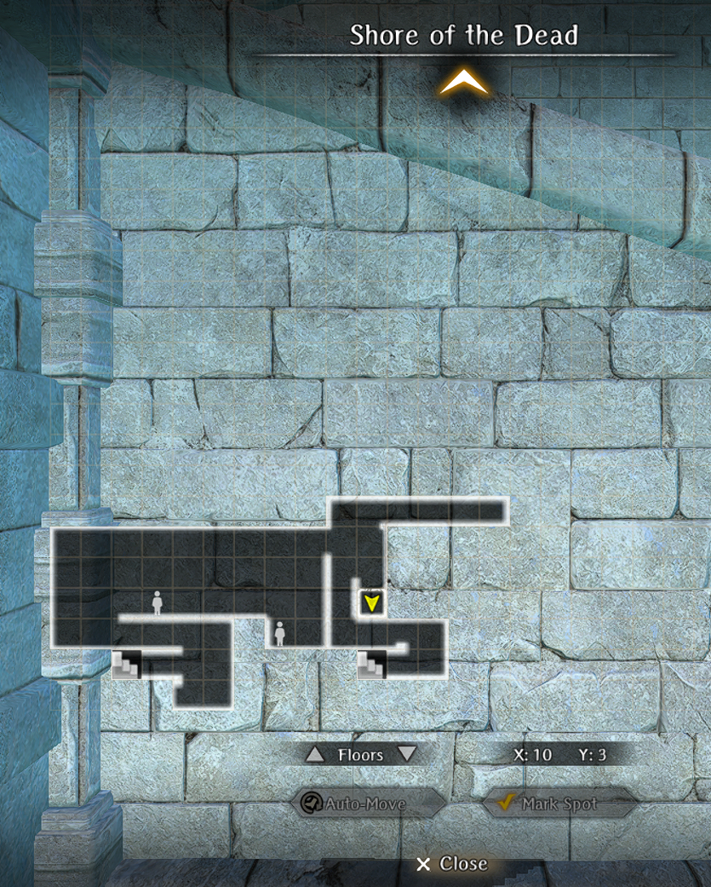

#  Respawning Bone Locations

Follow these steps before you start:

1st Curse Wheel to "Fresh Start"
2nd Curse Wheel to "King's Rescue"
3rd begin your search

Note: Only Curse Wheel to "Awakening" when searching for the "Old Remains"

Most bones will respawn after roughly one month.

??? map "Old Remains - Curse Wheel to Awakening"

??? map "Priest/Mage/Fighter/Knight Remains - Beginning Abyss B1F Death Stench Investigation"
    

    !!! note "To reset the related request for the monthly bone, you'll need to walk to the B1F harken from the Cursed Wheel point Fresh Start"

??? map "Adventurer's Remains - Beginning Abyss Goblin Nest"
    

??? map "Adventurer's Remains - Beginning Abyss B4F"
    

??? map "Adventurer's Remains - Beginning Abyss B5F"
    

??? map "Adventurer's Remains - Beginning Abyss B6F"
    
    
??? map "Adventurer's Remains - Beginning Abyss B7F"
     

??? map "Adventurer's Remains - Beginning Abyss B8F"
    

??? map "Adventurer's Remains - Trade Waterway 7th District Pier Shore of the Dead"
    

    !!! note "Bone will not respawn after Abyss 2 GWO is killed. You will need to cursed wheel before then."

??? map "Adventurer's Remains - Catacombs"
    
