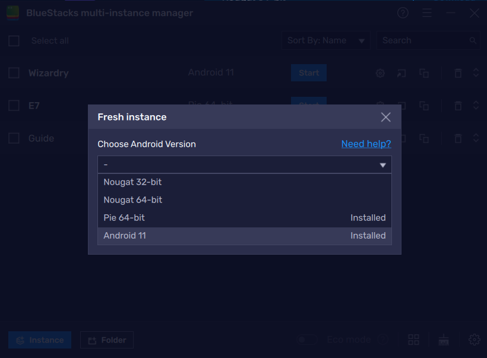
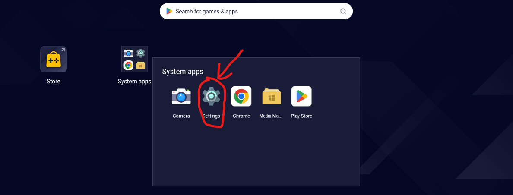
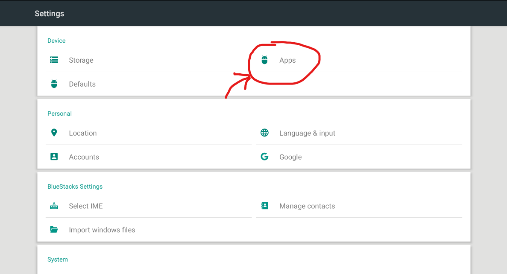
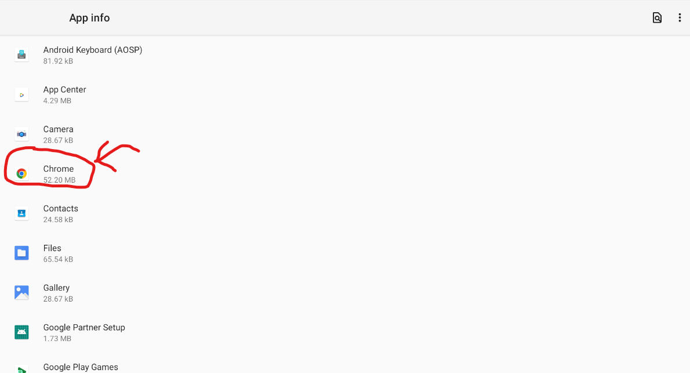
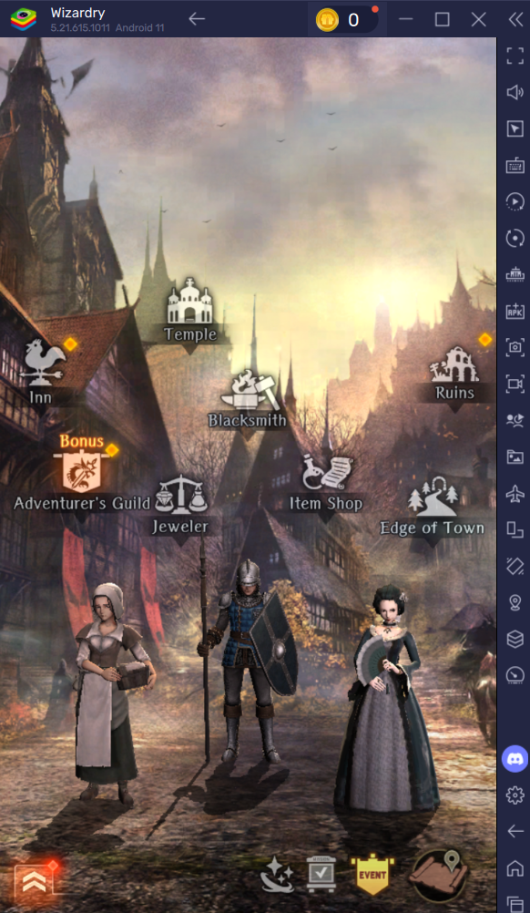
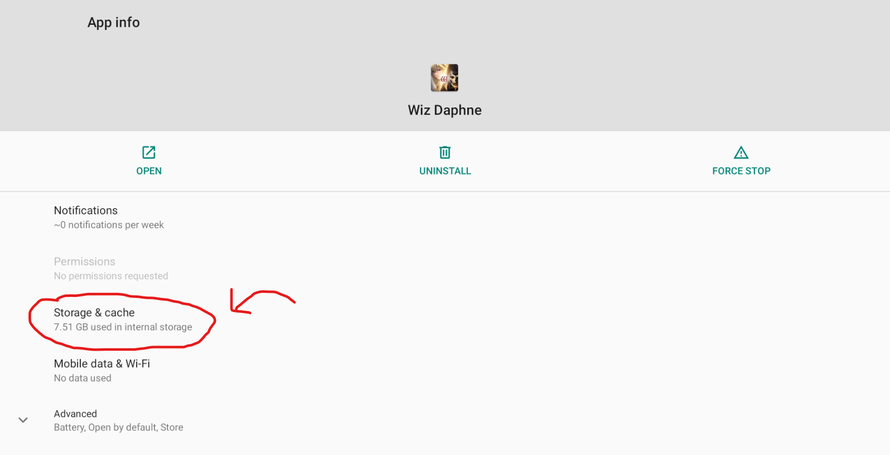
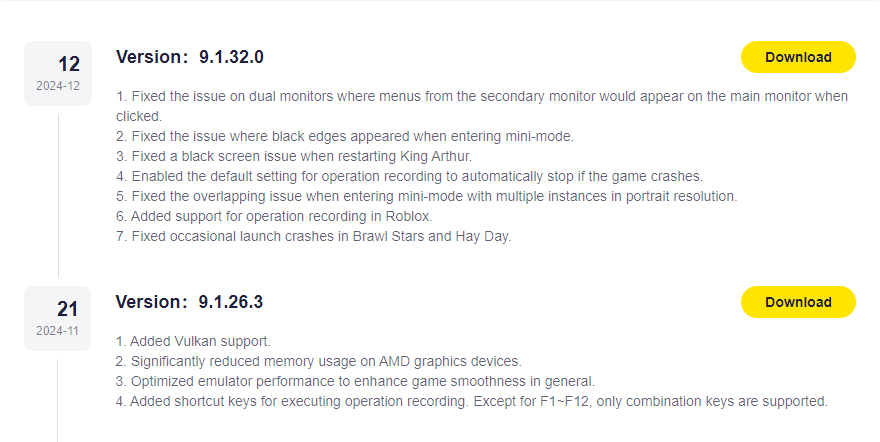
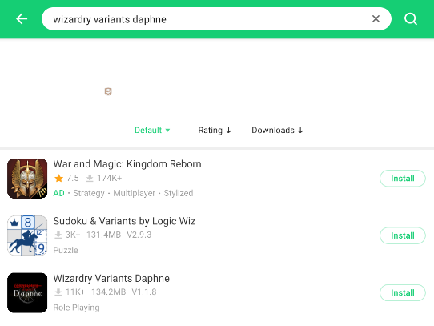
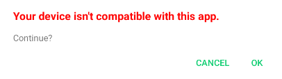

# Emulators
## Video Guide For Bluestacks and LDPlayer

## Bluestacks
1. Download the Latest Version of [Bluestacks 5 Android 11 64-bit](https://www.bluestacks.com/download.html)
    
    

    **Make sure your installed instance is Android 11**

2. Change Graphics Renderer to Vulkan
    

3. Download Wizardry Variants Daphne Through The Google PlayStore
    

4. Reset Chrome Settings to Avoid Terms of Service Bug
    
    Go to Settings->Apps->Chrome-> Clicking triple dot on the top right to uninstall updates.
    
    
    
    
    

5. Now You Can Play the Game **LINK YOUR ACCOUNT ASAP FOR SAFETY**
    
    

## Bluestacks Crashing Bug
If you are experiencing frequent crashing to homescreen when you are trying to open the app then you might need to clear the cache through settings.
    
Go to Settings->Apps->Wiz Daphne->Storage & Cache->**CLEAR CACHE** and **NOT CLEAR STORAGE**
    
    
    
    
    

    
**IF YOU CLEAR STORAGE YOU DELETE YOUR ACCOUNT. THE ONLY WAY TO RECOVER THE ACCOUNT IS IF YOU ALREADY LINKED IT**

## LDPlayer

1. Download the Lastest Version of [LDPlayer9](https://www.ldplayer.net/other/version-history-and-release-notes.html)
    
    

    **Make sure your installed version is at least 9.1.26.3 or up**

    
2. You won't be able to download through the Google Playstore so you will have to download a Third Party Downloader like [APKPure](https://apkpure.com/apkpure/com.apkpure.aegon/download/) or downloading the latest APKs Online
    
    
    
3. Ignore Incompatibility Warnings When Installing Wizardry Variants Daphne to LDPlayer
    

    **Above is APKPure**

    
    
    
4. Now You Can Play the Game **LINK YOUR ACCOUNT ASAP FOR SAFETY**
    
    

## FAQ
### Which one is better?
For Bluestacks you can download through the Google PlayStore directly which is conveniet for both updates and if you want to buy packs and gain Google Play Points. However, you might run into crashes more frequently on Bluestacks. There will be more ads on Bluestacks. Some of the ads you can turn off, but others you can't. 

For LDPlayer, there aren't as many ads as Bluestacks. The ads won't be as intrusive than on Bluestacks. It can run better on lower end devices. Not as many crashes. However, you will not be able to download Wizardry Variants Daphne on the Google PlayStore. This means you can't buy packs and whenever there are updates you will have to wait until the apk is updated online or through a third party app like APKPure.

At the end of the day it is up to you and your personal preferences.

### I keep crashing on Bluestacks. How can I fix this?
If you are crashing when you try to open up the Terms of Service or Privacy Policy then you need to Uninstall the Google Chrome Updates on Bluestacks. 

Go to Settings->Apps->Chrome-> Clicking triple dot on the top right to uninstall updates. 

Refer to the Bluestacks installation guide for visuals. 

If you are crashing to homescreen whenever you try to open up Wizardry then you need to clear the cache. 

Go to Settings->Apps->Wiz Daphne->Storage & Cache->**CLEAR CACHE** and **NOT CLEAR STORAGE**

Refer to the Bluestack Crashing Bug Guide for visuals.