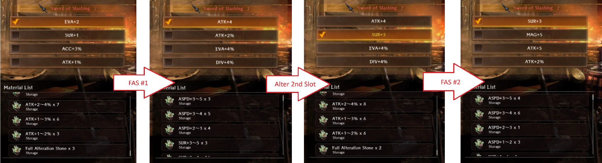

# Blacksmithing Basics

Blacksmithing becomes available early in the game after your party enters the first major city, Royal Capital Luknalia.  It offers several methods for improving your weapons, armor and accessories, and is essential for strengthening your party.

!!! warning "ABYSS 4 WARNING: DO NOT USE COMPOSITE REINFORCEMENT INGOTS (SILVER INGOTS) UNLESS YOU ABSOLUTELY KNOW HOW IT WORKS AND WHAT YOU'RE DOING.  They're rare, expensive, and you do NOT want to waste one out of ignorance."

## ^^Video Guide^^

<iframe width="560" height="315" src="https://www.youtube.com/embed/w8pNI4OCXT4?si=oy3g4x5MfFPMTYe9" title="Wizardry variants daphne way of blacksmithing" frameborder="0" allow="accelerometer; autoplay; clipboard-write; encrypted-media; gyroscope; picture-in-picture; web-share" referrerpolicy="strict-origin-when-cross-origin" allowfullscreen></iframe>

## Nomenclature

- Innate attributes - Stats the item has that affect character abilities like Attack Power, Defense Power, etc. Every item of the same type will have the same attributes.
- Rank - Item material (bronze, iron, steel, etc.) that affect the magnitude of the base attributes for that item. Also referred to as 'tier'.
- Strength - Item characteristic indicating how many times it has been Unified to raise it's maximum enhancement value by 5. Items start at a strength of 0 and can be increased to a strength of 3.
- Blessings - Item characteristic that provids an additional increase to to a single attribute. An item may have up to four blessings. Also referred to as sub-stats.
- Grade - Item "color" which represents the number of Blessings a material has. White = 0, Green = 1, Blue = 2, Purple = 3, Red = 4.  
- Quality - "star" value of an item, which indicates how powerful Blessings on an item can be, ranging from 1 to 5 stars.
- Traits - Additional characteristics or abilities of an item, that are often specific to item type (e.g., most Daggers have the "Nimble Strike" trait) or subgroup (e.g., Undead Bane weapons all have "Vs. Undead" traits).

## ^^Enhance^^
- Increases item Enhancement Value up to a maximum of +20, increasing the Innate Attributes of the item.
- Enhancing an item to +5 and beyond requires different grades and quantities of iron ore to be used.   
- Enhancing items beyond +5, +10, and +15 also requires unification (see below) to increase the Strength of the item.
- At Enhancement Values of +5, +10, +15 and +20, an item's Grade is increased and either a new Blessing is unlocked in the item's 1st, 2nd, 3rd, or 4th blessing slot, respectievly, or an existing Blessing in that slot is improved if it already exists.

### ^^Gold Cost for Enhancing^^
#### Worn-to-Ebonsteel Gear

| Gear Tier   |  +1  |  +2  |  +3  |  +4  |  +5  |  +6  |  +7  |  +8  |  +9  |  +10  |  +11  |  +12  |  +13  |  +14  |  +15  |  +16  |  +17  |  +18  |  +19  |  +20  | Total  |
|:-----------:|:----:|:----:|:----:|:----:|:----:|:----:|:----:|:----:|:----:|:-----:|:-----:|:-----:|:-----:|:-----:|:-----:|:-----:|:-----:|:-----:|:-----:|:-----:|:------:| 
|   Worn      |  150 |  300 |  500 |  750 | 1050 | 1400 | 1950 | 2550 | 3200 |  3900 |  4650 |  5700 |  6800 |  7950 |  9150 | 10400 | 12050 | 13750 | 17150 | 23950 | 127300 |
|  Bronze     |  200 |  350 |  550 |  800 | 1100 | 1450 | 2000 | 2700 | 3550 |  4550 |  5700 |  7250 |  8950 | 10800 | 12800 | 14950 | 17700 | 20650 | 26550 | 38350 | 180950 |
|   Iron      |  350 |  500 |  750 | 1100 | 1550 | 2100 | 2850 | 3750 | 4800 |  6050 |  7500 |  9350 | 11500 | 13950 | 16700 | 19750 | 23400 | 27350 | 39200 | 76200 | 268700 |
|   Steel     |  500 |  700 | 1100 | 1700 | 2500 | 3500 | 4900 | 6650 | 8750 | 11200 | 14000 | 17400 | 21250 | 25550 | 30300 | 35550 | 41500 | 48050 | 67700 | 126650| 469450 |
| Ebonsteel   |  550 |  770 | 1210 | 1870 | 2750 | 3850 | 5390 | 7315 | 9625 | 12320 | 15400 | 19140 | 23375 | 28105 | 33330 | 39050 | 45650 | 52855 | 74470 | 139315| 516340 |
|  *Special*  |  650 |  900 | 1500 | 2450 | 3750 | 5400 | 7650 | 10500| 13950| 18000 | 22650 | 28100 | 34750 | 42600 | 51650 | 61900 | 74150 | 87800 | 128750| 251600| 848700 |

#### Silver Gear

| Gear Tier |  +1  |  +2  |  +3  |  +4  |  +5  |  +6  |  +7  |  +8  |  +9  |  +10  |  +11  |  +12  |  +13  |  +14  |  +15  |  +16  |  +17  |  +18  |  +19  |  +20  | Total  |
|:---------:|:----:|:----:|:----:|:----:|:----:|:----:|:----:|:----:|:----:|:-----:|:-----:|:-----:|:-----:|:-----:|:-----:|:-----:|:-----:|:-----:|:-----:|:-----:|:------:| 
| Armor, 1H Melee, 1/2H Staff |	610|	850|	1340|	2060|	3030|	4240|	5930|	8050|	10590|	13560|	16940|	21060|	25720|	30920|	36670|	44910|	52500|	60790|	?|	?|	? |
| 2H Melee Weapons |	640	|	?	|	?	|	?	|	?	|	?	|	?	|	?	|	?	|	?	|	?	|	?	|	?	|	?	|	?	|	?	|	?	|	177160|	254790 |	468610	|	?	|
| *Special* |	720|	990|	1650|	2700|	4130|	5940|	8420|	11550|	5941|	19800|	24920|	30910|	38230|	46860|	56820	|	?	|	?	|	?	|	?	|	?	|	?	|

### ^^Ore Type and Amounts for Enhancing^^

#### Worn, Bronze, Iron, Steel, and Ebonsteel Rank Equipment:  

| Ore Grade         |  +1  |  +2  |  +3  |  +4  |  +5  |  +6  |  +7  |  +8  |  +9  |  +10  |  +11  |  +12  |  +13  |  +14  |  +15  |  +16  |  +17  |  +18  |  +19  |  +20  |  Total  |
|:-----------------:|:----:|:----:|:----:|:----:|:----:|:----:|:----:|:----:|:----:|:-----:|:-----:|:-----:|:-----:|:-----:|:-----:|:-----:|:-----:|:-----:|:-----:|:-----:|:-------:| 
| Low Grade (gray)  |   0  |   0  |   0  |   0  |   1  |   2  |   3  |   4  |   5  |   0   |   0   |   0   |   0   |   0   |   0   |   0   |   0   |   0   |   0   |   0   |    15   |
| Mid Grade (red)   |   0  |   0  |   0  |   0  |   0  |   0  |   0  |   0  |   0  |   1   |   2   |   3   |   4   |   5   |   0   |   0   |   0   |   0   |   0   |   0   |    15   |
| High Grade (blue) |   0  |   0  |   0  |   0  |   0  |   0  |   0  |   0  |   0  |   0   |   0   |   0   |   0   |   0   |   1   |   2   |   3   |   4   |   5   |   0   |    15   |
| Fine Grade (gold) |   0  |   0  |   0  |   0  |   0  |   0  |   0  |   0  |   0  |   0   |   0   |   0   |   0   |   0   |   0   |   0   |   0   |   0   |   0   |   1   |     1   |

#### Silver Rank Equipment:  

| Ore Grade         |  +1  |  +2  |  +3  |  +4  |  +5  |  +6  |  +7  |  +8  |  +9  |  +10  |  +11  |  +12  |  +13  |  +14  |  +15  |  +16  |  +17  |  +18  |  +19  |  +20  |  Total  |
|:-----------------:|:----:|:----:|:----:|:----:|:----:|:----:|:----:|:----:|:----:|:-----:|:-----:|:-----:|:-----:|:-----:|:-----:|:-----:|:-----:|:-----:|:-----:|:-----:|:-------:| 
| Mid Grade (red)  |   0  |   0  |   0  |   0  |   1  |   2  |   3  |   4  |   5  |   0   |   0   |   0   |   0   |   0   |   0   |   0   |   0   |   0   |   0   |   0   |    15   |
| High Grade (blue)   |   0  |   0  |   0  |   0  |   0  |   0  |   0  |   0  |   0  |   1   |   2   |   3   |   4   |   5   |   0   |   0   |   0   |   0   |   0   |   0   |    15   |
| Fine Grade (gold) |   0  |   0  |   0  |   0  |   0  |   0  |   0  |   0  |   0  |   0   |   0   |   0   |   0   |   0   |   1   |   2   |   3   |   4   |   5   |   0   |    15   |
| Sliver Grade (silver) |   0  |   0  |   0  |   0  |   0  |   0  |   0  |   0  |   0  |   0   |   0   |   0   |   0   |   0   |   0   |   0   |   0   |   0   |   0   |   1   |     1   |

### ^^Enhancement Values^^  
As mentioned above, gear of different Grades can be found that already have from 1 to 4 Blessings applied to them.  Blessings are also added or increased in value on enhancement. Below are tables **estimating** the range of gear stat increases from blessings based on the Quality of the item.

**These values are estimates.**

#### Worn-through-Ebonsteel Gear

|   BASE (as found) STAT                              |  1★ |  2★ | 3 ★ |  4★ |  5★ |
|:---------------------------------------------------:|:---:|:---:|:---:|:----:|:-----:|
| **ATK, MAG, DIV, DEF, MDEF, ACC, EVA, RES**         | 2-3 | 3~5 | 5~7 | 8~10 | 11~13 |
| **ATK%, MAG%, DIV%, DEF%, MDEF%, ACC%, EVA%, RES%** | 1-3 | 3-6 | 5-9 | 9-13 | 12-16 |
|                 **ASPD**                            | 1-2 | 2-4 | 4-6 | 6-8  | 10    |
|                 **SUR**                             | 1-2 | 2-3 | 3-4 | 4-5  | 5-6   |
|                 **ASPD%**                           | 1-2 | 2-4 | 4-6 |  6-9 |  ?    |

|   ENHANCEMENT STAT INCREASE                         |  1★ |  2★ | 3 ★ |  4★ |  5★ |
|:---------------------------------------------------:|:---:|:---:|:---:|:----:|:----:|
|     **ATK, MAG, DIV, DEF, MDEF, ACC, EVA, RES**     | 1~2 | 2~6 | 2~8 | 3~10 | 5~12 |
| **ATK%, MAG%, DIV%, DEF%, MDEF%, ACC%, EVA%, RES%** | ?   | ?   | 2-3 |  3   |  4?  |
|                 **ASPD**                            | ?   | 1-2 | 1~3 | 1~4  | ?    |
|                 **SUR**                             | 1   | 1   | 1~2 | 1~3  | 5?   |
|                 **ASPD%**                           | ?   | ?   | ? |   3   |  ?    |

<!-- PREVIOUS TABLE
|                                               |  1★ |  2★ | 3 ★ |  4★ |  5★ |
|:---------------------------------------------:|:---:|:---:|:---:|:----:|:----:|
|     **ATK, MAG, DIV, DEF, MDEF, ACC, EVA**    | 1~3 | 2~6 | 3~9 | 4~10 | 5~15 |
| **ATK%, MAG%, DIV%, DEF%, MDEF%, ACC%, EVA%** | 1   | 1   | 2-3 |  3   |  4   |
|                 **ASPD, SUR**                 | 1   | 1~2 | 1~3 | 1~3  | 2~5  |
|                   **ASPD%**                   | 1   | 1   | 2-3 |  3   |  4   |
-->

#### Silver Gear  
!!! note "Silver gear appears to provide larger blessings than those shown above. Data is being collected and we will add information when we are able to do so.  [Data contributions are welcome](https://canary.discord.com/channels/1296602475918524507/1451245240798285936)."

## ^^Enhancement Inheritance^^

Enhancement Inheritance sacrifices an existing enhanced item of the same type (one-handed weapons to one-handed weapons, shoes to shoes, etc) to increase the enhancement value of another item.

This helps save gold + ore when changing to better or higher tier equipment when you have already enhanced your existing equipment.

The resulting enhancement level will depend on the material and enhancement level of the sacrificed item relative to the item being enhanced. The expected enhancement outcome is shown after selecting the item to be sacrificed.

Enhancement inheritance comes with a small chance of an excellent or poor outcome that will result in one extra or one less level of enhancement.

You can inherit an enhancement level higher than an item can reach if its Strength (Unification level) is not high enough (see Unification below). When that is the expected level, the value will be shown as something like `+5 (+7)!`.  Upon increasing the item's unification Strength to accommodate the higher level, the item's enhancement level will automatically be increased. 

## ^^Default Equipment Blessings^^

Equipment can be found with, or receive through enhancement, additional **Blessings** that increase the attributes of the character equipping the item.  Below are estimates of the types of blessings that can appear on different types of items.

**These values are only estimates, and should be used as reference only.**

* `O`: Confirmed
* `Empty`: None

|   Type   | Shield  |  Hat  |  Armor  | Gloves  | Shoes | Accessory | Weapon|
|:--------:|:-------:|:-----:|:-------:|:-------:|:-----:|:---------:|:-----:|
|   ATK%   |         |   O   |         |    O    |       |     O     |   O   |
|   MAG%   |         |   O   |         |    O    |       |     O     |   O   |
|   DIV%   |         |   O   |         |    O    |       |     O     |   O   |
|   ACC%   |         |   O   |         |    O    |   O   |     O     |   O   |
|   EVA%   |    O    |       |    O    |         |   O   |     O     |   O   |
|   RES%   |    O    |   O   |    O    |         |   O   |     O     |       |
|   DEF%   |    O    |   O   |    O    |    O    |   O   |     O     |       |
|   MDEF%  |    O    |   O   |    O    |    O    |   O   |     O     |       |
|   ASPD%  |    O    |       |    O    |         |   O   |     O     |       |
|    ATK   |         |   O   |         |    O    |       |     O     |   O   |
|    MAG   |         |   O   |         |    O    |       |     O     |   O   |
|    DIV   |         |   O   |         |    O    |       |     O     |   O   |
|    ACC   |         |   O   |         |    O    |   O   |     O     |   O   |
|    EVA   |    O    |       |    O    |         |   O   |     O     |   O   |
|    RES   |    O    |   O   |    O    |         |   O   |     O     |       |
|    DEF   |    O    |   O   |    O    |    O    |   O   |     O     |       |
|   MDEF   |    O    |   O   |    O    |    O    |   O   |     O     |       |
|    SUR   |    O    |       |    O    |         |       |     O     |   O   |
|   ASPD   |    O    |       |    O    |         |   O   |     O     |       |

!!! caution "Bows can generate ASPD and ASPD % naturally, but other weapons cannot."

## ^^Refine^^

Refining an item increases the value of a **Blessing** and requires a matching Refinement Stone. Every blessing on an item can be refined, but only one refinement stone can be applied to each blessing.  Subsequent refinements of a blessing will replace previously applied refinements. Potential refinement range is shown prior to using the stone.

As of version 1.12.1, refinement bonuses are retained if you enhance to a level that also enhances that attribute. Previously, if refined before enhancing to +5, +10, +15, or +20, the enhancement would clear any refinement on the assocated blessing. Depending on the values rolled this could make the attribute value appear to worsen on enhancement.

## ^^Alteration^^

Altering an item allows you use an Alteration Stone to change a Blessing to the attribute of that stone, with the new blessing value determined by the range of the alteration stone replacing any previous blessing and refinement value. 

Alteration has some nuanced behavior related to enhancement values of +5, +10, +15, and +20, that will apply Blessing enhancements to the 1st, 2nd, 3rd, and 4th Blesssing slots, respectively:

* Any enhancement performed after alteration will improve that blessing value as usual.

* Altering a Blessing after that slot has already reached its enhancement checkpoint will replace both the initial Blessing and any refinements as well as the enhancements increase.  This will leave the slot with only the value provided by the Alteration Stone. It can be further refine, but will not be further enhanced.

* This makes it generally preferable to perform any Alteration prior to enhancing beyond the level that will increase that Blessing.

## ^^Extraction^^

Extracting destroys an item, with a small chance of producing an Alteration Stone or Refinement Stone that can be used to modify or increase substats on items as described above.

The type of stone produced will be randomly selected from one of the Blessings on the item under extraction. The refinement/alteration values of the stones will be higher when produced from higher Quality (star-value) items.

Only weapons, armor and accessories can be extracted.

Items that fail extraction are lost.  There is a small chance that a Refinement Stone Fragment will be produced from failed extractions.  These fragments can be collected and turned in for Refinement Stones at the Jeweler in town.

### ^^Extraction Values^^

**These values may be inaccurate, and should be treated as estimates.**

|                                               | 1 ★ | 2 ★ | 3 ★ | 4 ★ | 5 ★ |
|:---------------------------------------------:|:---:|:---:|:---:|:---:|:---:|
|     **ATK, MAG, DIV, DEF, MDEF, ACC, EVA**    | 1~3 | 2~4 | 3~5 | 4~6 | 5~7 |
| **ATK%, MAG%, DIV%, DEF%, MDEF%, ACC%, EVA%** | 1~2 | 1~3 | 2~4 | 3~5 | 4~6 |
|                 **ASPD, SUR**                 | 1~2 | 2~3 | 3~4 | 3~5 | 4~6 |
|                   **ASPD%**                   | 1~2 | 1~3 | 2~4 | 3~5 | 4~6 |

## ^^Unification^^

Unification is the process of increasing the Strength of an item it increase its allowable enhancement limit.

## ^^Advanced Blacksmithing^^

### ^^Advanced Extraction^^

Only the star quality of an item being extracted determines the blessing magnitude of the Refinement and Alteration stones produced. 

**Tip:** Altering a high quality item with undesired Blessings with a low-grade Stone of a desired Blessing, and then successfully extracting the resulting item will result in a higher quality Stone than was used for the alteration, as the game only considers **item quality** and **type of available substats** when generating a Stone. The magnitude of the item's Blessings values is not considered.  Despite the low rate of extraction success, this can produce useful stones from otherwise less-desired stones and equipment.

### ^^Full Alteration^^

A **Full Alteration Stone** allows you to reroll all unlocked substats on an item.

!!! note "Known Ways to Obtain"
    - Very VERY rare chance from extracting ANY grade/quality gear.
    - As of April 1st, 2025, can be purchased from the monthly pack: ^^Jeweler Curated Collection Set^^ for 74.99 USD.
    - From Old Castle Ruins Event Shop for 10000 event tokens.
    - Occasionally appear in Limited-Time Offers as an exclusive sale item in packs during events.

It re-rolls all blessings currently on an item. This process is subject to the same RNG that all items are subject to when generating stats on Reversal from junk. It also applies a bonus amount to each blessing; similar to the same check point that you would normally receive when enhancing an item to +5/10/15/20. This allows you to "double-dip" on stats when enhancing a piece of gear altered with FAS if it hasn't been enhanced already. Using this method will allow gear to receive stats significantly higher than naturally possible, even in ideal circumstances.

As of Update 1.12.1, Full Alteration Stones will now also re-apply Milestone Blessing bonuses on applicable items (The game will remember the item's Grade or Color), so it is now feasible to use these on items that are already +20. However, it only re-applies those blessings on rolls that are generated by the stone itself and not ones altered after.

Using a SECOND FAS on the same item repeats the process - it will again re-roll all blessings while unlocking an alteration slot, even if you had altered previously.

!!! note "Example 1: Using One Full Alter Stone"
    

!!! note "Example 1: Using Two Full Alter Stones"
    

As of Update 1.12.1, Lesser Full Alteration Stones have been added that re-rolls the stats but does not apply re-apply Milestone Blessings. They drop more frequently than Full Alteration Stones, but are still quite rare. 

It is highly suggested that a FAS should be saved and used on your highest rarity items - 4 star purple or higher. Good examples for this would the Master Fighter Ring from the Fighter Proving Grounds (A 4 star Red Ring) or certain extremely strong gacha equipment like Blade Cuisinart if they have a good quality/grade. Alternatively, it can be used to give another chance at better rolls on gear that has already been enhanced to +20 if the item has generated with a decent Grade (color).

### Composite Reinforcement  
The release of Abyss 4 and Silver Tier equipment includes a new method of improving equipment called **Composite Reinforcement**.  To over-simplify, it's a way of trying to enhance primary equipment stats to be in the range of equipment in a higher material rank by sacrificing items of that higher rank (or special, very expensive, silver ingots for guaranteed success).  The cost, requirements, and chances of success are a bit complicated, and we will try to provide more detail in time. But for now, in summary:

*just don't. they tried. it's not worth it.*

Just go get actual silver equipment. There's enough out there.

Credits to samuraidoc on Discord for experimenting with FAS + Guide writeup.

