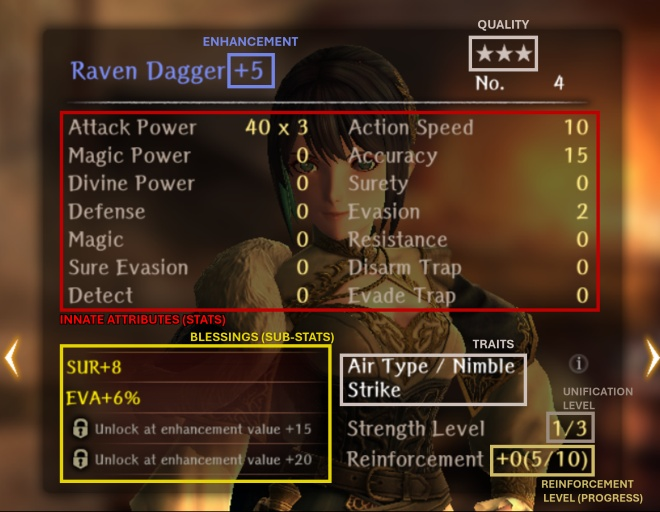
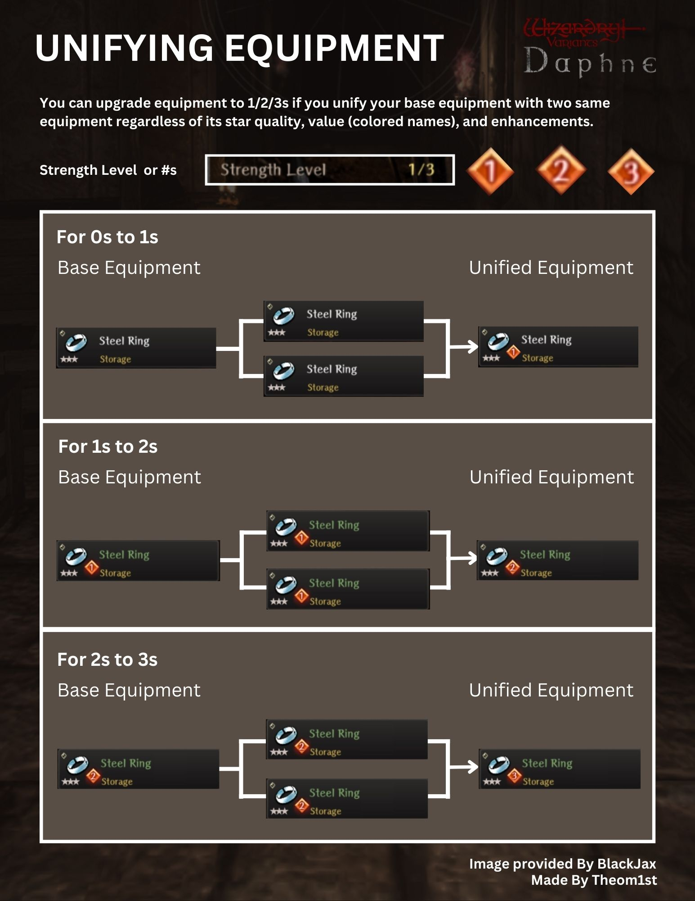
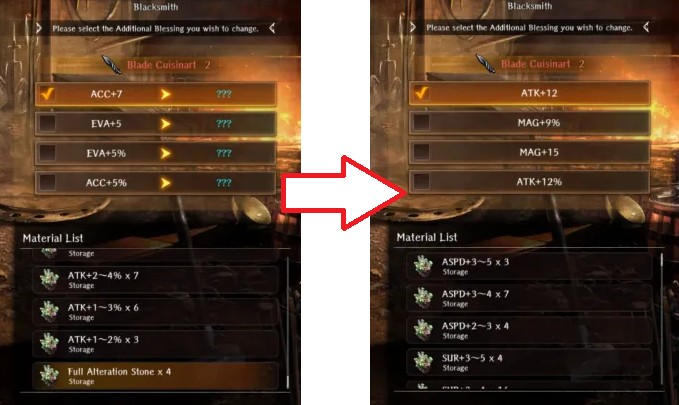
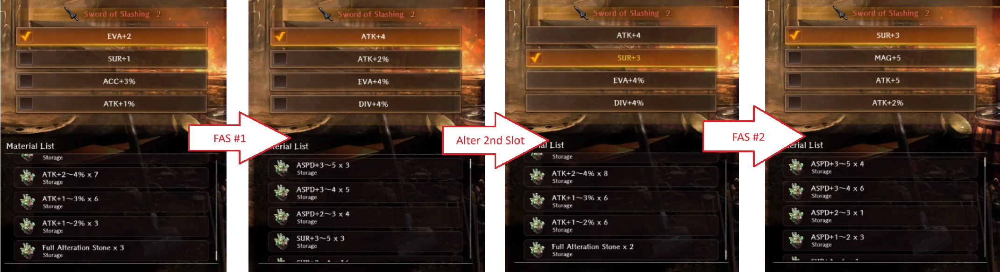

# Blacksmithing 

## Overview

- Blacksmithing becomes available early in the game after your party enters the first major city, Royal Capital Luknalia.  It offers several methods for improving your weapons, armor and accessories, and is essential for strengthening your party.
- This guide covers most aspects of equipment improvement along with some general equipment guidelines and suggestions.

### ^^Terminology^^ 

| **Term** &emsp;  &emsp;                   | **Definition** &emsp;                                                                                                                                                     |
|:-----------------------|:---------------------------------------------------------------------------------------------------------------------------------------------------------------------------------------------|
| Innate Attributes      | Stats inherent to a piece of equipment before any special blessings are applied, such as Attack Power, Defense Power, etc. Every item of the same type shares the same attributes.           |
| Blessings              | Provide an additional increase to a single attribute. Every piece of equipment can have a maximum of 4 blessings. Commonly referred to as "sub-stats".                                       |
| Grade                  | The color of the gear that corresponds to the number of Blessings. White = 0, Green = 1, Blue = 2, Purple = 3, Red = 4.                                                                      |   
| Rank (Tier)            | Item material such as Bronze, Iron, Steel, etc. that determine the size of the innate attributes. Commonly referred to as "Tier".                                                            |
| Quality                | Refers to the numbers of stars (<small>★</small>), which determines the the Blessing stat range that can roll at both creation (initial value at +0) and enhancements. Ranges from 1-5.     |
| Traits                 | Additional characteristics or abilities. The most common types are Slayer (e.g., anti-race such as Undead), Type (elemental), or class (e.g., all Daggers have the "Nimble Strike" trait).   |
| Flat Stats             | Refers to Blessings that give a static +X to a stat such as +8 ATK or +12 MAG.                                                                                                               |
| Percent (%) Stats      | Refers to Blessings that give a % of a unit's base stats with no gear equipped such as 10% ATK or 7% ASPD.                                                                                   |

### ^^Visual Guides^^ 

=== "Terminology - Equipment Screen"

    

    
    

=== "Blacksmithing Video Tutorial"

    

    <iframe width="560" height="315" src="https://www.youtube.com/embed/w8pNI4OCXT4?si=oy3g4x5MfFPMTYe9" title="Wizardry variants daphne way of blacksmithing" frameborder="0" allow="accelerometer; autoplay; clipboard-write; encrypted-media; gyroscope; picture-in-picture; web-share" referrerpolicy="strict-origin-when-cross-origin" allowfullscreen></iframe>
    

=== "Potential Blessings Table" 

    

    
    

## Enhance

- Increases item Enhancement Value up to a maximum of +20, increasing the Innate Attributes of the item. See [Equipment Tables](./equipment-tables.md) for catalogued stats and enhancement improvements.
- Enhancing an item to +5 and beyond requires different grades and quantities of iron ore to be used.   
- Enhancing items beyond +5, +10, and +15 also requires unification (see below) to increase the Strength of the item.
- At Enhancement Values of +5, +10, +15 and +20, an item's Grade is increased and either a new Blessing is unlocked in the item's 1st, 2nd, 3rd, or 4th blessing slot, respectively, or a Blessing that already exists in that slot is improved.

### ^^Gold Cost for Enhancing^^

=== "Worn - Ebonsteel Rank Equipment"

    | Equipment Rank &emsp;  &emsp;             |  +1  |  +2  |  +3   |  +4   |  +5   |  +6   |  +7   |   +8   |   +9   |   +10  |   +11  |   +12  |   +13  |   +14  |   +15  |   +16  |   +17  |   +18  |    +19  |    +20  |  Total  |
    |:------------|:----:|:----:|:-----:|:-----:|:-----:|:-----:|:-----:|:------:|:------:|:------:|:------:|:------:|:------:|:------:|:------:|:------:|:------:|:------:|:-------:|:-------:|:-------:| 
    | Worn        |  150 |  300 | 500   | 750   | 1,050 | 1,400 | 1,950 | 2,550  | 3,200  | 3,900  | 4,650  | 5,700  | 6,800  | 7,950  | 9,150  | 10,400 | 12,050 | 13,750 | 17,150  | 23,950  | 127,300 |
    | Bronze      |  200 |  350 | 550   | 800   | 1,100 | 1,450 | 2,000 | 2,700  | 3,550  | 4,550  | 5,700  | 7,250  | 8,950  | 10,800 | 12,800 | 14,950 | 17,700 | 20,650 | 26,550  | 38,350  | 180,950 |
    | Iron        |  350 |  500 | 750   | 1,100 | 1,550 | 2,100 | 2,850 | 3,750  | 4,800  | 6,050  | 7,500  | 9,350  | 11,500 | 13,950 | 16,700 | 19,750 | 23,400 | 27,350 | 39,200  | 76,200  | 268,700 |
    | Steel       |  500 |  700 | 1,100 | 1,700 | 2,500 | 3,500 | 4,900 | 6,650  | 8,750  | 11,200 | 14,000 | 17,400 | 21,250 | 25,550 | 30,300 | 35,500 | 41,500 | 48,050 | 67,700  | 126,650 | 469,400 |
    | Ebonsteel   |  550 |  770 | 1,210 | 1,870 | 2,750 | 3,850 | 5,390 | 7,315  | 9,625  | 12,320 | 15,400 | 19,140 | 23,375 | 28,105 | 33,330 | 39,050 | 45,650 | 52,855 | 74,470  | 139,315 | 516,340 |
    | Special\*     |  650 |  900 | 1,500 | 2,450 | 3,750 | 5,400 | 7,650 | 10,500 | 13,950 | 18,000 | 22,650 | 28,100 | 34,750 | 42,600 | 51,650 | 61,900 | 74,150 | 87,800 | 128,750 | 251,600 | 848,700 |
    
=== "Silver Rank Equipment"

    | Type &emsp;  &emsp; &emsp;  &emsp; &emsp;  &emsp; &emsp;  &emsp;                         |  +1  |  +2  |  +3  |  +4  |  +5  |  +6  |  +7  |  +8  |  +9  |  +10  |  +11  |  +12  |  +13  |  +14  |  +15  |  +16  |  +17  |  +18  |  +19  |  +20  | Total  |
    |:-----------------------------|:----:|:----:|:----:|:----:|:-----:|:-----:|:-----:|:------:|:------:|:------:|:------:|:------:|:------:|:------:|:------:|:-------:|:-------:|:-------:|:-------:|:-------:|:---------:| 
    | Armor, 1H Weapon, 1/2H Staff | 610 | 850 | 1,340 | 2,060 | 3,030 | 4,240 | 5,930 | 8,050  | 10,590 | 13,560 | 16,940 | 21,060 | 25,720 | 30,920 | 36,670 | 44,910  | 52,500  | 60,790  | 85,650  | 160,220 | 585,640   |
    | 2H Weapons                   | 640 | 940 | 1,560 | 2,500 | 3,830 | 5,330 | 7,600 | 10,500 | 14,080 | 18,360 | 27,400 | 36,120 | 46,670 | 59,210 | 73,930 | 112,590 | 142,280 | 177,160 | 254,790 | 468,610 | 1,464,100 |
    | Special\* | 720 | 990 | 1,650 | 2,700 | 4,130 | 5,940 | 8,420 | 11,550 | 15,350 | 19,800 | 24,920 | 30,910 | 38,230 | 46,860 | 56,820 | 71,190  | 85,280  | 100,970 | 148,070 | 289,340 | 963,840   |
    | Special 2H Weapons\* | 750|	1,100|	1,920|	3,260|	5,200|	7,450	|10,770	|15,040	|20,370|	26,770	|40,090	|52,820	|69,040	|89,140	|113,570	|175,450|	226,690	|288,190|	430,720	|831,260	|2,409,600|  

  

\* "Special" mostly refers to "Banner" or "gacha" gear. Not all banner weapons and armor sort exactly by those descriptions. The 1st level enhancement cost will confirm for you what tier it falls into.

### ^^Ore Cost^^

    
=== "Worn - Ebonsteel Rank Equipment"  

    | Grade &emsp;  &emsp;  &emsp; &emsp;  &emsp;              | Color  &emsp; &emsp;   |  +1  |  +2  |  +3  |  +4  |  +5  |  +6  |  +7  |  +8  |  +9  |  +10  |  +11  |  +12  |  +13  |  +14  |  +15  |  +16  |  +17  |  +18  |  +19  |  +20  |  Total  |
    |:---------------------------------------|:--------|:----:|:----:|:----:|:----:|:----:|:----:|:----:|:----:|:----:|:-----:|:-----:|:-----:|:-----:|:-----:|:-----:|:-----:|:-----:|:-----:|:-----:|:-----:|:-------:| 
    | Low Grade                              | Gray    |      |      |      |      |  1   |  2   |  3   |  4   |   5  |       |       |       |       |       |       |       |       |      |        |       |  15     |
    | Mid Grade                              | Red     |      |      |      |      |      |      |      |      |      |  1    |   2   |   3   |   4   |   5   |       |       |       |      |        |       |  15     |
    | High Grade                             | Blue    |      |      |      |      |      |      |      |      |      |       |       |       |       |       |  1    |   2   |   3   |   4  |  5     |       |  15     |
    | Fine Grade                             | Gold    |      |      |      |      |      |      |      |      |      |       |       |       |       |       |       |       |       |      |        |    1  |   1     |

=== "Silver Rank Equipment"

    | Grade &emsp;  &emsp;  &emsp; &emsp;  &emsp;              | Color  &emsp; &emsp;   |  +1  |  +2  |  +3  |  +4  |  +5  |  +6  |  +7  |  +8  |  +9  |  +10  |  +11  |  +12  |  +13  |  +14  |  +15  |  +16  |  +17  |  +18  |  +19  |  +20  |  Total  |
    |:---------------------------------------|:--------|:----:|:----:|:----:|:----:|:----:|:----:|:----:|:----:|:----:|:-----:|:-----:|:-----:|:-----:|:-----:|:-----:|:-----:|:-----:|:-----:|:-----:|:-----:|:-------:| 
    | Mid Grade                              | Red     |      |      |      |      |  1   |  2   |  3   |  4   |   5  |       |       |       |       |       |       |       |       |      |        |       |  15     |
    | High Grade                             | Blue    |      |      |      |      |      |      |      |      |      |  1    |   2   |   3   |   4   |   5   |       |       |       |      |        |       |  15     |
    | Fine Grade                             | Gold    |      |      |      |      |      |      |      |      |      |       |       |       |       |       |  1    |   2   |   3   |   4  |  5     |       |  15     |
    | Silver Grade                           | Silver  |      |      |      |      |      |      |      |      |      |       |       |       |       |       |       |       |       |      |        |    1  |   1     |

### ^^Blessing Range Tables^^

- When enhancing a piece of equipment there is a minimum and maximum range of values that can roll depending on its Rank (Tier) and Quality (★).
    - Worn through Ebonsteel Rank share the same enhancement values although their costs are different.
    - Silver gear found in Abyss 4 benefits from higher minimum and maximum values. 2H Silver weapons are more expensive to enhance, but have the highest maximum enhancement values.
- Quality (<small>★</small>) is the primary determining factor of Blessing ranges.
- Most players target 3-4 <small>★</small> and Blue (2 Blessings) and/or Purple (3 Blessings) to invest in for the long-term. If you are a new player, then use what you have available. But, understand that you will develop several "interim" pieces that you will switch out in the future.   

#### ^^Worn - Ebonsteel^^

=== "Initial Value (Base) Stats" 

    | Blessing Type &emsp; &emsp; &emsp; &emsp;  &emsp;  &emsp;  &emsp; &emsp;  | 1★ &emsp; &emsp;  |  2★ &emsp; &emsp; | 3 ★ &emsp; &emsp; |  4★ &emsp; &emsp; |  5★ &emsp; &emsp;   |
    |:----------------------------------------------------|:----|:----|:----|:-----|:------|
    | Flat                                                | 2-3 | 3-5 | 5-7 | 8-10 | 11-13 |
    | Percent (%)                                         | 1-3 | 3-6 | 5-9 | 9-13 | 12-16 |
    | ASPD                                                | 1-2 | 2-4 | 4-6 | 6-8  | 8-10  |
    | ASPD%                                               | 1-2 | 2-4 | 4-6 | 6-9  | 9-11  |
    | SUR                                                 | 1-2 | 2-3 | 3-4 | 4-5  | 5-6   |

=== "Enhancement Increase"

    | Blessing Type &emsp; &emsp; &emsp; &emsp;  &emsp;  &emsp;  &emsp; &emsp;  | 1★ &emsp; &emsp;  |  2★ &emsp; &emsp; | 3 ★ &emsp; &emsp; |  4★ &emsp; &emsp; |  5★ &emsp; &emsp;   |
    |:----------------------------------------------------|:----|:----|:----|:-----|:-----|
    | Flat                                                | 1-2 | 2-5 | 2-8 | 3-10 | 3-12 |
    | Percent (%)                                         | 1   | 1-2 | 2-3 |  3   | 3-4  |
    | ASPD                                                | 1-2 | 1-2 | 1-3 | 1-4  | 1-5  |
    | ASPD%                                               | 1   | 1-2 | 2-3 |   3  | 3-4  |
    | SUR                                                 | 1   | 1-2 | 1-2 | 1-3  | 1-4  |

=== "Initial + Enhancement Totals"

    | Blessing Type &emsp; &emsp; &emsp; &emsp;  &emsp;  &emsp;  &emsp; &emsp;  | 1★ &emsp; &emsp;  |  2★ &emsp; &emsp; | 3 ★ &emsp; &emsp; |  4★ &emsp; &emsp; |  5★ &emsp; &emsp;   |
    |:----------------------------------------------------|:---|:----|:----|:-----|:-----|
    | Flat                                                | 3-5 | 5-10 | 7-15 | 11-20 | 14-25 |
    | Percent (%)                                         | 2-4 | 4-8  | 7-12 | 12-16 | 15-20 |
    | ASPD                                                | 2-4 | 3-6  | 5-9  | 7-12  | 9-15  |
    | ASPD%                                               | 2-3 | 3-6  | 6-9  | 9-12  | 12-15 |
    | SUR                                                 | 2-3 | 3-5  | 4-6  | 5-8   | 6-10  |

=== "Initial + FAS Totals"

    | Blessing Type &emsp; &emsp; &emsp; &emsp;  &emsp;  &emsp;  &emsp; &emsp;  | 1★ &emsp; &emsp;  |  2★ &emsp; &emsp; | 3 ★ &emsp; &emsp; |  4★ &emsp; &emsp; |  5★ &emsp; &emsp;   |
    |:----------------------------------------------------|:---|:----|:----|:-----|:-----|
    | Flat                                                | 4-7 | 7-15 | 9-23 | 14-30 | 17-37 |
    | Percent (%)                                         | 3-5 | 5-10 | 9-15 | 15-19 | 18-24 |
    | ASPD                                                | 3-5 | 4-8  | 6-12 | 8-16  | 10-20 |
    | ASPD%                                               | 3-4 | 4-8  | 8-12 | 12-15 | 15-19 |
    | SUR                                                 | 3-4 | 4-7  | 5-8  | 6-11  | 7-14  |

<!-- PREVIOUS TABLE
|                                               |  1★ |  2★ | 3 ★ |  4★ |  5★ |
|:---------------------------------------------:|:---:|:---:|:---:|:----:|:----:|
|     **ATK, MAG, DIV, DEF, MDEF, ACC, EVA**    | 1~3 | 2~6 | 3~9 | 4~10 | 5~15 |
| **ATK%, MAG%, DIV%, DEF%, MDEF%, ACC%, EVA%** | 1   | 1   | 2-3 |  3   |  4   |
|                 **ASPD, SUR**                 | 1   | 1~2 | 1~3 | 1~3  | 2~5  |
|                   **ASPD%**                   | 1   | 1   | 2-3 |  3   |  4   |
-->

#### ^^Silver^^ 

=== "Initial Value (Base) Stats" 

    | Blessing Type &emsp; &emsp; &emsp; &emsp;  &emsp;  &emsp;  &emsp; &emsp;  | 1★ &emsp; &emsp;  |  2★ &emsp; &emsp; | 3 ★ &emsp; &emsp; |  4★ &emsp; &emsp; |  5★ &emsp; &emsp;   |
    |:----------------------------------------------------|:----|:----|:----|:-----|:------|
    | Flat                                                | 2-4 | 3-6 | 5-8 | 8-12  | 11-16 |
    | Percent (%)                                         | 1-4 | 3-7 | 5-11 | 9-16 | 12-19 |
    | ASPD                                                | 1-2 | 2-5 | 4-7 | 6-10  | 8-12  |
    | ASPD%                                               | 1-2 | 2-5 | 4-7 | 6-11  | 9-13  |
    | SUR                                                 | 1-2 | 2-4 | 3-5 | 4-6   | 5-7   |

=== "Enhancement Increase"

    | Blessing Type &emsp; &emsp; &emsp; &emsp;  &emsp;  &emsp;  &emsp; &emsp;  | 1★ &emsp; &emsp;  |  2★ &emsp; &emsp; | 3 ★ &emsp; &emsp; |  4★ &emsp; &emsp; |  5★ &emsp; &emsp;   |
    |:----------------------------------------------------|:----|:----|:----|:-----|:-----|
    | Flat                                                | 1-2 | 2-6 | 2-10 | 3-12 | 3-14 |
    | Percent (%)                                         | 1   | 1-2 | 2-4 |  3-4  | 3-5  |
    | ASPD                                                | 1-2 | 1-2 | 1-4 | 1-5   | 1-6  |
    | ASPD%                                               | 1   | 1-2 | 2-4 | 3-4   | 3-5  |
    | SUR                                                 | 1   | 1-2 | 1-2 | 1-4   | 1-5  |

=== "Initial + Enhancement Totals"

    | Blessing Type &emsp; &emsp; &emsp; &emsp;  &emsp;  &emsp;  &emsp; &emsp;  | 1★ &emsp; &emsp;  |  2★ &emsp; &emsp; | 3 ★ &emsp; &emsp; |  4★ &emsp; &emsp; |  5★ &emsp; &emsp;   |
    |:----------------------------------------------------|:---|:----|:----|:-----|:-----|
    | Flat                                                | 3-6 | 5-12 | 7-18 | 11-24 | 14-30 |
    | Percent (%)                                         | 2-5 | 4-9  | 7-15 | 12-20 | 15-24 |
    | ASPD                                                | 2-4 | 3-7  | 5-11 | 7-15  | 9-18  |
    | ASPD%                                               | 2-3 | 3-7  | 6-11 | 9-15  | 12-18 |
    | SUR                                                 | 2-3 | 3-6  | 4-7  | 5-10  | 6-12  |

#### ^^Silver 2H Weapons^^  

=== "Initial Value (Base) Stats" 

    | Blessing Type &emsp; &emsp; &emsp; &emsp;  &emsp;  &emsp;  &emsp; &emsp;  | 1★ &emsp; &emsp;  |  2★ &emsp; &emsp; | 3 ★ &emsp; &emsp; |  4★ &emsp; &emsp; |  5★ &emsp; &emsp;   |
    |:----------------------------------------------------|:----|:----|:----|:-----|:------|
    | Flat                                                | 2-4 | 3-7 | 5-9  | 8-13  | 11-17 |
    | Percent (%)                                         | 1-4 | 3-8 | 5-12 | 9-17  | 12-21 |
    | ASPD                                                | 1-2 | 2-5 | 4-8  | 6-11  | 8-13  |
    | ASPD%                                               | 1-2 | 2-5 | 4-8  | 6-12  | 9-14  |
    | SUR                                                 | 1-2 | 2-4 | 3-5  | 4-7   | 5-8   |

=== "Enhancement Increase"

    | Blessing Type &emsp; &emsp; &emsp; &emsp;  &emsp;  &emsp;  &emsp; &emsp;  | 1★ &emsp; &emsp;  |  2★ &emsp; &emsp; | 3 ★ &emsp; &emsp; |  4★ &emsp; &emsp; |  5★ &emsp; &emsp;   |
    |:----------------------------------------------------|:----|:----|:----|:-----|:-----|
    | Flat                                                | 1-2 | 2-7 | 2-11 | 3-13 | 3-15 |
    | Percent (%)                                         | 1   | 1-2 | 2-4  | 3-4  | 3-5  |
    | ASPD                                                | 1-2 | 1-2 | 1-4  | 1-5  | 1-7  |
    | ASPD%                                               | 1   | 1-2 | 2-4  | 3-4  | 3-5  |
    | SUR                                                 | 1   | 1-2 | 1-2  | 1-4  | 1-5  |

=== "Initial + Enhancement Totals"

    | Blessing Type &emsp; &emsp; &emsp; &emsp;  &emsp;  &emsp;  &emsp; &emsp;  | 1★ &emsp; &emsp;  |  2★ &emsp; &emsp; | 3 ★ &emsp; &emsp; |  4★ &emsp; &emsp; |  5★ &emsp; &emsp;   |
    |:----------------------------------------------------|:---|:----|:----|:-----|:-----|
    | Flat                                                | 3-6 | 5-14  | 7-20 | 11-26 | 14-32 |
    | Percent (%)                                         | 2-5 | 4-10  | 7-16 | 12-21 | 15-26 |
    | ASPD                                                | 2-4 | 3-7   | 5-12 | 7-16  | 9-20  |
    | ASPD%                                               | 2-3 | 3-7   | 6-12 | 9-16  | 12-19 |
    | SUR                                                 | 2-3 | 3-6   | 4-7  | 5-11  | 6-13  |

<!-- PREVIOUS Note
!!! note "Silver gear appears to provide larger blessings than those shown above. Data is being collected and we will add information when we are able to do so.  [Data contributions are welcome](https://canary.discord.com/channels/1296602475918524507/1451245240798285936)."
-->

## Enhancement Inheritance

- Enhancement Inheritance sacrifices an existing enhanced piece of equipment of the same type (1H weapons-to-1H weapons, shoes-to-shoes, etc.) to increase the enhancement value of another item.
- The total gold and ore cost of the sacrificed item is applied to the new one, which is why you will differences between the potential enhancement level across gear of different Ranks (Steel, Ebon, etc.).
- This option can help preserve your resources when upgrading to better or higher-tier equipment.
- The expected outcome is shown after selecting the piece of equipment to be sacrificed. It also comes with a small chance of an excellent (+1) or poor (-1) outcome.
- You can inherit an enhancement level higher than an item can reach if its Strength (Unification level) is not high enough (see Unification below). When that is the expected level, the value will be shown as something like `+5 (+7)!`.  Upon increasing the item's unification Strength to accommodate the higher level, the item's enhancement level will automatically be increased. 

## Unify

- Unification is the process of increasing the Strength of an item to increase its allowable enhancement limit by 'unifying' it with <em>identically named</em> items. Those items don't need to be enhanced in any way, and are consumed in the process.  

??? note "Unification Visual Guide" 
    

    
    

- Update March 2026: Unification no longer needs to be done step-by-step from 1 to 2 to 3, you can now select as many items as you want to 'feed' into the item being strengthened.  
    - The total item count still works the same (27 items unified produces a single Strength 3 item)
    - For example: you can take an item from Strength 0 to 2 by unifying it with 8 other items (for a total of 9 including the improved item) all in one unification step.
- Items can now be 'partially' strengthened:
    - Only feeding an item 7 other items will leave it at Strength 1 and 5/6 of the way to Strength 2.
    - It will stay this way until unified with one more item, at which point it will become Strength 2.
    - Many players regularly enhancing equipment to +20 deliberately use 26 'unification fodder' items to build up a stock of "Strength 2 (17/18)" items ready to take a good base item right to Strength 3.
    - Such fodder items only take 1 storage slot instead of the 6 slots previously needed to quickly +20 an item.

!!! warning "There is NO 'partially unified' visual indicator"
    
    - A "Strength 2 (0/18)" item looks identical to a "Strength 2(17/18)" item, despite one being a lot more value than the other.
    - The unification screen would let you select either of those items for use with 2 other Strength 2 items to make a Strength 3 item.
    - The game will provide zero indication that you're 'over-unifying' the item. Selecting the wrong one will wasted those unified fodder items.
    - This might not matter for a shop-bought helm, but could be quite frustrating for painstakingly acquired rare items.
    - Drecom will not restore lost items from such user-error no matter how much you beg.

## Extract

- Equipment that has one or more Blessings can be "extracted". The extraction process <em>destroys the item</em> and can yield an Alteration Stone, Refinement Stone, Refinement Stone Fragments, or nothing.
- The type of stone extracted is randomly selected from one of the Blessings on the piece of equipment. Current estimates put extraction liklihood at about 20% per Blessing.
- Refinement stone fragments can be redeemed for Refinment Stones at the Jeweler under Exchange - Refinement Stone. They cost 500 fragments each for a 3* equivalent stone.

### ^^Alteration and Refinement Stone Values^^

| Blessing Type &emsp; &emsp; &emsp; &emsp;  &emsp;  &emsp;  &emsp; &emsp;  | 1★ &emsp; &emsp;  |  2★ &emsp; &emsp; | 3 ★ &emsp; &emsp; |  4★ &emsp; &emsp; |  5★ &emsp; &emsp;   |
|:----------------------------------------------------|:----|:----|:----|:-----|:------|
| Flat                                                | 1-3 | 2-4 | 3-5  | 4-6  | 5-7 |
| Percent (%)                                         | 1-2 | 1-3 | 2-4  | 3-5  | 4-6 |
| ASPD, SUR                                           | 1-2 | 2-3 | 3-4  | 3-5  | 4-6 |
| ASPD%                                               | 1-2 | 1-3 | 2-4  | 3-5  | 3-6 |

- The equipment's Quality (★) determines the ★ value of the Alteration or Refinement Stone.
- Depending on RNG an extracted stone can roll up to 2 tiers higher than the extract piece of equipment. Examples:
    - Extracting a 2★ piece of equipment call roll a 2★ (common), 3★ (rare), or 4★ (very rare) Alteration or Refinment stone.
    - Extracting a 3★ piece of equipment call roll a 3★ (common), 4★ (rare), or 5★ (very rare) Alteration or Refinment stone.

## Refine

Refining an item increases the value of a **Blessing** and requires a matching Refinement Stone. Every blessing on an item can be refined, but only one refinement stone can be applied to each blessing.  Subsequent refinements of a blessing will replace previously applied refinements. Potential refinement range is shown prior to using the stone.

As of version 1.12.1, refinement bonuses are retained if you enhance to a level that also enhances that attribute. Previously, if refined before enhancing to +5, +10, +15, or +20, the enhancement would clear any refinement on the assocated blessing. Depending on the values rolled this could make the attribute value appear to worsen on enhancement.

## Alter

Altering an item allows you use an Alteration Stone to change a Blessing to the attribute of that stone, with the new blessing value determined by the range of the alteration stone replacing any previous blessing and refinement value. 

Alteration has some nuanced behavior related to enhancement values of +5, +10, +15, and +20, that will apply Blessing enhancements to the 1st, 2nd, 3rd, and 4th Blesssing slots, respectively:

- Any enhancement performed after alteration will improve that blessing value as usual.
- Altering a Blessing after that slot has already reached its enhancement checkpoint will replace both the initial Blessing and any refinements as well as the enhancements increase.  This will leave the slot with only the value provided by the Alteration Stone. It can be further refine, but will not be further enhanced.
- This makes it generally preferable to perform any Alteration prior to enhancing beyond the level that will increase that Blessing.

## Advanced Blacksmithing

### ^^Advanced Extraction^^

Only the star quality of an item being extracted determines the blessing magnitude of the Refinement and Alteration stones produced. 

**Tip:** Altering a high quality item with undesired Blessings with a low-grade Stone of a desired Blessing, and then successfully extracting the resulting item will result in a higher quality Stone than was used for the alteration, as the game only considers **item quality** and **type of available substats** when generating a Stone. The magnitude of the item's Blessings values is not considered.  Despite the low rate of extraction success, this can produce useful stones from otherwise less-desired stones and equipment.

### ^^Full Alteration^^

A **Full Alteration Stone** allows you to reroll all unlocked substats on an item.

!!! note "Known Ways to Obtain"
    - Very VERY rare chance from extracting ANY grade/quality gear.
    - As of April 1st, 2025, can be purchased from the monthly pack: ^^Jeweler Curated Collection Set^^ for 74.99 USD.
    - From Old Castle Ruins Event Shop for 10000 event tokens.
    - Occasionally appear in Limited-Time Offers as an exclusive sale item in packs during events.

It re-rolls all blessings currently on an item. This process is subject to the same RNG that all items are subject to when generating stats on Reversal from junk. It also applies a bonus amount to each blessing that will be the same range as the enhancement bonus you get when enhancing an item to +5/10/15/20. This allows you to "double-dip" on stats when enhancing a piece of gear altered with FAS if it hasn't been enhanced already. Using this method will allow gear to receive stats significantly higher than naturally possible, even in ideal circumstances.

As of Update 1.12.1, Full Alteration Stones will now also re-apply Milestone Blessing bonuses on applicable items (The game will remember the item's Grade or Color), so it is now feasible to use these on items that are already +20. However, it only re-applies those blessings on rolls that are generated by the stone itself and not ones altered after.

Using a SECOND FAS on the same item repeats the process - it will again re-roll all blessings while unlocking an alteration slot, even if you had altered previously.

!!! note "Example 1: Using One Full Alter Stone"
    

!!! note "Example 1: Using Two Full Alter Stones"
    

As of Update 1.12.1, Lesser Full Alteration Stones have been added that re-rolls the stats but does not apply re-apply Milestone Blessings. They drop more frequently than Full Alteration Stones, but are still quite rare. 

It is highly suggested that a FAS should be saved and used on your highest rarity items - 4 star purple or higher. Good examples for this would the Master Fighter Ring from the Fighter Proving Grounds (A 4 star Red Ring with <em>fixed blessing types</em>, so using a LFAS or FAS just rerolls the values - and FAS adds an bonus Blessing - but doesn't change the blessing types.) or certain extremely strong gacha equipment like Blade Cuisinart if they have a good quality/grade. Alternatively, it can be used to give another chance at better rolls on gear that has already been enhanced to +20 if the item has generated with a decent Grade (color).

## Composite Reinforcement  

!!! warning "ABYSS 4 WARNING: DO NOT USE COMPOSITE REINFORCEMENT INGOTS (SILVER INGOTS) UNLESS YOU ABSOLUTELY KNOW HOW IT WORKS AND WHAT YOU'RE DOING.  They're rare, expensive, and you do NOT want to waste one out of ignorance."

Abyss 4 and Silver Tier equipment introduced a new method of improving lower rank equipment called **Composite Reinforcement**.  To over-simplify, it lets you attempt to improve primary equipment stats stats (ATK/MAG/DIV for weapons, DEF/MDEF for armor) to that of the next material/rank equipment.  You do this by paying a fairly steep price and sacrificing other items of the target rank (you can also use special, very expensive, Silver Ingots for guaranteed success).  The cost is very high and chance of success gets very low. More details below but in summary:

*Just don't. They tried. It's almost never worth it. Just go get actual silver equipment. There's enough out there. This goes double for armor.*

Since DEF and MDEF is ridiculously undervalued by the game mechanics, there's practically zero value to reinforcing armor. Because ATK, the primary stat of value, is increased for weapons it may be worth reinfocing particualry rare, very high impact Banner (Gacha) weapons.

Mechanics and Example: *pending*

Reinforcement Cost:

    
=== "Weapons"
    | Level Target \\ Rank Target | Bronze | Iron    | Steel   | Ebon    | Silver 1H | Silver 2H | Silver Banner 1H | Silver Banner 2H |
    | :---------------------------: | :------: | :-------: | :-------: | :-------: | :---------: | :---------: | :----------------: | :----------------: |
    | 1                           | 30,200 | 44,800  | 78,300  | 51,700  | 58,600    | 146,500   | 72,300           | 180,800          |
    | 2                           | 33,200 | 49,300  | 86,100  | 54,300  | 61,500    | 153,800   | 77,200           | 192,800          |
    | 3                           | 36,200 | 53,800  | 93,900  | 56,800  | 64,500    | 161,100   | 82,000           | 204,900          |
    | 4                           | 42,300 | 62,700  | 109,600 | 62,000  | 70,300    | 175,700   | 86,800           | 216,900          |
    | 5                           | 75,400 | 112,000 | 195,600 | 67,200  | 76,200    | 190,400   | 96,400           | 241,000          |
    | 6                           | 90,500 | 134,400 | 234,700 | 72,300  | 82,000    | 205,000   | 120,500          | 301,200          |
    | 7                           | \--    | \--     | \--     | 77,500  | 87,900    | 219,700   | 144,600          | 361,500          |
    | 8                           | \--    | \--     | \--     | 103,300 | 117,200   | 292,900   | 192,800          | 482,000          |
    | 9                           | \--    | \--     | \--     | 129,100 | 146,500   | 366,100   | 241,000          | 602,400          |
    | 10                          | \--    | \--     | \--     | 155,000 | 175,700   | 439,300   | 289,200          | 722,900          |

=== "Armor"
    | Level Target \\ Rank Target | Bronze | Iron   | Steel  | Ebon   | Silver | Gacha  |
    | :---------------------------: | :------: | :------: | :------: | :------: | :------: | :------: |
    | 1                           | 60400  | 89600  | 156500 | 51700  | 58600  | 77200  |
    | 2                           | 78500  | 116500 | 203500 | 56800  | 64500  | 82000  |
    | 3                           | 150800 | 224000 | 391200 | 62000  | 70300  | 86800  |
    | 4                           | \--    | \--    | \--    | 67200  | 76200  | 96400  |
    | 5                           | \--    | \--    | \--    | 77500  | 87900  | 192800 |
    | 6                           | \--    | \--    | \--    | 129100 | 146500 | 241000 |
    | 7                           | \--    | \--    | \--    | 155000 | 175700 | 289200 |

Credits to samuraidoc on Discord for experimenting with FAS + Guide writeup.  Credits to L'Montes for a lot of very expensive trial and error to generate data for Composite Reinforcement.

