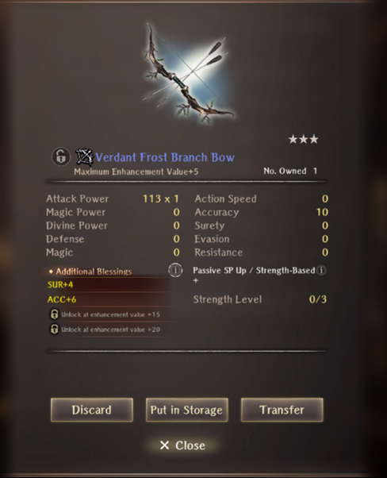

# Alabaster Hunting

## Requirements

!!! warning "Reach Isberg, the fourth Abyss main town, to unlock in the Royal Capital."

## Guide

Three runs are necessary to fully complete the request "Bring Me an Alabaster Pelt". You gain knowledge on the 1st and 2nd runs that allows you to fulfill the conditions for the Good and True endings.

??? "Reset Request"
    Ruins > Cursed Wheel > Special Request (bottom corner) > Alabaster Hunting

!!! bug "At the moment, it is possible to softlock the game by stepping on a spike trap in this cave. It can be resolved by restarting the game."

##### Alabaster Wolf Den 

??? map "B1F"
    

??? map "B2F"
    

??? map "B3F"
    

### 1st Run 

- Accept the request at the Royal Capital Adventurer's Guild. You will be briefed shortly about what to do. Having a Ranger on your team will provide different text.
- Go to the world map and head to the cave.
- Continue through the cave. Be wary that there are many spike traps at dead ends and room edges. There are also two pitfall traps on each floor that lead to meaningless empty rooms. Eventually, you will find the wolf on the right middle section of B2F. You will attempt to fight it, but it will have infinite HP and will eventually run away.
- Head to B3F and find a dead body on the floor. It is not necessary to revive it at the moment, but you could bring it back to the temple in the Royal Capital to get some lore.
- Find the wolf again on B3F at the bottom left room. Fight it again, it self-buffs at the start with 4 turns of ATK and CT. It moves twice a turn and can attack out of turn when taking damage. It has only around 10k HP.
- However, once you defeat it, you will fail to capture it as a second wolf appears and saves it. You will gain a knowledge that there are two wolves. The request is automatically failed. You must go to the adventurer's guild and turn in the request failed. Cursed Wheel the event and accept the request again.

### 2nd Run 

- Go back into the cave, and this time you will be prompted to attack or skip the 1st wolf. Skip it this time and walk around it. In this run again, you still do not need to resurrect the body on the 3rd floor.
- Head to 3f. This time you will need to fight both wolves at once. The fight plays the same but now they both have an additional accuracy buff. Upon beating them however, you will receive a damaged wolf pelt. You gain the knowledge this time that fighting both will result in a damaged pelt. Upon turning in the request, it will automatically fail again, but you do not need to turn in a failed request. You can simply Cursed Wheel.

### 3rd Run - Good Ending

- Go back to the cave and this time, skip the 1st wolf. Go pick up the dead hunter and bring back to temple. If you have a Ranger, you can get some advice from him. If not then pay him 1000 gold and receive some bait. Head back to the 1st wolf's general area and automatically put down the bait.
- Head to 3f and beat the wolf by itself. However, upon defeating it you'll fight the other wolf again but this time their buffs are undispellable and permanent. Furthermore, they will attack after every turn you make. Defeating this will reward an undamaged pelt.
- Head back to the Adventurer's Guild and turn it in.

### 4th Run - True Ending 

- Head into the cave and skip the 1st Wolf again. If you have a Ranger in your party, you can continue without resurrecting the Ranger, but if you don't, you will need to resurrect him again and pay 1000 for bait. Bait/Trap the 1st Wolf and proceed onwards.
- Head to fight the 2nd Wolf in B3F, but this time you have the option to spare it. Attempt to head back to the Harken. The wolves will appear and show you the location of the buried coat they took from the dead hunter. You will reverse it into pristine condition, in which you can then turn it in.

### Rewards

The bow gives 6 SP when equipped and always spawns as 3* blue.
