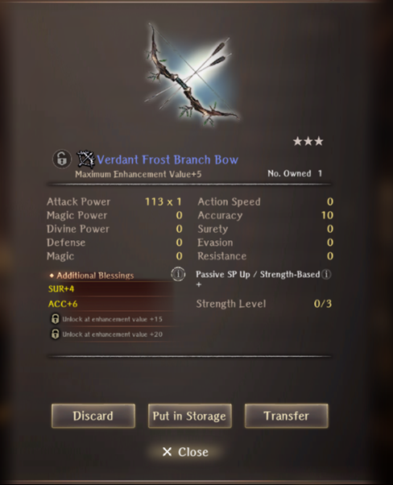
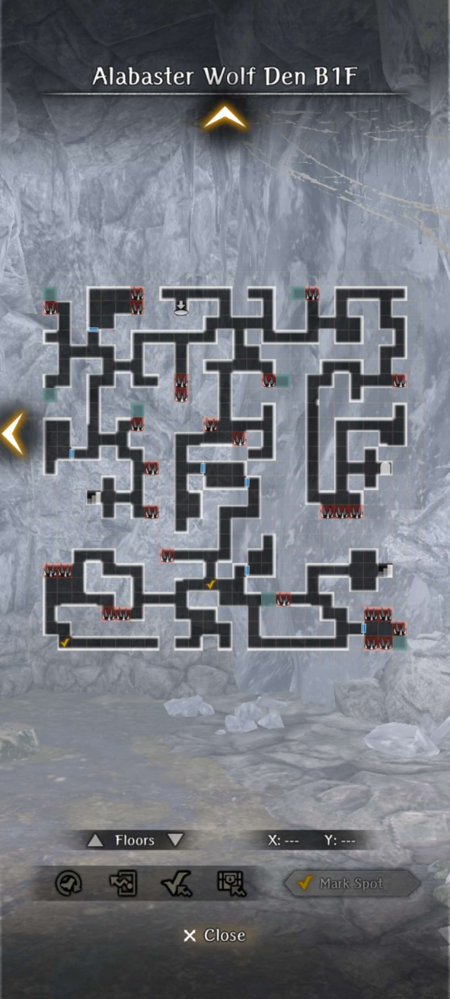
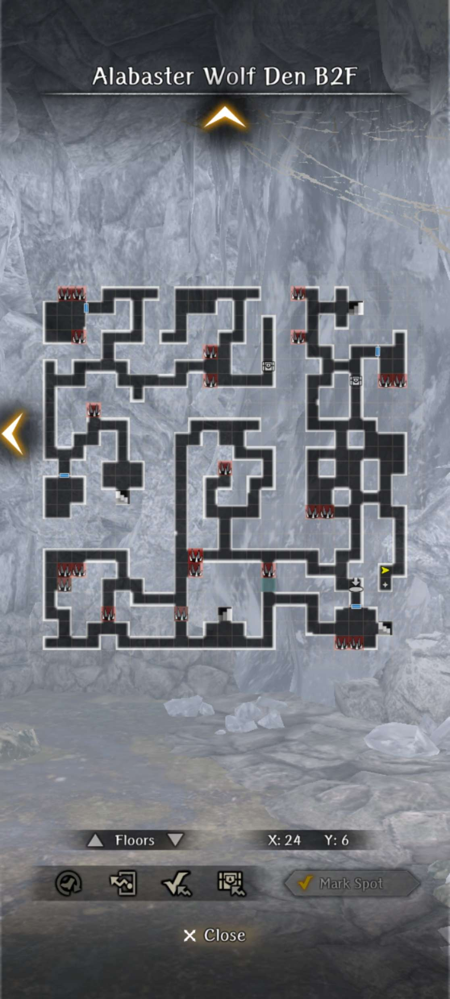
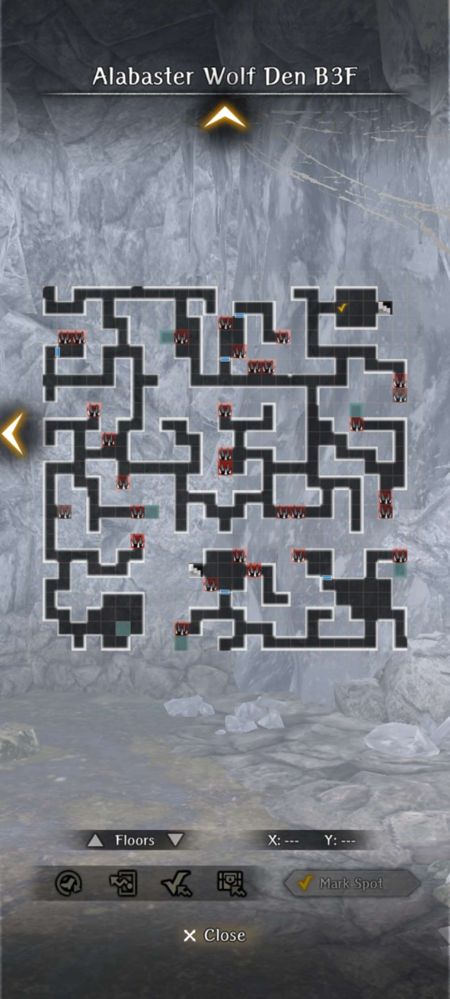

# Alabaster Hunting
    
### Unlock Condition 

- Step foot into Route 1 of Abyss 4, Deepsnow Hinterlands of Isberg. 

### Overview 

??? note "How to Accept the Request" 
    - Go to the Royal Capital Guild. Under Requests - Featured select "Bring Me an Alabaster Pelt."
    - Speak with Lady Matilda and read each of the options. If you have a Ranger in your party, you will receive slightly different text. 
    - The Alabaster Wolf Den is located directly west of Isberg on the world map. 

??? warning "Before You Begin - Read Me"

    === "Basics" 

        - Endings
            - Total of 4 different endings. Minimum of 3 runs to complete the request.   
            - The 1st and 2nd runs end in failure, but provide Knowledge that is required for both the Good and Best endings. 
        - Ranger
            - Units
                - [Yrsa](../../adventurers/legendary-adventurers/details/Yrsa.md) - Limited Legendary 
                - [Heinrico](../../adventurers/general-adventurers/details/Heinrico.md) - General Adventurer 
            - The first 2 runs and the Good ending can be completed without a Ranger in your party. 
            - A L25 Ranger is required for the Best ending as a bear trap needs to be set. 
            - If a Ranger is in your party they will provide flavor text throughout the dungeon and point out the correct path to take on each floor. 
        - Recommended Units
            - A Knight is borderline mandatory for most teams as the wolf bosses will auto-counter every time they receive physical damage. 
            - Ninjas (Dissipation) and Mages (Malefic Wind) are helpful strip their buffs. 

    === "Farming"

        - Summary
            - One of the best farming locations in the game. It provides access to Hunting Gloves and Boots (both best-in-slot), and Steel 5* Red gear.
            - Enemies on B1F are fairly weak and suitable for players that have not yet passed the Copper Grade exam.
            - Currency is low at ~20-60 per enemy or map chest.
            - Higher-than-average relic monster spawn rate. Notable enemies include Scorpion Lady, Vorpal Bunny, Snow Big Slime, and Frost Plant.  
            - Do not need to complete the request to farm. Progress or endings does not impact chest spawning frequency or currency amounts. 
        - Optimal Routes
            - B1F only with auto-chest is one of the most efficient approaches. 
            - An alternative approach is to farm B1F but auto-path to one of the drop-down holes. The self-contained area on B2F has a high chest spawning rate.  

    === "How to Reset" 

        - Go to the Ruins - Cursed Wheel. In the bottom right-hand corner click the Special Request button. 
        - Select Alabaster Hunting from the list and Leap.

    === "Troubleshooting"
    
        - The request has been bugged since launch and has required several patches. Problem areas are denoted by red text. We recommend you follow the directions exactly as written. 
        - If you are running into issues you can post in the comments below or ping @lightbearer on the [Discord](https://discord.gg/CKrdEgzAz).  

??? warning "Request Reward" 

    

    
    

    - Fixed at 3* Blue. 
    - Passive SP Up provides a flat 6 SP that does not increase upon enhancement.
    - Note that bows are the only weapons that can roll ASPD blessings. 

### Alabaster Wolf Den 

??? note "Overview"

    === "Notes" 
    
        - Map discovery is permanently saved and does not reset.
        - The dungeon has 3 floors with branching paths and spike traps scattered throughout. On both B1F and B2F there are 2 drop-down holes that lead to optional side areas.
        - Large variety of enemies, but primarily Magical Beasts and Demi-Humans. Gorgons will appear as regular enemy on B3F. 
        - Encounters frequently include up to 3-4 rows of enemies. Row or AOE attacks (LA- or MA- spells, Wide Volley, Unending, MoF, Hue, etc.) are helpful or use Katino (Sleep) or Kantios (Confuse) for crowd control. 
        - Poor location for farming EXP but above-average for relics. 
        - Enemy level is 66-68 at Copper Grade. 

    === "Enemy List" 

        - Demi-Human
            - Snowland Hobgoblin
            - Snowland Goblin, Archer, Mage, and Cleric 
        - Magical Beast
            - Vorpal Bunny 
            - Scorpion Lady
            - Gorgon (B2-3F only) 
        - Magical Beings
            - Snow Slime
            - Snow Big Slime
        - Insect
            - Abyssal Insect
            - Dragon Fly 
        - Other
            - Frost Plant (Plant)
            - Pixie (Fairy)
            - Succubus (Demon)

??? map "B1F"
    

??? map "B2F"
    

??? map "B3F"
    

### Guide

??? warning "Super Condensed Version"

    === "1st Run"
    
        - Fight the wolf on B2F until it runs away. 
        - Collect body on B3F, exit, revive at the Temple. 
        - Go to bottom-left room on B3F and kill the wolf boss. 
        - Submit failed request. Reset. 
        
    === "2nd Run"
    
        - Ignore the B2F wolf.
        - Ignore B3F dead hunter.
        - Fight 2x wolf boss on B3F, bottom-left room. 
        - Request fails. Reset. 
    
    === "3rd Run"
    
        - Ignore the B2F wolf.
        - Collect the B3F dead hunter's body and exit. Remove all Rangers from active party. 
        - Revive at the Tempe and pick 2nd option to receive rabbit meat. 
        - Distract B2F wolf. 
        - Go to B3F bottom-left room. Fight back-to-back wolf bosses. Cannot heal inbetween fights. 
        - Submit request for unique reward. 
    
    === "4th Run"
    
        - Ignore the B2F wolf.
        - Collect the B3F dead hunter's body and exit. 
        - L25 Ranger must be in your party. Revive at the Tempe and pick 2nd option. Told to use a bear trap. 
        - Trap B2F wolf with Ranger bear trap skill. 
        - Go to B3F bottom-left room and fight wolf boss. Chose to "Let it go". 
        - Ranger will release the B2F wolf. Head to the Harken. 
        - Follow the wolves to buried Alabaster Coat. Restore with reversal power.
        - Submit request for unique reward. 
    
    === "Note"
    
        - We are experimenting with abbreviated guides. 
        - If you like it leave a comment or ping @lightbearer on the [Discord](https://discord.gg/CKrdEgzAz).  

??? note "1st Run - Bad Ending 1"

    === "Guide" 
    
        - B1F
            - Head to the SE stairs. The sidepaths will take you to an optional fight against a normal wolf. 
            - Avoid the 2 drop-down holes. They lead to a small side area in the NW corner of B2F. 
        - B2F
            - Ignore the first set of stairs. This is where you exit if you fall into either drop-down hole. 
            - Progress until you encounter a Gorgon and Lulu will comment. If you have a Ranger, you can set a trap. If you opt to fight (2 Gorgons front row, 2 Pixies backrow), then use Kantios (Confuse) to prevent the Gorgons from using their stone breath attack. Attempting to dodge around it is challenging given the narrow corridor. 
            - At the end of the path you will encounter a wolf. It has infinite HP and will flee after you do enough damage. Continue north to the B3F stairs. 
        - B3F
            - Upon entering you will find a dead hunter. Collect the body and exit back to town. Go to any Temple and revive him.  
            - Warning! If you do not revive him, then the wolf boss will not spawn on B3F.
            - Return to B3F and make your way to the bottom-left room. There are more difficult enemies on this floor, including Gorgons.
            - Defeat the Alabaster Balewolf. 
        - Post-Battle 
            - After the fight a second wolf will appear and both will escape. You will gain the "There Are Two Alabaster Balewolves" Knowledge. 
            - The request automatically fails. Return to the Royal Capital Guild to submit. Afterward reset using the Cursed Wheel (Special Requests) to start the 2nd run. 

    === "Boss: Alabaster Balewolf"
    
        - HP: ~10K. The boss hits fast and hard, but has relatively low HP. It can be killed quickly with your strongest burst attacks. 
        - It will immediately self-buffs with 4 turns of ATK and ASPD. Remove these immediately with Dissipation or Maelfic Wind. 
        - Has 2 actions per turn and will auto-counter all physical attacks.
        - Balafeos (ATK down) and Batilgref (ASPD down) are helpful debuffs to maintain throughout the fight. Chrono 1-2 or Delay Attack with a multi-hit weapon can further increase its wait time.  
        - Basic Strategy
            - Defend with your entire front row to proc openings while the backrow does DPS and provides support. 
            - If you are taking too much damage, then use Knight's Defense and Makalatu as an extra layer of protection.
            - You control the flow of the battle since it will always auto-counter physical attacks. FPS or Poised Attack is helpful to do significant DPS in a single action.

??? note "2nd Run - Bad Ending 2"

    === "Guide" 
    
        - B1-2F 
            - Repeat the steps from the 1st Run, but when you encounter the wolf on B2F you will be given a new option to ignore it for now. 
            - Avoid being detected by the wolf as you head north.
        - B3F
            - Ignore the dead hunter. He does not need to be revived on this run. 
            - Go to the bottom-left room again and prepare for a fight against both wolves at the same time. 
        - Post-Battle 
            - You will receive the Damaged Alabaster Pelt and the "Alabaster Balewolf Intervention" Knowledge. 
            - The request automatically fails. Exit and prepare for the next run. 
        - Warning! Diverging Endings
            - The goal for the 3rd and 4th run is to distract or trap, respectively, the B2F wolf to prevent it from helping the B3F wolf. 
            - If you do not have a Ranger in your party, you will automatically be routed to the 3rd Run (Good ending). This ending has a more difficult boss fight. 
            - A Ranger (L25 or higher) is required for the 4th Run (Best ending). 
            - Either ending will complete the request and grant the unique reward. If you want all of the compendium entries (or love animals) then you will need to do both. 

    === "Boss: 2x Alabaster Balewolfs"
    
        - The fight is structured similarly except now they receive an additional ACC buff.
        - Boss fight details to be added. 

??? note "3rd Run - Good Ending"

    === "Guide" 

        - B1-2F
            - Same steps as the 2nd Run. Ignore the wolf on B2F and do not draw its attention.  
        - B3F 
            - Collect the body of the dead hunter, exit, and revive him at any Temple. This step is mandatory.  
            - Warning! Remove any Rangers in your active party before visiting the Temple. If present, you will be routed to the 4th Run (Best ending). 
            - Revive the dead hunter. Pick the second option to ask for his help to "pin down" the B2F wolf. Pay the 1,000 gold to receive the Game Hunter's Rabbit Meat.  
        - B2F
            - Harken back to B2F.
            - Important! Review the "Map - Bait Placement" tab. Approach from the west path (yellow check-mark) and stand on the tile where MC's cursor is located. If done correctly you will see a cutscene with Lulu. If you move outside the wolf's patrol area, then the game may become bugged and you will have to exit and try again or reset the entire request. 
            - Head north to B3F. 
        - B3F
            - Return to the bottom-left room and engage the second wolf.
            - Warning! This is a back-to-back fight against both wolves with no opportunity to heal inbetween. 
        - Post-Battle 
            - You will receive the Alabaster Pelt. Return to the Guild and submit the request for the Verdant Frost Branch Bow. 
            - The request is successfully completed! The 4th Run (Best ending) is optional unless you want all the compendium entries or want both wolves to survive. 

    === "Map - Bait Placement"

        

        
        

    === "Boss: 2x Alabaster Balewolfs" 
    
        - Warning! Unlike the 2nd Run where you fought the wolves together you will have back-to-back fights against each one. You will have no opportunity to heal, restore MP/SP, or cleanse status ailments between fights. 
        - Note that the B2F wolf (second fight) has permanent buffs that cannot be removed and can attack after every turn. 
        - Boss fight details to be added. 

??? note "4th Run - Best Ending - Requires Ranger L25" 

    === "Guide" 

        - B1-2F
            - Same steps as the 2nd Run. Ignore the wolf on B2F and do not draw its attention.   
        - B3F 
            - Collect the body of the dead hunter, exit, and revive him at any Temple. This step is mandatory.  
            - Warning! A Ranger (L25 minimum to set a bear trap) must be in your active party before visiting the Temple. If they are not present then you will be routed to the 3rd Run (Good ending). They are also required for the entire remainder of this run.  
            - Revive the dead hunter. Pick the second option that you want his help to "pin down" the Alabaster wolf. Since you have a Ranger in your party, he will tell you to use a bear trap.
        - B2F
            - Harken back to B2F.
            - Set a bear trap anywhere in the wolf's patrol area. To avoid potential bugs do not move too far north or south outside its range.
            - When you set the trap do not move or enter any inputs until you get a short cutscene with Lulu. If the cutscene fails to play, then immediately exit and re-enter, and try again. 
            - Warning! It is possible to do all the steps correctly and not trigger the Lulu scene. As long as the B2F wolf is patrolling you can reset by going to an Inn. This will restock your traps and potentially fix any broken flags. You can also try exiting the game and reloading. 
        - B3F
            - Return to the bottom-left room and engage the wolf.  
        - Post-Battle 
            - After defeating the wolf chose to "Let it go." Return to B2F and head to the area where you trapped the wolf. Walk around until you trigger a cutscene. Your Ranger will release the wolf from the trap. 
            - Go to the Harken. Both wolfs will reappear and lead you to a buried Alabaster Coat. Use your reversal power. 
            - Return to the Guild and submit the request. You will receive the Verdant Frost Branch Bow.  
            - The 3rd Run (Good ending) is optional unless you want all the compendium entries.
            
    === "Boss: Alabaster Balewolf" 
    
        - Boss fight details to be added. 

