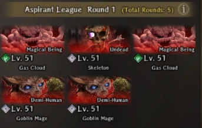
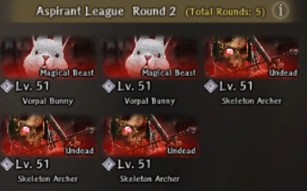
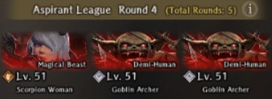
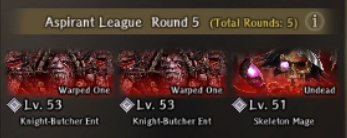

# Battlefront of Heroes - Season 1

!!! warning " Work In Progress"

    - The page will be heavily updated over the coming days with more details. 
    - Visit the [Discord](https://discord.gg/PTBu6WgV) and go to the the Forums - Battlefront of Heroes - Season 1 channel for the most up-to-date information and strategies. 

## Overview

- Battlefront of Heroes was released on 4/16 and runs until 6/10. Drecom has announced that they plan to release future seasons on an ongoing basis.  
- Standard, arena-style challenge with 4 Leagues. The difficulty level, number of matches, and roster size increases as you progress. 
- Each season spotlights a subset of units that are granted a special buff based on certain attributes. For Season 1, it is Dark, Human, and 2H Swords. Class or alignment may be added in future seasons.
- Clearing a League rewards a medal that gives a permanent passive, which can be leveled up. See [Hero's Sigil: Dark](#heros-sigil-dark) for details. Future seasons will also rewards medals, but only one can be equipped at a time. 
- The Hero's Award mission offers up to 4 Doppel Quicksilver, a new item, which gives 25 Discipline experience points to any unit. The other unique reward is a 2H Sword, the Heavy Warblade of Honor.

## Requirements

=== "How to Unlock" 

    - Battlefront of Heroes unlocks after defeating the first Greater Warped One and saving the King.

=== "How to Accept" 

    - Enter the Royal Capital for a brief cutscene. Go to the Beginning Abyss - BF2.
    - Speak with the noble. Your choice does not matter. 
    - Speak to the receptionist, Beth, to learn more about the arena's rules and mechanics. 
    - Select "Participate", choose up to 8 members for your roster, and head to the right-hand room to begin your first match. 

## Mechanics

### Basics 

=== "League Structure"

    

    
    | League Name &emsp; &emsp;            | # of Combatants  | # of Matches | 
    |:-------------------------------------|:----------------:|:------------:|
    | Aspirant                             | 8                | 5            | 
    | Adept                                | 12               | 10           | 
    | Elite                                | 16               | 15           | 
    | Hero                                 | 20               | 20           | 
     
    

    - There are 4 Leagues this season. The number of matches starts at 5 and grows by +5 per League to a maximum of 20. 
    - Warning! After a League is cleared it cannot be re-attempted. You are automatically advanced to the next tier. 
    - The Hero League is the only exception and can be repeated for the weekly mission achievements. 

    
=== "Registration" 
    
    - For the first League, Aspirant, you can register up to 8 members. You can add +4 more members with each additional League up to a maximum of 20.
    - Dispatched units cannot be registered. 
    - You do not have to use the same units for each League, but it is -highly- recommended due to how the [medal](#heros-sigil-dark) system works. 
    - If you fully exit and reset the Battlefront of Heroes, then you must re-register all units for your current League. 
    
=== "Pre-Battle"

    - Before each match you can re-arrange your active party using the red "people" icon in the upper right-hand corner.
    - Speak to the Blackiron Warden for information about the upcoming fight. 
    - To heal between matches a unit must be in your active party. It is helpful to bring additional healers to conserve your team's MP. 
    - To change equipment the unit does not need to be in your active party. 
    - You can use a Resistance buff while in the waiting room. It will remain active even after accepting the next match. 

=== "During Battle" 

    - Referee Intervention 
        - The Referee can implement additional buffs or debuffs at the start of the match. Fortunately, it is limited to a small number of fights per League. 
        - The debuffs are extremely strong, but can be removed with Abit. It is usually best to not use an affected unit. 
    - Flee 
        - You can flee at any point during the match with 100% success. Any effects sustained in combat will carry over. 
        - No progress is lost. You are sent back to your prior match, which can you can do over again. 
    
=== "Death" 

    - MC 
        - "Rise again" 
            - Revived and transported to the waiting room with no impact on your team's HP, MP, or SP. 
            - Consumes a Flame of Reawakening. 
        - "Be carried out" 
            - MC is revived with 1 HP. Any MP or SP used in the previous fight is not restored to its pre-match level. 
            - Match progress is not lost. Does not consume a Flame of Reawakening. 
        - Death of any kind does not appear to lower the MC's hidden Fortitude value. 
        - You can gain up to 2 Flames of Reawakening in the Well of the Mind, allowing you to revive up to 5 times. 
    - Party Member     
        - If a unit dies and is revived they will lose 30 Fortitude. Once Fortitude reaches 0 the unit is "dead" and can no longer be used. 
        - Fortitude does not recover between matches. If you exit the arena, then the Fortitude of all units is restored to its original level when you first entered. 

### Battlefront Rules 

=== "Summary" 

    - The arena provides a special buff during combat called a "Battlefront Rule" for units that are Dark, Human, or use a 2H sword. 
    - The buff is significant and scales with each League. It becomes increasingly more important for the Elite and Hero Leagues. 
    - We recommend you change MC's Type to Dark in the Well of the Mind. While the Type nodes do not change the 3 elements that are rolled each time you reset are randomly determined.      
=== "Special Buff" 

    === "Table" 

        

        | Requirement &emsp; &emsp;    | Description          | Aspirant | Adept | Elite | Hero |
        |:----------------|:----------------------------------|--------- |-------|-------|------|
        | Dark Type       | All stats increased               | 1.2x     | 1.3x  | 1.4x  | 1.5x |
        | Human           | Attack and Magic Power increased &emsp; &emsp;  | 1.2x     | 1.3x  | 1.4x  | 1.5x |
        | 2H Sword        | Damage increased                  | 1.2x     | 1.3x  | 1.4x  | 1.5x |

        

        - We are in the process of verifying whether buffs stack or not and their interactions with other damage passives. 
        - The scaling factor (1.2-1.5x) per buff is the same for each League. 

    === "Battle Character Screen" 

        

        
        

        - If you click on a character you can see what buffs are currently active.

    === "Buff Indicator"

        

         
         

        - The red diamonds represent the number of active special buffs. 

=== "Restrictions" 

    - Use of consumable and support items is prohibited. 
    - The game update states that you cannot leave during a match, but this is not true. You can flee if you need to restart the match.

=== "Dark + Human Units" 

    - Gandolfo
    - Gerard 
    - Gillion
    - Kiriha 
    - Linaria 
    - See the [Adventurer Quicklist](../../../../adventurers/adventurer-quicklist/) for a list of all Human units. 

### Hero's Sigil: Dark

!!! danger "Review this section carefully before registering for the Aspirant League."

=== "Basics" 

    - Warning! The medal is a one-time reward after clearing a League. Each clear gives an additional level up to L4. It cannot be farmed or reassigned to a different unit. 
    - The medal gives a passive (Hero's Sigil: Dark) that reduces Dark-type damage and gives a small boost to HP, MP, and SP. The bonuses for Dark units are doubled. See the next tab for specifics. 
    - All members in your Battlefront roster receive the medal even if they do not participate. 
    - Future seasons will offer additional medals, but only one can be equipped at a time. 

=== "Stat Gains per Level" 

    

    
    | Stat &emsp; &emsp;  | L1     | L2     | L3     | L4     | Totals  | 
    |:--------------------|--------|--------|--------|--------|---------|
    | HP                  | 5 (10) |        |        | 5 (10) | 10 (20) |
    | MP                  |        | 5 (10) |        |        | 5 (10)  | 
    | SP                  |        |        | 5 (10) |        | 5 (10)  |  
                 
    

    - Dark units receive a 2x bonus to each stat. Those values are listed as (#). 
    - It is unknown if the Dark-type damage reduction increases with each level.  

=== "Leveling Mechanics"

    - Warning! As a one-time reward it cannot be farmed or transferred to another unit.  
    - Each time you clear a league all the units in the battlefront roster recieve 100 EXP (or 1 level) toward the passive skill. 
    - Since you cannot go back and redo an already cleared league this means that only the first 8 units you selected for the Aspirant league have the potential to reach L4. 
    - The roster expands by +4 each league, so you can continue to add 4 new members to receive the medal, but at a lower max level. See the table in the next tab.
    - We recommend you think very carefully about what units you want to prioritize, especially with the 2x bonus for Dark units. 

=== "Max Level per League Entry Point"

    

    | League Name &emsp; &emsp; &emsp;     | Aspirant | Adept | Elite | Hero | Max Level | Max # of Units | 
    |:-------------------------------------|:--------:|:-----:|:-----:|:----:|:---------:|:--------------:|
    | Aspirant                             | +1       | +1    | +1    | +1   | 4         | 8              |     
    | Adept                                |          | +1    | +1    | +1   | 3         | 4              | 
    | Elite                                |          |       | +1    | +1   | 2         | 4              |
    | Hero                                 |          |       |       | +1   | 1         | 4              |
     
    

### Hero's Mission 

- Forthcoming.

!!! danger "Critical Warnings" 

    - Mission achievements and progress can only be viewed while in the Battlefront of Heroes arena. 
    - Strong recommend you complete the 5 Dark, 3 Mage, 3 Knight, and 10,000 damage achievements during the Aspirant or the Adept Leagues.
    - MC does not count toward the Dark achievement. 
    - The Hero League is a massive increase in difficulty and it may not be possible to fulfill achievement requirements if your units are not strong enough.
    - For normal players it is strongly recommended to -not- clear Elite until the Hero's Mission is completed (6,500 points).
    - Current bug: If you max out the Hero's Mission without clearing Hero you cannot (currently) get the Doppel Quicksilver. We expect this to be patched in the near future. 

## League Matches

### Aspirant League

=== "Match 1"

    === "Fight Image"
        

    === "Fight Details"
        - Frontline: Air Cloud 2x, Skeleton 1x
        - Backline: Goblin Mage 2x

=== "Match 2"

    === "Fight Image"
        

    === "Fight Details"
        - Frontline: Vorpal Bunny 2x
        - Backline: Skeleton Archer 3x

=== "Match 3"

    === "Fight Image"
        

    === "Fight Details"
        - Frontline: Skeleton Knight 2x
        - Backline: Red Spinner Woman 2x

=== "Match 4"

    === "Fight Image"
        

    === "Fight Details"
        - Frontline: Scorpion Lady 1x, Goblin Archer 1x
        - Backline: Goblin Archer 1x

=== "Match 5"

    === "Fight Image"
        

    === "Fight Details"
        - Frontline: Knight-Butcher Ent 2x
        - Backline: Skeleton Mage 1x

### Adept League

=== "Match 1"

    === "Fight Image"
        

    === "Fight Details"
        - Frontline: Earth Hobgoblin 2x
        - Backline: Earth Creeping Coin 2x

=== "Match 2"

    === "Fight Image"
        

    === "Fight Details"
        - Frontline: Earth Sahuagin 3x
        - Backline: Earth Cloud 2x
        
=== "Match 3"

    === "Fight Image"
        

    === "Fight Details"
        - Frontline: Earth Big Slime 1x
        - Backline: Earth Entity 4x
        
=== "Match 4"

    === "Fight Image"
        

    === "Fight Details"
        - Frontline: Desert Fly 3x
        - Backline: Earth Sahuagin Archer 2x, Earth Creeping Coin 1x

=== "Match 5"

    === "Fight Image"
        

    === "Fight Details"
        - Frontline: Earth Pixie 4x
        - Backline: Earth Pixie 1x, Hydra Plant 1x

=== "Match 6"

    === "Fight Image"
        

    === "Fight Details"
        - Frontline: Water Sahuagin 2x, Water Lizardman 1x
        - Backline: Sahuagin Archer 1x, Sahuagin Mage 1x

=== "Match 7"

    === "Fight Image"
        

    === "Fight Details"
        - Frontline: Scorpion Lady 1x
        - Backline: Earth Entity 3x

=== "Match 8"

    === "Fight Image"
        

    === "Fight Details"
        - Frontline: Pirate Berserker 2x
        - Backline: Gluttonous Maw 2x

=== "Match 9"

    === "Fight Image"
        

    === "Fight Details"
        - Frontline: Water Lizardman Champion 
        - Backline: Pirate Deacon 2x

=== "Match 10"

    === "Fight Image"
        

    === "Fight Details"
        - Frontline: Plague Crewman 3x
        - Backline: Oar Collector 1x

### Elite League

=== "Match 1"

    === "Fight Image"
        

    === "Fight Details"
        - Frontline: Skeleton Archer 2x
        - Backline: Poltergeist 2x

=== "Match 2"

    === "Fight Image"
        

    === "Fight Details"
        - Frontline: Vorpal Bunny 3x
        - Backline: Evil Eye 1x

=== "Match 3"

    === "Fight Image"
        

    === "Fight Details"
        - Frontline: Chimera 1x
        - Backline: Indigo Ninja 2x

=== "Match 4"

    === "Fight Image"
        

    === "Fight Details"
        - Frontline: Ninja 3x
        
=== "Match 5"

    === "Fight Image"
        

    === "Fight Details"
        - Frontline: Greater Demon 1x
        - Backline: Skeleton Archer 3x

=== "Match 6"

    === "Fight Image"
        

    === "Fight Details"
        - Frontline: Fire Goblin 3x
        - Backline: Fire Pixie 2x

=== "Match 7"

    === "Fight Image"
        

    === "Fight Details"
        - Frontline: Fire Insect 3x
        - Backline: Fire Entity 2x

=== "Match 8"

    === "Fight Image"
        

    === "Fight Details"
        - Frontline: Fire Fly 3x
        - Backline: Fire Hawk 2x

=== "Match 9"

    === "Fight Image"
        

    === "Fight Details"
        - Frontline: Fire Slime 3x
        - Middle: Fire Cloud 3x
        - Backline: 2x Fire Goblin Archer, 1x Fire Goblin Mage

=== "Match 10"

    === "Fight Image"
        

    === "Fight Details"
        - Frontline: Minotaur 2x
        - Backline: Fire Entity 3x
        - Debuff Applied: Beastfolk Stats Down

=== "Match 11"

    === "Fight Image"
        

    === "Fight Details"
        - Frontline: Earth Cloud 4x

=== "Match 12"

    === "Fight Image"
        

    === "Fight Details"
        - Frontline: Gorgon 2x
        - Backline: Earth Pixie 3x

=== "Match 13"

    === "Fight Image"
        

    === "Fight Details"
        - Frontline: Earth Big Slime 1x
        - Backline: Earth Entity 2x

=== "Match 14"

    === "Fight Image"
        

    === "Fight Details"
        - Frontline: Wight 2x
        - Backline: Desert Fly 2x, Earth Big Slime 1x

=== "Match 15"

    === "Fight Image"
        

    === "Fight Details"
        - Frontline: Light Succubi 2x, Necrocore 1x
        - Backline: Necromancer 1x
        - Debuff Applied: Elf Stats Down

### Heroic League

=== "Match 1"

    === "Fight Image"
        

    === "Fight Details"
        - Frontline: Hobgoblin 2x, Goblin 1x
        - Backline: Goblin Mage 1x, Goblin Shaman 1x, Goblin Archer 1x

    === "Fight Tips"
        - All the enemies use their standard skillsets. All of them are evadable with Dark Element units with 230+ EVA.
        - Kill the magic casting backline units first. Kill the rest with basic attacks to conserve SP.

=== "Match 2"

    === "Fight Image"
        

    === "Fight Details"
        - Frontline: Hobgoblin 3x
        - Backline: Mage Adventurer 3x

    === "Fight Tips"
        - Mage Adventurers tend to prioritze casting BALAFEOS first on any rows without ATK debuff. They also prefer casting other debuff spells, but can cast single-target attack spells sometimes. The BALAFEOS is quite strong so ABIT it ASAP on ATK-scaling units.
        - Hobgoblins use their standard skillset. Can be evaded with Dark Element units with 230+ EVA.
        - Kill the mages first ASAP. Kill the rest with basic attacks to conserve SP.

=== "Match 3"

    === "Fight Image"
        

    === "Fight Details"
        - Frontline: Vorpal Bunny 2x, Large Slime 1x
        - Middle: Wind Entity 2x, Water Slime 2x
        - Backline: Ninja 2x

    === "Fight Tips"
        - Bunnies have extremely high evasion and decently high HP. they can be instantly frozen with MADALTO and then killed in one with with a 700-800 ATK 2H Sword Lvl 1 ESS or Poised.
        - The Big Slime and Water Slimes can be evaded entirely with Dark Element units with 230+ EVA.
        - The Entities can be evaded if they are not casting magic with the previously mentioned stats.
        - The Ninjas tend to cast low accuracy row status effects or low damage row magic. They can be evaded otherwise.
        - It's recommended to kill in the order of Bunnies, Ninjas, Entities, and Slimes.

=== "Match 4"

    === "Fight Image"
        

    === "Fight Details"
        - Frontline: Red Spinner Woman 1x, Scorpion Lady 1x
        - Backline: Mage Adventurer 1x, Ninja 2x

    === "Fight Tips"
        - It's recommended to clear the backline first. See previous entries for how these enemies function. They will be consistent throughout the run.
        - It's possible to evade the Red Spinner Woman and Scorpion Lady but they might require MASOLOTU + DILTO applied as they are a bit more accurate. BATILGREF also helps buy a lot of time to kill the backline first before dealing with the frontline.
        - It's recommended to kill in the order of Mage, Ninja, Red Spinner Woman, Scorpion Lady.
        
=== "Match 5"

    === "Fight Image"
        

    === "Fight Details"
        - Frontline: Giant Monster Bird 1x
        - Backline: Air Hawk 3x

    === "Fight Tips"
        - This is probably one of the more annoying fights for a majority of the runs, as it drains a lot of resources. It's recommended to deal with the Hawks immediately by using KATINO, which is nearly guaranteed on them. If they are not taken care of they can easily surety for over 1K damage. Otherwise, they have rather low HP and can be killed with ESS or Poised after being slept despite being in the backline. 
        - The Monster Bird itself has very high HP, perhaps around 100k or higher. It's also extremely evasive, so it's recommended to apply MACALDIA to your DPS and debuff it's evasion via BATILGREF and Chill. The Monster Bird is immune to the CT debuffing effects of BATILGREF but not the EVA debuffing portion. The single target attack of the Monster Bird is evadable.
        - Knights can be employed here if necessary to survive its full team AOE attack. Alternatively, you can simply equip every unit with Magical Beast Resistance Gear and have two Priests, preferably Dark Element for maximum HP.

=== "Match 6"

    === "Fight Image"
        

    === "Fight Details"
        - Frontline: Skeleton Knight 2x, Skeleton Giant
        - Backline: Skeleton Mage 2x, Skeleton Archer

    === "Fight Tips"
        - Every enemy has extremely high accuracy, otherwise relatively low HP compared to most fights in this mode. They all have standard movesets, just very high physical damage.
        - MAREIN isnt suggested, it's better to BATILGREF the frontline and then focus on wiping the backline ASAP.

=== "Match 7"

    === "Fight Image"
        

    === "Fight Details"
        - Frontline: Plague Crewman 2x, Cursed Sack Doll 2x
        - Backline: Ninja 2x, Necromancer 1x

    === "Fight Tips"
        - The Cursed Sack Dolls guaranteed go first (even if u have 500 ASPD), and will typically either use Cursed Ritual to apply Curse to everyone or do a lot of damage. They are somewhat hard to evade.
        - Everything has a standard moveset, but main issue are the Cursed Sack Dolls. They are extremely fast and evasive, but can be taken care of instantly with MADALTO and ESS/Poised with a 2H Sword. Afterwards it's recommended to kill the Necromancer and Ninjas. You can also KATINO the Plague Crewman, as they are one of the few enemies that can sleep for multiple turns while you take care of the rest. Alternatively, BATILGREF works too.

=== "Match 8"

    === "Fight Image"
        

    === "Fight Details"
        - Frontline: Necrocore 1x, Lesser Demon 2x
        - Backline: Dark Slime 4x

    === "Fight Tips"
        - You can evade all of the enemies here with previously mentioned EVA build. They mainly just use physical attacks.
        - Ideally just BATILGREF both rows and kill them with basic attacks to replenish some SP with Debra's inherit skill if possible.
        - Focus the front row before killing the backrow.

=== "Match 9"

    === "Fight Image"
        

    === "Fight Details"
        - Frontline: Chimera 2x
        - Backline: Ninja 2x, Mage Adventurer 2x

    === "Fight Tips"
        - The Chimeras are extremely fast, accurate, and have very high surety chance. You essentially have to pray your damage reduction passives (WOTK, Sanctuary's Blessing, Wisdom of Truth, Eyes that Know the Future) will proc here or they can instantly kill. It's very recommended that your entire frontline has Magical Beast Resist gear.
        - Ideally just BATILGREF the Chimeras and defend with your frontline. Try to kill enemies with your backline. Focus on clearing the enemy backline first, particularly the mages so they don't keep debuffing you.

=== "Match 10"

    === "Fight Image"
        

    === "Fight Details"
        - Frontline: Minotaur 1x, Our Heirlooms 1x
        - Backline: Ninja 2x, Mage Adventurer 1x

    === "Fight Tips"
        - It's recommended to immediately BATILGREF the enemy frontline, then deal with the backline first as per usual
        - The Minotaur has relatively high accuracy, and does very high damage so deal with it first. Very recommended to use Magical Beast Resist gear for your frontline.
        - Our Heirlooms has a standard moveset and isn't that strong. Preferably do not use low fortitude units for this fight though.

=== "Match 11"

    === "Fight Image"
        

    === "Fight Details"
        - Frontline: Lamenting Snowfolk 2x
        - Middle: Pixie 2x
        - Backline: Gorgon 2x

    === "Fight Tips"
        - MADALTO the pixies immediately and get rid of them, as they can apply Sleep which can easily get you killed.
        - It's recommended to BATILGREF both rows and then quickly deal with the columns. If possible, kill the Gorgon before the Lamenting Snowfolk as the Gorgons can instantly stone a row if both aim their breath at the same row. The Gorgons also frequently Lunge, which switches a frontline unit with the backline.
        - The Gorgons have very high accuracy and do quite a lot of damage with Lunge as they move closer. It may be favorable to bring Magical Beast Resistance gear.

=== "Match 12"

    === "Fight Image"
        

    === "Fight Details"
        - Frontline: Evil Eye 1x, Earth Slime 2x
        - Backline: Hydra Plant 2x, Mage Adventurer 1x

    === "Fight Tips"
        - It goes without saying, immediately kill the Mage Adventurer. Then it's preferable to focus on killing the Evil Eye, as it gets two actions a turn, and can potentially wipe an entire row at once. It's somewhat evadable, but very risky if it starts targetting the backline, which may not have very high evasion. In addition, it has a very high chance of calling for an Ally randomly, which is another Evil Eye but with significantly less HP.
        - The Hydra Plants have a standard moveset, and don't really do much damage. However, that row damage cannot be evaded.
        - The Earth Slimes are evadable and very weak, so they are the least priority to deal with.
        - It's preferable to run a lot of damage for this stage to end it quickly.

=== "Match 13"

    === "Fight Image"
        

    === "Fight Details"
        - Frontline: Big Snow Hawk 2x
        - Backline: Snow Hawk 2x, Pixie 2x

    === "Fight Tips"
        - This match is pretty easy, everything can be evaded. MADALTO the backline and immediately kill the pixies. The Snow Hawks however, require 3 DALTOs to freeze.
        - Can BATILGREF/MADALTO to reduce their evasion. It's not recommended to use Dissipation or Malefic Wind unless you have plenty of resources remaining to remove their CT/EVA buffs.

=== "Match 14"

    === "Fight Image"
        

    === "Fight Details"
        - Frontline: Succubi 3x
        - Backline: Earth Cloud 2x, Mage Adventurer 1x

    === "Fight Tips"
        - The clouds have very high defense, especially in the backline and seem to always go first. However, they can generally be evaded. Deal with these last.
        - MADALTO the front row, as the Succubi are very evasive but freeze immediately. Kill them and the Mage Adventurer. Then focus on chipping away on the clouds.

=== "Match 15"

    === "Fight Image"
        

    === "Fight Details"
        - Frontline: Bigfoot 1x, Cyclops 1x
        - Backline: Bigfoot Child 3x
        - Debuff Applied: Beastfolk Stats Down

    === "Fight Tips"
        - Not clear yet

=== "Match 16"

    === "Fight Image"
        

    === "Fight Details"
        - Frontline: Mimic 1x, Stonefolk 1x
        - Backline: Lamenting Snowfolk 2x

    === "Fight Tips"
        - Not clear yet

=== "Match 17"

    === "Fight Image"
        

    === "Fight Details"
        - Frontline: Lizardman 2x, Fire Slime 2x
        - Backline: Fire Entity 2x, Lizardman Champion 1x

    === "Fight Tips"
        - Not clear yet

=== "Match 18"

    === "Fight Image"
        

    === "Fight Details"
        - Frontline: Vampire 2x, Sand Apparition 2x
        - Backline: Mage Adventurer 3x

    === "Fight Tips"
        - Not clear yet

=== "Match 19"

    === "Fight Image"
        

    === "Fight Details"
        - Frontline: Snow Wolf Leader 1x, Alabaster Balewolf 3x
        - Backline: Alabaster Balewolf 4x

    === "Fight Tips"
        - Not clear yet

=== "Match 20"

    === "Fight Image"
        

    === "Fight Details"
        - Frontline: Defense Golem 1x, Attack Golem 1x
        - Backline: Greater Demon 2x

    === "Fight Tips"
        - Not clear yet

