# Battlefront of Heroes - Season 1

!!! warning " Work In Progress"

    - The page will be heavily updated over the coming days with more details. 
    - Visit the [Discord](https://discord.gg/PTBu6WgV) and go to the the Forums - Battlefront of Heroes - Season 1 channel for the most up-to-date information and strategies. 

!!! danger "Before you Begin"
    - It is possible to lock yourself out of being able to complete the Hero Mission achievements and rewards. [Here](#heros-mission) for details. 
    - The medals are one-time only and cannot be farmed or transferred. [Here](#heros-sigil-dark) for details. 
    - Read all the warnings carefully before proceeding. 

## Overview

- Event Period: 4/16 - 6/10. Drecom has announced plans to release future seasons on an ongoing basis.  
- Battlefront of Heroes is a standard, arena-style challenge with 4 Leagues. The difficulty level, number of matches, and roster size increases as you progress. 
- Each season spotlights a subset of units that are granted a special set of buffs based on certain attributes. For Season 1 it is Dark, Human, and 2H Swords. Class or alignment may be added in future seasons.
- Clearing a League rewards a medal that gives a permanent passive, which can be leveled up. See [Hero's Sigil: Dark](#heros-sigil-dark) for details. 
- The Hero's Award mission offers up to 4 Doppel Quicksilver, a new item, which gives 25 Discipline experience points to any unit. The other unique reward is a 2H Sword, the Heavy Warblade of Honor.

## Requirements

=== "How to Unlock" 

    - Battlefront of Heroes unlocks after defeating the first Greater Warped One and saving the King.

=== "How to Accept" 

    - Enter the Royal Capital for a brief cutscene. Go to the Beginning Abyss - BF2.
    - Speak with the noble. Your choice does not matter. 
    - Speak to the receptionist, Beth, to learn more about the arena's rules and mechanics. 
    - Select "Participate", choose up to 8 members for your roster, and head to the right-hand room to begin your first match. 

## Mechanics

### Basics 

=== "League Structure"

    

    
    | League Name &emsp; &emsp;            | # of Combatants  | # of Rounds  | 
    |:-------------------------------------|:----------------:|:------------:|
    | Aspirant                             | 8                | 5            | 
    | Adept                                | 12               | 10           | 
    | Elite                                | 16               | 15           | 
    | Hero                                 | 20               | 20           | 
     
    

    - There are 4 Leagues this season. The number of matches starts at 5 and grows by +5 per League to a maximum of 20. 
    - Warning! After a League is cleared it cannot be re-attempted. You are automatically advanced to the next tier. 
    - Warning! There is a massive difficulty spike between the Elite and Hero Leagues. Only a handful of players globally have been able to clear the content. It is unclear if Drecom plans to adjust the difficulty or leave as-is. 
    - The Hero League is the only exception and can be repeated for the weekly [Hero's Mission](#heros-mission) achievements. 

=== "Registration" 
    
    - For the first League you can register up to 8 members. Each subsequent League lets you add 4 more members up to a maximum of 20. 
    - Dispatched units cannot be registered. 
    - You do not have to use the same units for each League, but it is -highly- recommended due to how the [medal](#heros-sigil-dark) leveling system works. 
    - If you fully exit and reset the Battlefront of Heroes, then you must re-register all units.  
    
=== "Pre-Battle"

    - Before each round you can re-arrange your active party using the red "people" icon in the upper right-hand corner.
    - Speak to the Blackiron Warden for a preview of the enemies for the next round. It does not include enemy row placements.  
    - To heal the unit must be in your active party. 
    - To change equipment the unit does not need to be in your active party. 
    - You can use a Resistance buff while in the waiting room or while in the arena before engaging with the enemy. 
    
=== "During Battle" 

    - Referee Intervention 
        - The Referee can implement additional buffs or debuffs at the start of the match. Fortunately, it is limited to a small number of fights per League. 
        - The debuffs are not permanent and can be removed with Abit. Priests learn Abit at Level 40 and it is Daniel's potential inherit. Note that Abit 2 can remove 2 debuffs from an entire row.  
        - The debuffs are extremely powerful. We recommend clearing them immediately or not bringing affected units. 
        - The racial debuffs (Beastfolk, Elf) seem to lower all of a unit's stats by a % amount. 
    - Flee 
        - You can flee with 100% success. Any effects sustained in combat will carry over. 
        - No progress is lost. You are sent back to your prior round, which can you can do over again. 
    
=== "Death" 

    - If MC dies:  
        - "Rise again" 
            - Revived and transported to the waiting room in your pre-battle condition.  
            - Consumes a Flame of Reawakening. Progress is not lost.  
        - "Be carried out" 
            - MC is revived with 1 HP. Any MP or SP used in the previous fight is not restored. Units that were not revived prior to the MC's death stay dead.
            - Does not consume a Flame of Reawakening. Progress is not lost.  
        - You can gain up to 2 Flames of Reawakening in the Well of the Mind, allowing you to revive up to 5 times. 
    - If a party member dies:   
        - If revived they will lose 30 Fortitude per usual. Once Fortitude reaches 0 the unit is "dead" and can no longer be used. 
        - Fortitude does not recover between rounds. If you exit the arena, then the Fortitude of all units is restored to its original level when you first entered. 

=== "Exiting the Arena"

    - Ignore the warnings that you are permanently barred from competing if you leave the arena. 
    - To exit you must speak with Beth, the receptionist, and confirm that you want to leave. You will be Cursed Wheel back to the registration desk. You can exit freely at that point or re-register for your current League. 
    - Progress in the current League is not saved so you will start over at the first match. 

=== "Cursed Wheel"

    - If you need to Cursed Wheel outside your current Abyss, then the Battlefront of Heroes event will reset and disappear from the world map.
    - After Cursed Wheeling enter the Royal Capital from the world map to see the invitiation cutscene again. 
    - If your Cursed Wheel node places you in the Royal Capital, then the request should automatically trigger. If not, simply exit to the world map and re-enter. 

### Battlefront Rules 

=== "Summary" 

    - The arena provides a set of special buffs during combat called "Battlefront Rules" for units that are Dark, Human, or use a 2H Sword. 
    - The buff is significant and scales with each League. It is most impactful and useful for the Elite and Hero Leagues. 
    - We recommend you change MC's Type to Dark in the [Well of the Mind](../../../../docs/adventurer-customization/well-of-the-mind). The Type node locations do not change, but the 3 elements are randomly determined each time you reset.      
    
=== "Special Buffs" 

    === "Table" 

        

        | Requirement &emsp; &emsp;    | Description          | Aspirant | Adept | Elite | Hero |
        |:----------------|:----------------------------------|--------- |-------|-------|------|
        | Dark Type       | All stats increased               | 1.2x     | 1.3x  | 1.4x  | 1.5x |
        | Human           | Attack and Magic Power increased &emsp; &emsp;  | 1.2x     | 1.3x  | 1.4x  | 1.5x |
        | 2H Sword        | Damage increased                  | 1.2x     | 1.3x  | 1.4x  | 1.5x |

        

        - We are in the process of verifying whether the special buffs stack and how they interact with other damage passives. 
        - The scaling factor per buff is the same for each League. 

    === "Battle Character Screen" 

        

        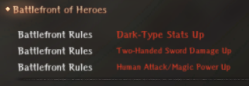
        

        - If you click on a character during battle you can see what buffs and debuffs are currently active.

    === "Buff Indicator"
    
        

        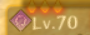
        

        - The red diamonds represent the number of active special buffs. 

=== "Restrictions" 

    - Use of consumable and support items is prohibited. 
    - The game update states that you cannot leave during a match, but this is not true. You can flee if you need to restart a match.

=== "Dark + Human Units" 

    - Gandolfo
    - Gerard 
    - Gillion
    - Kiriha 
    - Linaria 
    - See the [Adventurer Quicklist](../../../../adventurers/adventurer-quicklist/) for a list of all Human units. 

### Hero's Sigil: Dark

!!! danger "Critical Warnings"

    - The Hero League is unpassable for 99.9% of players in its current state. Operate on the assumption that L3 is the maximum that can be reached. Drecom has stated they will add other ways to increase medal levels in the future. 
    - You cannot redo an already cleared League. Consequently, only the first 8 units registered for the Aspirant League will have access to the +5 SP (+10 for Dark) at L3. 

=== "Basics" 

    - Warning! The medal is a one-time reward after clearing a League. Each clear gives an additional level up to L4. It cannot be farmed or reassigned to a different unit. 
    - The medal gives a passive (Hero's Sigil: Dark) that reduces Dark-type damage along with a small boost to HP, MP, and SP. The bonuses for Dark units are doubled. See the next tab for specifics. 
    - All members in your Battlefront roster receive the medal even if they do not participate. 
    - Future seasons will offer additional medals, but only one can be equipped at a time. 

=== "Stat Gains per Level" 

    

    
    | Stat &emsp; &emsp;  | L1     | L2     | L3     | L4     | Totals  | 
    |:--------------------|--------|--------|--------|--------|---------|
    | HP                  | 5 (10) |        |        | 5 (10) | 10 (20) |
    | MP                  |        | 5 (10) |        |        | 5 (10)  | 
    | SP                  |        |        | 5 (10) |        | 5 (10)  |  
                 
    

    - Dark units receive a 2x bonus to each stat. Those values are listed as (#). 
    - It is unknown if the Dark-type damage reduction increases with each level.  

=== "Leveling Mechanics"

    - Each time you clear a League your entire Battlefront roster recieves 100 EXP (or 1 Level) toward the passive skill. 
    - The roster expands by 4 each League. New members can receive the medal, but at a lower max level. See the table in the next tab.
    - We recommend you think very carefully about what units you want to prioritize, especially with the 2x bonus for Dark units. 

=== "Max Level per League Entry Point"

    

    | League Name &emsp; &emsp; &emsp;     | Aspirant | Adept | Elite | Hero | Max Level | Max # of Units | 
    |:-------------------------------------|:--------:|:-----:|:-----:|:----:|:---------:|:--------------:|
    | Aspirant                             | +1       | +1    | +1    | +1   | 4         | 8              |     
    | Adept                                |          | +1    | +1    | +1   | 3         | 4              | 
    | Elite                                |          |       | +1    | +1   | 2         | 4              |
    | Hero                                 |          |       |       | +1   | 1         | 4              |
     
    

=== "Trade-offs"

    Unit selection can be complicated, but here are some things to consider:
    - Prioritize your core, long-term units for the incremental stat bonuses and Dark damage reduction. 
    - Maximize the 2x stat bonus for Dark units. 
    - Dark Knights gain +10 SP at L3, which is extremely helpful due to their low SP pools even with high discipline. 
    - Improve the survivability of Light units by giving them at least L1 of the medal. Dark bosses and super bosses are very common. 

## Hero's Reward Mission 

!!! danger "Critical Warnings" 

    - It is possible to lock yourself out of receiving all the Mission rewards. If you neglect to do the Special, Damage: One-hit, and Damge: Total achievements in a lower League, then you are stuck with the first round of either Elite or Hero depending on your progress. This also applies to the Weekly achievements.   
    - We -strongly- recommend: 
        - Complete at least the Special and Damage: One-Hit achievements in either the Aspirant or Adept Leagues. 
        - Wait to clear the Elite League until after you have finished the Hero's Reward Mission. 
    - The 4th Doppel Quicksilver is locked behind clearing the Hero League. For most players this means a maximum of 3 Doppel Quicksilvers or 75 Discipline experience. 
    
### Basics  

- Mission achievements, progress, and rewards can only be accessed while in the arena. 
- To receive all the achievement rewards requires a total of 6,500 points. 
- There is a maximum of 12,060 points from all sources. It is possible to clear the entire mission before reaching the Hero League.

### Point Breakdowns 

=== "League"

    

    | League Name &emsp; &emsp; &emsp;     | Rounds | Clear | Total | Cumulative |  
    |:-------------------------------------|--------|-------|-------|------------|
    | Aspirant                             | 500    | 200   | 700   | 700        |      
    | Adept                                | 1,000  | 200   | 1,200 | 1,900      |  
    | Elite                                | 1,500  | 200   | 1,700 | 3,600      | 
    | Hero                                 | 2,000  | 200   | 2,200 | 5,800      | 

    

    - Each round is worth 100 points. Clearing a League is worth 200 points. 
    - Clearing all the matches through Elite gives you 3,600 points. 
    - If you do not progress to the Hero League, then you will need 2,900 points from special and weekly achievements to reach 6,500 points. 

=== "Special" 

    

    | Category    &emsp; &emsp; &emsp;     | 1   | 2   | 3   | 4   | 5   | Total |  
    |:-------------------------------------|-----|-----|-----|-----|-----|-------|
    | Dark-type                            | 100 | 100 | 100 | 100 | 200 | 600   |      
    | Human                                | 100 | 100 | 100 | 100 | 200 | 600   |  
    | 2H Swords                            | 100 | 100 | 100 | 100 | 200 | 600   |   
    | Knight                               | 100 | 100 | 100 |     |     | 300   |   
    | Mage                                 | 100 | 100 | 100 |     |     | 300   |      
    | Total                                | 500 | 500 | 500 | 300 | 600 | 2,700 |      

    

    - The number of required adventurers are the column headings. 
    - The special achievements are worth a total of 2,700 points. If you cannot make progress on the Hero League this will be one of your primary sources for reaching 6,500 points for all mission rewards. 

=== "Damage: One-Hit" 

    

    | Damage     &emsp; &emsp;          | Total   | Cumulative |  
    |:----------------------------------------|:-------:|:------------:|
    | &emsp; 200                              | 100 | 100   |       
    | &emsp; 400                              | 100 | 200   | 
    | &emsp; 600                              | 100 | 300   |    
    | &emsp; 900                              | 100 | 400   | 
    | &emsp; 1,500                            | 100 | 500   |       
    | &emsp; 1,800                            | 100 | 600   | 
    | &emsp; 2,200                            | 100 | 700   |    
    | &emsp; 2,600                            | 100 | 800   | 
    | &emsp; 3,000                            | 100 | 900   |       
    | &emsp; 5,000                            | 100 | 1,000 | 
    | &emsp; 7,000                            | 100 | 1,100 |    
    | &emsp; 10,000                           | 100 | 1,200 | 

    

    - Each achievement is worth 100 points for a total of 1,200 points. 
    - Multi-hit weapons and attacks such as Hue count as "one-hit". 
    - Strongly recommend doing the 10,000 damage achievement on a lower League. Sleep or freeze a weak enemy and hit them with your strongest skill using a Dark Human equipped with a 2H sword. 

=== "Damage: Total" 

    

    | Damage     &emsp; &emsp;                       | Total| Cumulative |  
    |:-----------------------------------------------|:-------:|:------------:|
    | &emsp; 3,000                                   | 100 | 100   |       
    | &emsp; 6,000                                   | 100 | 200   | 
    | &emsp; 9,000                                   | 100 | 300   |    
    | &emsp; 30,000                                  | 100 | 400   | 
    | &emsp; 60,000                                  | 100 | 500   |       
    | &emsp; 90,000                                  | 100 | 600   | 
    | &emsp; 120,000                                 | 100 | 700   |    
    | &emsp; 160,000                                 | 100 | 800   | 
    | &emsp; 200,000                                 | 100 | 900   |       
    | &emsp; 300,000                                 | 100 | 1,000 | 
    | &emsp; 600,000                                 | 100 | 1,100 |    

    

    - Each achievement is worth 100 points for a total of 1,100 points. 
    - Even if you lose the damage done in a round is still counted. (Needs additional verification). 
    - Strongly recommend farming the total damage achievements in the Aspirant and Adept Leagues depending on your Abyss progress and account power. 

=== "Weekly" 

    

    | Requirement                             | Total| Cumulative |  
    |:----------------------------------------|:-------:|:------------:|
    | Defeat 5 monsters                       | 30 | 30  |       
    | Defeat 10 monsters                      | 30 | 60  | 
    | Defeat 20 monsters                      | 30 | 90  |    
    | Deal a total of 5,000 damage            | 30 | 120 | 
    | Deal a total of 10,000 damage           | 30 | 150 |       
    | Deal a total of 20,000 damage &emsp; &emsp;  &emsp;           | 30 | 180 | 

    

    - There will be 7 weekly achievements during the season. Each achievement is worth 30 points for a total of 180 points per week. 
    - Weekly achievements are worth a total of 1,260 points. 
    - Note: We do not know if the requirements will change week-to-week or if these will stay constant.

=== "All"

    

    | Main Category  &emsp;  &emsp;  &emsp;                      | Total  | 
    |:-----------------------------------|--------|
    | Aspirant                           | 700    |  
    | Adept                              | 1,200  | 
    | Elite                              | 1,700  | 
    | Hero                               | 2,200  | 
    | Special                            | 2,700  |     
    | Damage:                            | 1,200  |
    | Damage: Total                      | 1,100  |    
    | Weekly                             | 1,260  | 
    | Grand Total                        | 12,060 |    

    

### Rewards

=== "Important Milestones" 

    

    | Total Points                       | Reward  | 
    |:-----------------------------------|--------|
    | 100                                | Savage Warrior Remains    |  
    | Adept                              | 1,200  | 
    | Elite                              | 1,700  | 
    | Hero                               | 2,200  | 
    | Special                            | 2,700  |     
    | Damage: One-Hit &emsp; &emsp;                   | 1,200  |
    | Damage: Total                      | 1,100  |    
    | Weekly                             | 1,260  | 
    | Grand Total                        | 12,060 |   

    

=== "Doppel Quicksilver" 

    { width="390" }
    { width="390" }

=== "Heavy Warblade of Honor" 

    

## General Strategies

- Forthcoming.

## League Battles

### Aspirant League

=== "Round 1"

    === "Preview"
        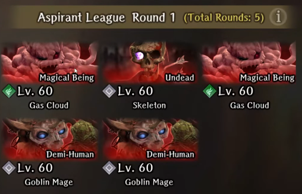{ width="390" }

    === "Details"
        - Frontline: Air Cloud 2x, Skeleton 1x
        - Backline: Goblin Mage 2x

=== "Round 2"

    === "Preview"
        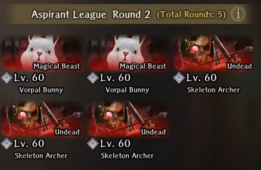{ width="390" }

    === "Details"
        - Frontline: Vorpal Bunny 2x
        - Backline: Skeleton Archer 3x

=== "Round 3"

    === "Preview"
        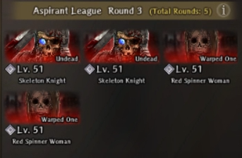{ width="390" }

    === "Details"
        - Frontline: Skeleton Knight 2x
        - Backline: Red Spinner Woman 2x

=== "Round 4"

    === "Preview"
        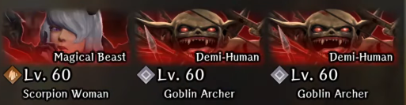{ width="390" }

    === "Details"
        - Frontline: Scorpion Lady 1x, Goblin Archer 1x
        - Backline: Goblin Archer 1x

=== "Round 5"

    === "Preview"
        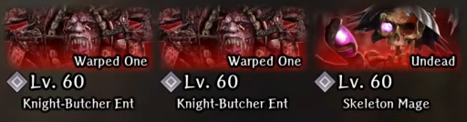{ width="390" }

    === "Details"
        - Frontline: Knight-Butcher Ent 2x
        - Backline: Skeleton Mage 1x

### Adept League

=== "Round 1"

    === "Preview"
        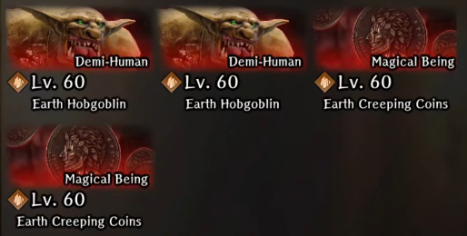{ width="390" }

    === "Details"
        - Frontline: Earth Hobgoblin 2x
        - Backline: Earth Creeping Coin 2x

=== "Round 2"

    === "Preview"
        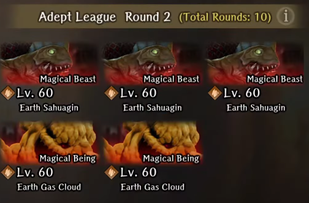{ width="390" }

    === "Details"
        - Frontline: Earth Sahuagin 3x
        - Backline: Earth Cloud 2x
        
=== "Round 3"

    === "Preview"
        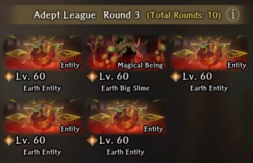{ width="390" }

    === "Details"
        - Frontline: Earth Big Slime 1x
        - Backline: Earth Entity 4x
        
=== "Round 4"

    === "Preview"
        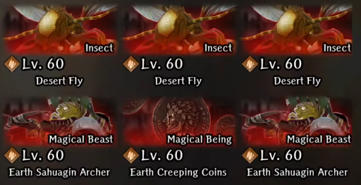{ width="390" }

    === "Details"
        - Frontline: Desert Fly 3x
        - Backline: Earth Sahuagin Archer 2x, Earth Creeping Coin 1x

=== "Round 5"

    === "Preview"
        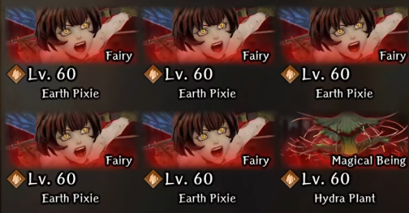{ width="390" }

    === "Details"
        - Frontline: Earth Pixie 4x
        - Backline: Earth Pixie 1x, Hydra Plant 1x

=== "Round 6"

    === "Preview"
        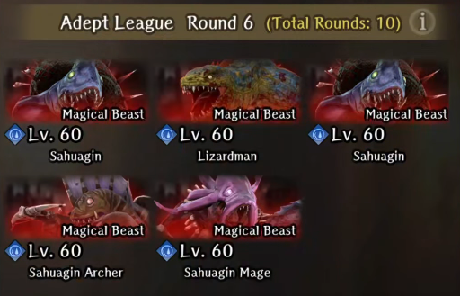{ width="390" }

    === "Details"
        - Frontline: Water Sahuagin 2x, Water Lizardman 1x
        - Backline: Sahuagin Archer 1x, Sahuagin Mage 1x

=== "Round 7"

    === "Preview"
        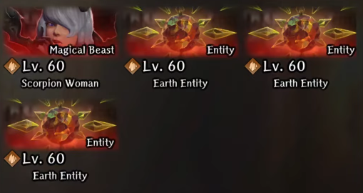{ width="390" }

    === "Details"
        - Frontline: Scorpion Lady 1x
        - Backline: Earth Entity 3x

=== "Round 8"

    === "Preview"
        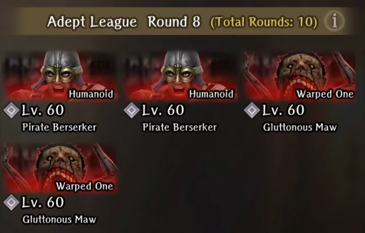{ width="390" }

    === "Details"
        - Frontline: Pirate Berserker 2x
        - Backline: Gluttonous Maw 2x

=== "Round 9"

    === "Preview"
        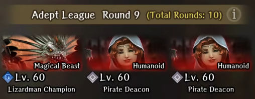{ width="390" }

    === "Details"
        - Frontline: Water Lizardman Champion 
        - Backline: Pirate Deacon 2x

=== "Round 10"

    === "Preview"
        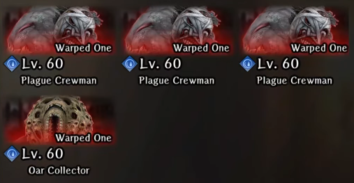{ width="390" }

    === "Details"
        - Frontline: Plague Crewman 3x
        - Backline: Oar Collector 1x

### Elite League

=== "Round 1"

    === "Preview"
        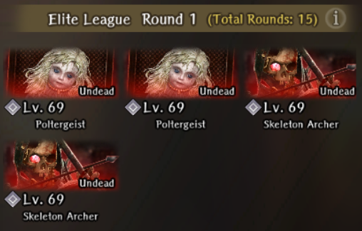{ width="390" }

    === "Details"
        - Frontline: Skeleton Archer 2x
        - Backline: Poltergeist 2x

=== "Round 2"

    === "Preview"
        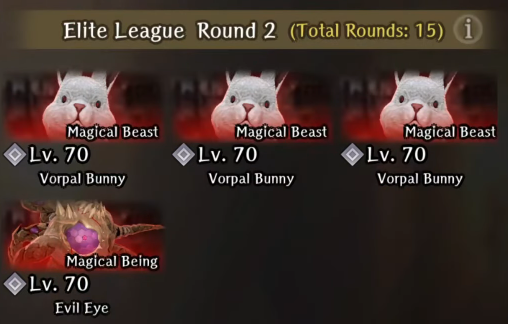{ width="390" }

    === "Details"
        - Frontline: Vorpal Bunny 3x
        - Backline: Evil Eye 1x

=== "Round 3"

    === "Preview"
        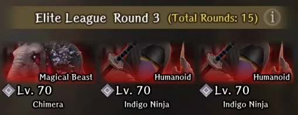{ width="390" }

    === "Details"
        - Frontline: Chimera 1x
        - Backline: Indigo Ninja 2x

=== "Round 4"

    === "Preview"
        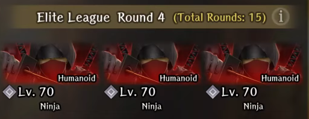{ width="390" }

    === "Details"
        - Frontline: Ninja 3x
        
=== "Round 5"

    === "Preview"
        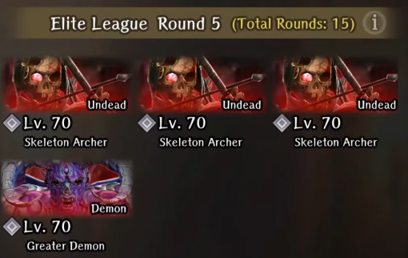{ width="390" }

    === "Details"
        - Frontline: Greater Demon 1x
        - Backline: Skeleton Archer 3x

=== "Round 6"

    === "Preview"
        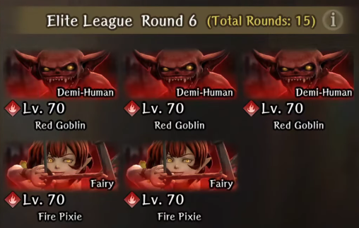{ width="390" }

    === "Details"
        - Frontline: Fire Goblin 3x
        - Backline: Fire Pixie 2x

=== "Round 7"

    === "Preview"
        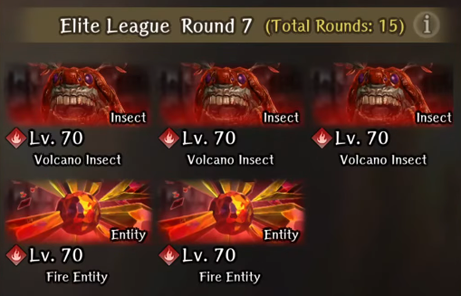{ width="390" }

    === "Details"
        - Frontline: Fire Insect 3x
        - Backline: Fire Entity 2x

=== "Round 8"

    === "Preview"
        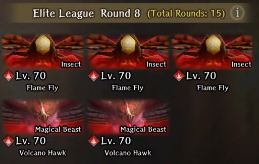{ width="390" }

    === "Details"
        - Frontline: Fire Fly 3x
        - Backline: Fire Hawk 2x

=== "Round 9"

    === "Preview"
        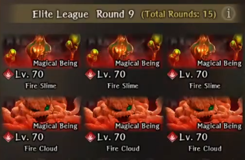{ width="390" }

    === "Details"
        - Frontline: Fire Slime 3x
        - Middle: Fire Cloud 3x
        - Backline: 2x Fire Goblin Archer, 1x Fire Goblin Mage

=== "Round 10"

    === "Preview"
        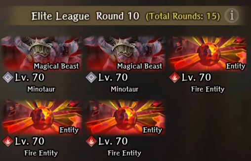{ width="390" }

    === "Details"
        - Frontline: Minotaur 2x
        - Backline: Fire Entity 3x
        - Debuff Applied: Beastfolk Stats Down

=== "Round 11"

    === "Preview"
        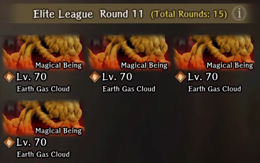{ width="390" }

    === "Details"
        - Frontline: Earth Cloud 4x

=== "Round 12"

    === "Preview"
        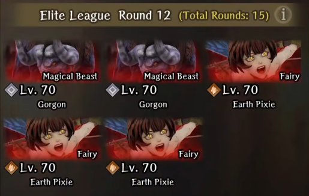{ width="390" }

    === "Details"
        - Frontline: Gorgon 2x
        - Backline: Earth Pixie 3x

=== "Round 13"

    === "Preview"
        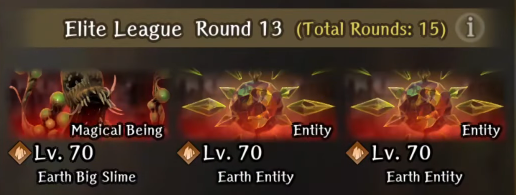{ width="390" }

    === "Details"
        - Frontline: Earth Big Slime 1x
        - Backline: Earth Entity 2x

=== "Round 14"

    === "Preview"
        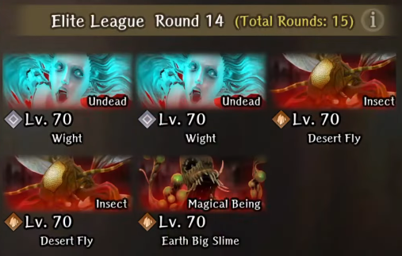{ width="390" }

    === "Details"
        - Frontline: Wight 2x
        - Backline: Desert Fly 2x, Earth Big Slime 1x

=== "Round 15"

    === "Preview"
        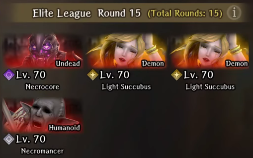{ width="390" }

    === "Details"
        - Frontline: Light Succubi 2x, Necrocore 1x
        - Backline: Necromancer 1x
        - Debuff Applied: Elf Stats Down

### Heroic League

=== "Round 1"

    === "Preview"
        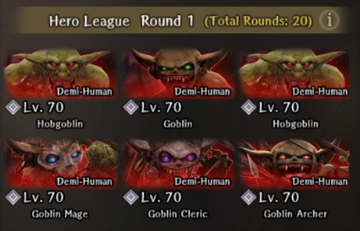{ width="390" }

    === "Details"
        - Frontline: Hobgoblin 2x, Goblin 1x
        - Backline: Goblin Mage 1x, Goblin Shaman 1x, Goblin Archer 1x

    === "Tips"
        - All the enemies use their standard skillsets. All of them are evadable with Dark Element units with 230+ EVA.
        - Kill the magic casting backline units first. Kill the rest with basic attacks to conserve SP.

=== "Round 2"

    === "Preview"
        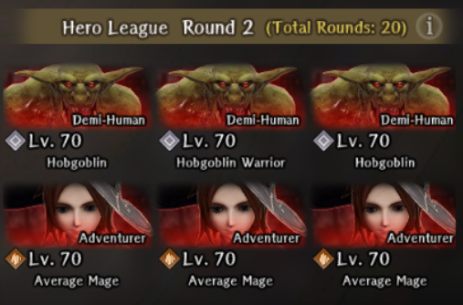{ width="390" }

    === "Details"
        - Frontline: Hobgoblin 3x
        - Backline: Mage Adventurer 3x

    === "Tips"
        - Mage Adventurers tend to prioritze casting BALAFEOS first on any rows without ATK debuff. They also prefer casting other debuff spells, but can cast single-target attack spells sometimes. The BALAFEOS is quite strong so ABIT it ASAP on ATK-scaling units.
        - Hobgoblins use their standard skillset. Can be evaded with Dark Element units with 230+ EVA.
        - Kill the mages first ASAP. Kill the rest with basic attacks to conserve SP.

=== "Round 3"

    === "Preview"
        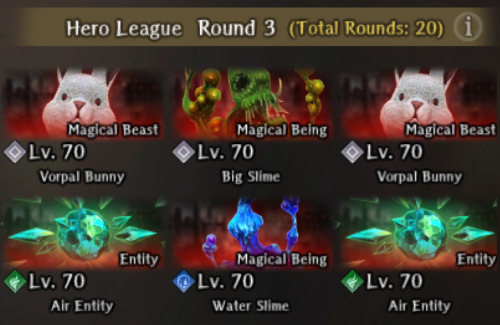{ width="390" }

    === "Details"
        - Frontline: Vorpal Bunny 2x, Large Slime 1x
        - Middle: Wind Entity 2x, Water Slime 2x
        - Backline: Ninja 2x

    === "Tips"
        - Bunnies have extremely high evasion and decently high HP. they can be instantly frozen with MADALTO and then killed in one with with a 700-800 ATK 2H Sword Lvl 1 ESS or Poised.
        - The Big Slime and Water Slimes can be evaded entirely with Dark Element units with 230+ EVA.
        - The Entities can be evaded if they are not casting magic with the previously mentioned stats.
        - The Ninjas tend to cast low accuracy row status effects or low damage row magic. They can be evaded otherwise.
        - It's recommended to kill in the order of Bunnies, Ninjas, Entities, and Slimes.

=== "Round 4"

    === "Preview"
        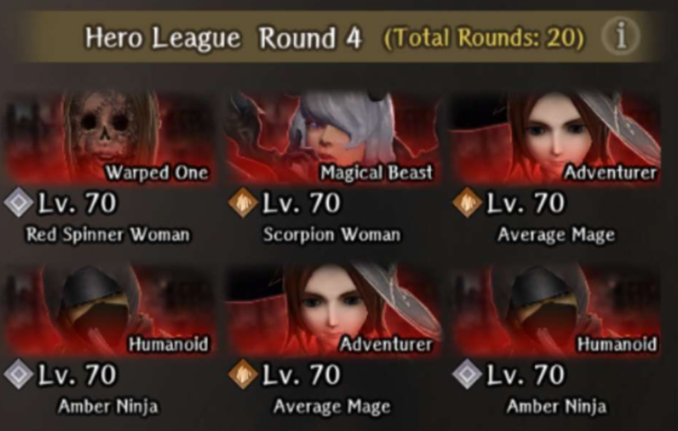{ width="390" }

    === "Details"
        - Frontline: Red Spinner Woman 1x, Scorpion Lady 1x
        - Backline: Mage Adventurer 1x, Ninja 2x

    === "Tips"
        - It's recommended to clear the backline first. See previous entries for how these enemies function. They will be consistent throughout the run.
        - It's possible to evade the Red Spinner Woman and Scorpion Lady but they might require MASOLOTU + DILTO applied as they are a bit more accurate. BATILGREF also helps buy a lot of time to kill the backline first before dealing with the frontline.
        - It's recommended to kill in the order of Mage, Ninja, Red Spinner Woman, Scorpion Lady.
        
=== "Round 5"

    === "Preview"
        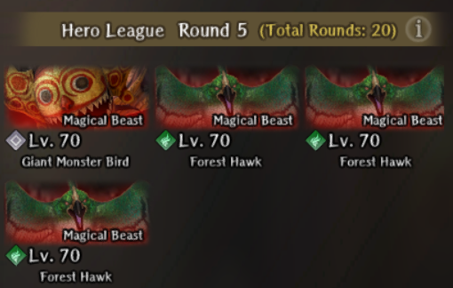{ width="390" }

    === "Details"
        - Frontline: Giant Monster Bird 1x
        - Backline: Air Hawk 3x

    === "Tips"
        - This is probably one of the more annoying fights for a majority of the runs, as it drains a lot of resources. It's recommended to deal with the Hawks immediately by using KATINO, which is nearly guaranteed on them. If they are not taken care of they can easily surety for over 1K damage. Otherwise, they have rather low HP and can be killed with ESS or Poised after being slept despite being in the backline. 
        - The Monster Bird itself has very high HP, perhaps around 100k or higher. It's also extremely evasive, so it's recommended to apply MACALDIA to your DPS and debuff it's evasion via BATILGREF and Chill. The Monster Bird is immune to the CT debuffing effects of BATILGREF but not the EVA debuffing portion. The single target attack of the Monster Bird is evadable.
        - Knights can be employed here if necessary to survive its full team AOE attack. Alternatively, you can simply equip every unit with Magical Beast Resistance Gear and have two Priests, preferably Dark Element for maximum HP.

=== "Round 6"

    === "Preview"
        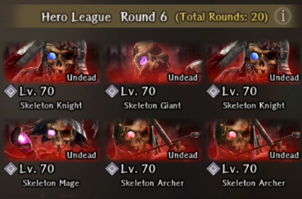{ width="390" }

    === "Details"
        - Frontline: Skeleton Knight 2x, Skeleton Giant
        - Backline: Skeleton Mage 2x, Skeleton Archer

    === "Tips"
        - Every enemy has extremely high accuracy, otherwise relatively low HP compared to most fights in this mode. They all have standard movesets, just very high physical damage.
        - MAREIN isnt suggested, it's better to BATILGREF the frontline and then focus on wiping the backline ASAP.

=== "Round 7"

    === "Preview"
        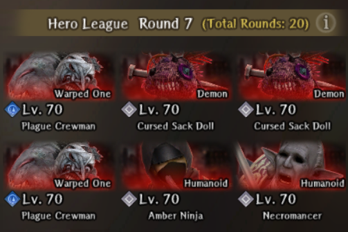{ width="390" }

    === "Details"
        - Frontline: Plague Crewman 2x, Cursed Sack Doll 2x
        - Backline: Ninja 2x, Necromancer 1x

    === "Tips"
        - The Cursed Sack Dolls guaranteed go first (even if u have 500 ASPD), and will typically either use Cursed Ritual to apply Curse to everyone or do a lot of damage. They are somewhat hard to evade.
        - Everything has a standard moveset, but main issue are the Cursed Sack Dolls. They are extremely fast and evasive, but can be taken care of instantly with MADALTO and ESS/Poised with a 2H Sword. Afterwards it's recommended to kill the Necromancer and Ninjas. You can also KATINO the Plague Crewman, as they are one of the few enemies that can sleep for multiple turns while you take care of the rest. Alternatively, BATILGREF works too.

=== "Round 8"

    === "Preview"
        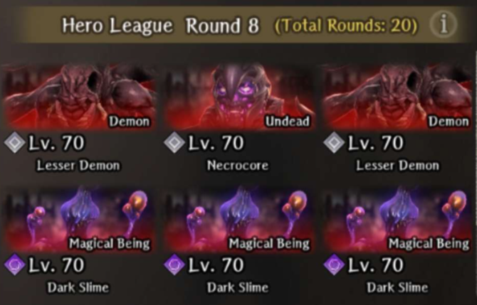{ width="390" }

    === "Details"
        - Frontline: Necrocore 1x, Lesser Demon 2x
        - Backline: Dark Slime 4x

    === "Tips"
        - You can evade all of the enemies here with previously mentioned EVA build. They mainly just use physical attacks.
        - Ideally just BATILGREF both rows and kill them with basic attacks to replenish some SP with Debra's inherit skill if possible.
        - Focus the front row before killing the backrow.

=== "Round 9"

    === "Preview"
        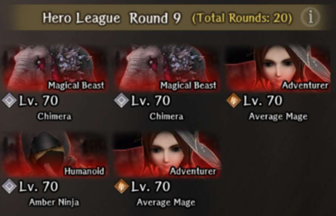{ width="390" }

    === "Details"
        - Frontline: Chimera 2x
        - Backline: Ninja 2x, Mage Adventurer 2x

    === "Tips"
        - The Chimeras are extremely fast, accurate, and have very high surety chance. You essentially have to pray your damage reduction passives (WOTK, Sanctuary's Blessing, Wisdom of Truth, Eyes that Know the Future) will proc here or they can instantly kill. It's very recommended that your entire frontline has Magical Beast Resist gear.
        - Ideally just BATILGREF the Chimeras and defend with your frontline. Try to kill enemies with your backline. Focus on clearing the enemy backline first, particularly the mages so they don't keep debuffing you.

=== "Round 10"

    === "Preview"
        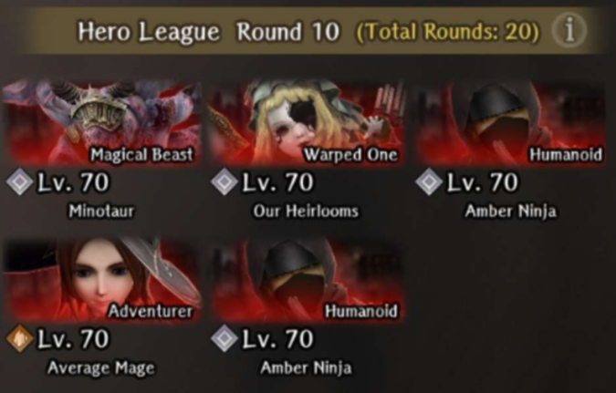{ width="390" }

    === "Details"
        - Frontline: Minotaur 1x, Our Heirlooms 1x
        - Backline: Ninja 2x, Mage Adventurer 1x

    === "Tips"
        - It's recommended to immediately BATILGREF the enemy frontline, then deal with the backline first as per usual
        - The Minotaur has relatively high accuracy, and does very high damage so deal with it first. Very recommended to use Magical Beast Resist gear for your frontline.
        - Our Heirlooms has a standard moveset and isn't that strong. Preferably do not use low fortitude units for this fight though.

=== "Round 11"

    === "Preview"
        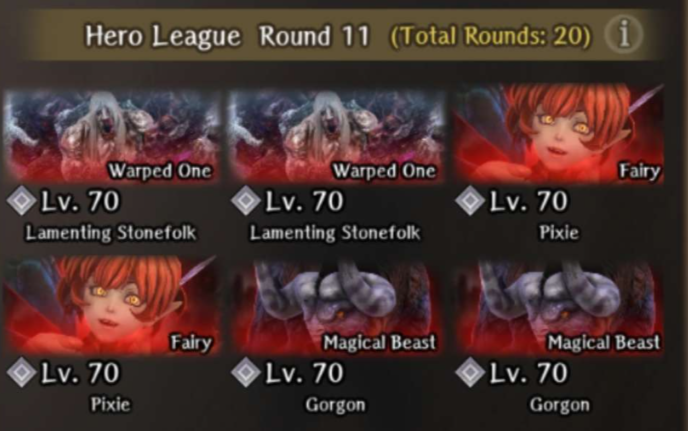{ width="390" }

    === "Details"
        - Frontline: Lamenting Snowfolk 2x
        - Middle: Pixie 2x
        - Backline: Gorgon 2x

    === "Tips"
        - MADALTO the pixies immediately and get rid of them, as they can apply Sleep which can easily get you killed.
        - It's recommended to BATILGREF both rows and then quickly deal with the columns. If possible, kill the Gorgon before the Lamenting Snowfolk as the Gorgons can instantly stone a row if both aim their breath at the same row. The Gorgons also frequently Lunge, which switches a frontline unit with the backline.
        - The Gorgons have very high accuracy and do quite a lot of damage with Lunge as they move closer. It may be favorable to bring Magical Beast Resistance gear.

=== "Round 12"

    === "Preview"
        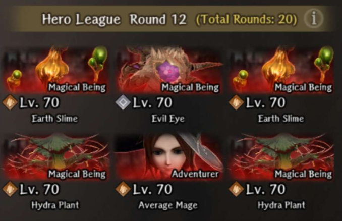{ width="390" }

    === "Details"
        - Frontline: Evil Eye 1x, Earth Slime 2x
        - Backline: Hydra Plant 2x, Mage Adventurer 1x

    === "Tips"
        - It goes without saying, immediately kill the Mage Adventurer. Then it's preferable to focus on killing the Evil Eye, as it gets two actions a turn, and can potentially wipe an entire row at once. It's somewhat evadable, but very risky if it starts targetting the backline, which may not have very high evasion. In addition, it has a very high chance of calling for an Ally randomly, which is another Evil Eye but with significantly less HP.
        - The Hydra Plants have a standard moveset, and don't really do much damage. However, that row damage cannot be evaded.
        - The Earth Slimes are evadable and very weak, so they are the least priority to deal with.
        - It's preferable to run a lot of damage for this stage to end it quickly.

=== "Round 13"

    === "Preview"
        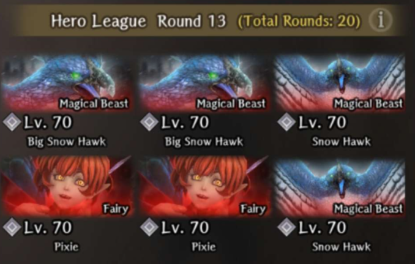{ width="390" }

    === "Details"
        - Frontline: Big Snow Hawk 2x
        - Backline: Snow Hawk 2x, Pixie 2x

    === "Tips"
        - This match is pretty easy, everything can be evaded. MADALTO the backline and immediately kill the pixies. The Snow Hawks however, require 3 DALTOs to freeze.
        - Can BATILGREF/MADALTO to reduce their evasion. It's not recommended to use Dissipation or Malefic Wind unless you have plenty of resources remaining to remove their CT/EVA buffs.

=== "Round 14"

    === "Preview"
        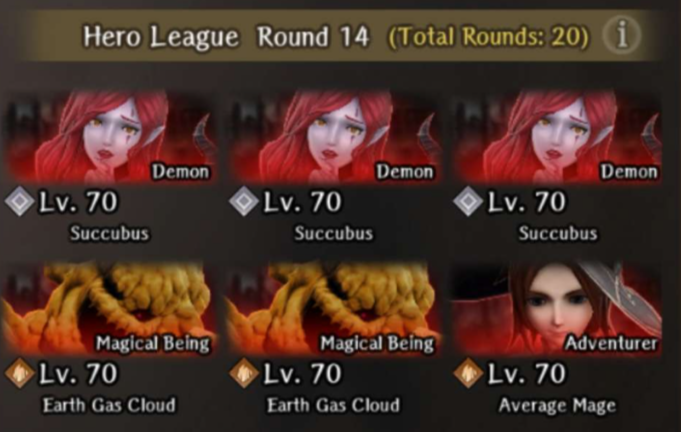{ width="390" }

    === "Details"
        - Frontline: Succubi 3x
        - Backline: Earth Cloud 2x, Mage Adventurer 1x

    === "Tips"
        - The clouds have very high defense, especially in the backline and seem to always go first. However, they can generally be evaded. Deal with these last.
        - MADALTO the front row, as the Succubi are very evasive but freeze immediately. Kill them and the Mage Adventurer. Then focus on chipping away on the clouds.

=== "Round 15"

    === "Preview"
        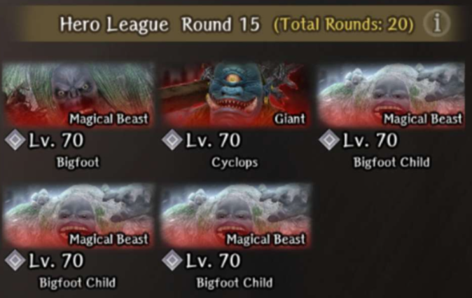{ width="390" }

    === "Details"
        - Frontline: Bigfoot 1x, Cyclops 1x
        - Backline: Bigfoot Child 3x
        - Debuff Applied: Beastfolk Stats Down

    === "Tips"
        - The Cyclops is evadable, but the rest of the enemies are not. It's highly recommended to cast BATILGREF and MADALTO on the frontline + backline in order to buy as much time as possible.
        - Kill the Bigfoot first, as this will apply an additional CT and ATK down on the Bigfoot children. You can then focus on killing the Cyclops and then the rest of the Bigfoot children.
        - It's almost mandatory to run a large amount of Stun/Paralysis Tolerance for this as the breath from the Bigfoot can easily end the run. It's recommended to bring Asha and Eldorado for this if possible, as they can both also help apply MADALTO.

=== "Round 16"

    === "Preview"
        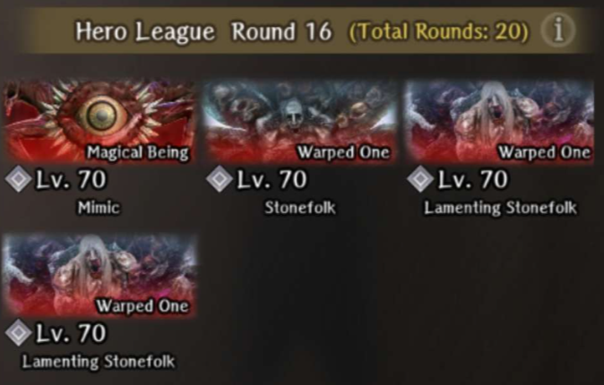{ width="390" }

    === "Details"
        - Frontline: Mimic 1x, Stonefolk 1x
        - Backline: Lamenting Snowfolk 2x

    === "Tips"
        - The Stonefolk typically just uses physical attack, and it has insanely high damage, basically unsurvivable if not defending. It has very high defense as well, but has very little HP.
        - The Lamenting Snowfolk will prioritize casting single-target magic, which includes DALTO, which can mess with evasion strategies. Keep in mind though, that they can also use Clamp which does a lot of damage if they move to the frontline.
        - The Mimic has its usual moveset. Its physical moves can be evaded, but it can occasionally cast low damage magic.
        - It's recommended to BATILGREF both rows and take care of the Stonefolk and Mimic first before dealing with the Lamenting Snowfolk.

=== "Round 17"

    === "Preview"
        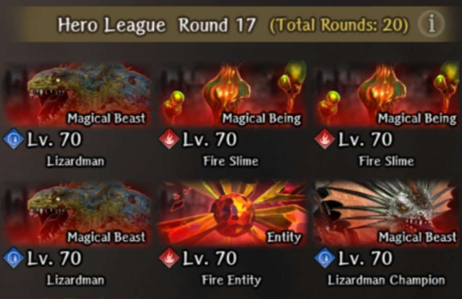{ width="390" }

    === "Details"
        - Frontline: Lizardman 2x, Fire Slime 2x
        - Backline: Fire Entity 2x, Lizardman Champion 1x

    === "Tips"
        - All the enemies have standard movesets in here. The Lizardman Champion will cast Merfolk Command on its first turn, which gives 4 turns of ACC,CT,EVA up on itself and the Lizardman. It's highly recommended to cleanse the ACC buff ASAP, as the strategy for this fight will be evasion. Keep in mind however, the Lizardman still have relatively high accuracy, so they hit you.
        - Kill the Fire Slimes first, as they have little HP and can apply evasion down. This will also move the Lizardman Champion to the same row as the Lizardman, where you can dispel all their buffs at once with Malefic Wind and/or Lvl 2 Dissiption. You can also now BATILGREF + MADALTO (chill reduces accuracy) all of them at once. Kill the Fire Entities ASAP as well as they can cast magic. Afterwards, continue working on the rest of the enemies.

=== "Round 18"

    === "Preview"
        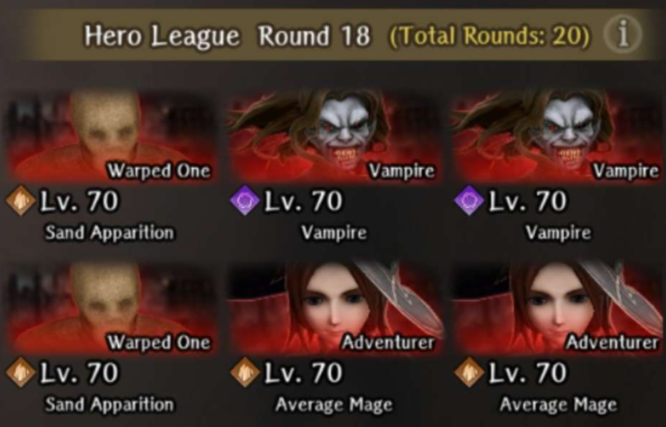{ width="390" }

    === "Details"
        - Frontline: Vampire 2x, Sand Apparition 2x
        - Backline: Mage Adventurer 3x

    === "Tips"
        - Not clear yet

=== "Round 19"

    === "Preview"
        { width="390" }

    === "Details"
        - Frontline: Snow Wolf Leader 1x, Snow Wolf 3x
        - Backline: Snow Wolf 4x

    === "Tips"
        - Not clear yet

=== "Round 20"

    === "Preview"
        { width="390" }

    === "Details"
        - Frontline: Defense Golem 1x, Attack Golem 1x
        - Backline: Greater Demon 2x

    === "Tips"
        - Not clear yet

